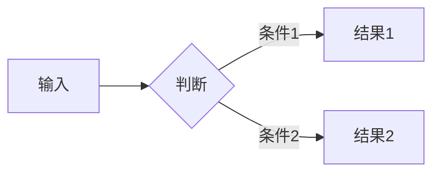

# Hello-AI Agent 写作指南

## 项目定位

Hello-AI 是面向中文小白的 AI / LLM 入门知识库。仓库即唯一内容源，MkDocs Material 构建为静态站点。

## 写作原则（必须遵守）

1. **先讲问题，再讲概念**：不要一上来堆定义，先说明这个概念解决什么困惑。
2. **先路径，后百科**：告诉读者先学什么、后学什么、学到什么程度即可。
3. **先能用，后讲原理**：先做出结果，再解释底层机制。
4. **面向小白，但不装傻**：讲清楚，但不啰嗦；有例子，但不堆术语；可以口语化，但不要油。
5. **每个新术语首次出现时**：提供中文解释 + 英文原文 + 简短定义 + 一个例子。
6. **涉及模型/产品/API/数据时**：必须标注来源；如果是推测，明确写"推测"或"待验证"。
7. **安全边界要写清楚**：涉及 API Key、数据上传、模型输出、自动化调用时，要提醒风险。
8. **避免制造焦虑**：目标是降低入门门槛，不是用概念堆叠劝退新手。

## 内容结构模板

每篇正文必须包含以下结构（根据内容适当调整）：

```markdown
# 标题

> 一句话概括这页讲什么。

## 这章解决什么问题

（1-2 段，说明读者为什么要花时间读这页）

## 核心概念解释

### 概念 A
...

### 概念 B
...

## 最小示例 / 动手试试

（给出可复现的代码、Prompt 示例或操作步骤）

## 常见误区

（至少 3 个常见误解 + 纠正）

## 延伸阅读

（链接到本仓库其他相关页面）

## 练习题 / 小实验

（至少 1 道思考题或动手实验）
```

## 插图规范

### Mermaid 图（优先使用）

以下类型的图优先用 Mermaid 直接在 Markdown 中绘制：

- 流程图 (`flowchart` / `graph`)
- 时序图 (`sequenceDiagram`)
- 类图 (`classDiagram`)
- 状态图 (`stateDiagram-v2`)
- 用户旅程图 (`journey`)
- 甘特图 (`gantt`)
- 饼图 (`pie`)
- Git 图 (`gitGraph`)
- 思维导图 (`mindmap`)
- 时间线 (`timeline`)
- 象限图 (`quadrantChart`)
- 需求图 (`requirementDiagram`)
- C4 图 (`C4Context` / `C4Container`)
- 桑基图 (`sankey-beta`)
- XY 图表 (`xychart-beta`)
- 块图 (`block-beta`)
- 数据包图 (`packet-beta`)
- 架构图 (`architecture-beta`)

Mermaid 示例：
```markdown

```

### 外部图片（按需下载）

当概念需要真实照片、产品截图、历史图片等时，可搜索并下载图片。

**命名规范**：`assets/images/<所属章节>/<位置_内容描述>.png`

例如：
- `assets/images/basics/what-is-ai/dartmouth_conference_1956.png`
- `assets/images/basics/deep-learning/alexnet_architecture.png`

**引用方式**：
```markdown


<center style="font-size:14px;color:#C0C0C0;">图X：图片描述</center>
```

## 标签规范

每篇新页面顶部可添加标签：

```yaml
---
tags:
  - AI 基础
---
```

可用标签见 `mkdocs.yml` 的 `material/tags` 配置。

## 事实核验规则

- 模型名称要写清版本（如 GPT-4、Claude 3.5 Sonnet）。
- API 和工具要标明更新时间。
- 关键页面保留参考链接。
- 过期内容要有版本意识，注明"截至 XXXX 年 X 月"。

## 格式约定

- 中英文之间加空格。
- 代码块标注语言类型。
- 列表层级清晰，不要嵌套超过 3 层。
- 每页长度建议 1500~4000 字，不要太短也不要太长。
