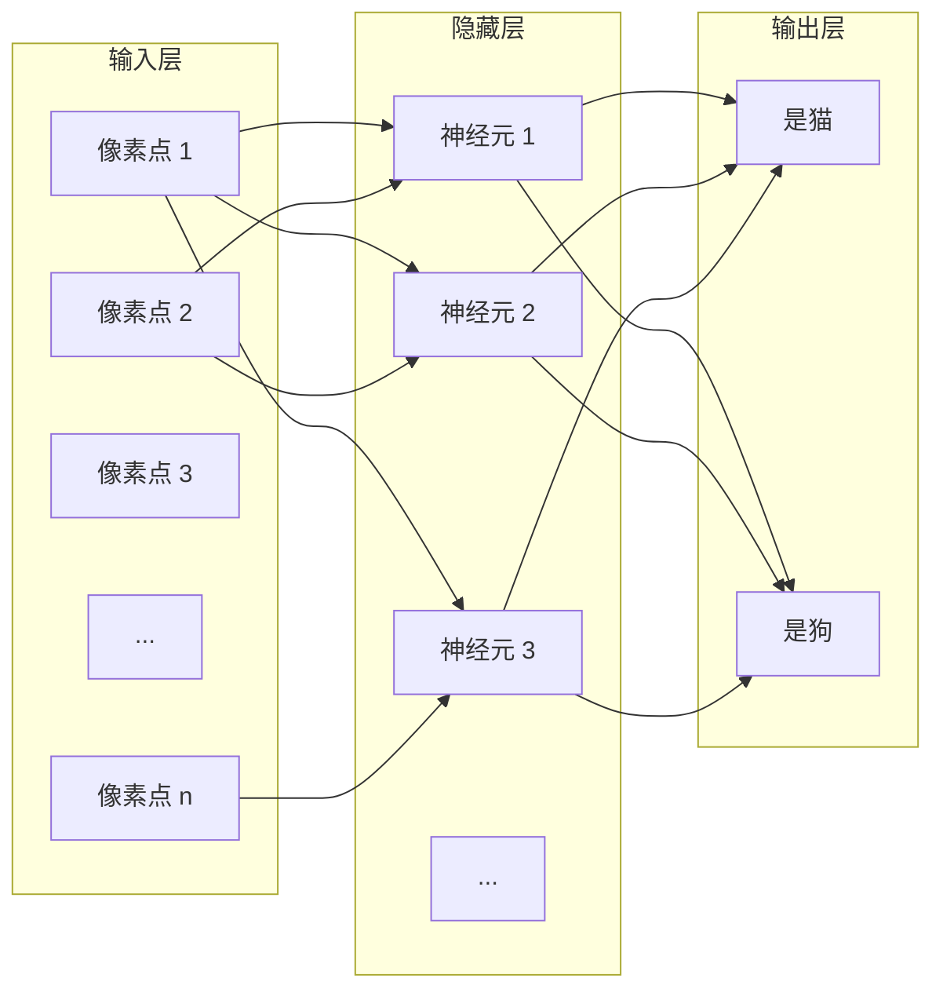
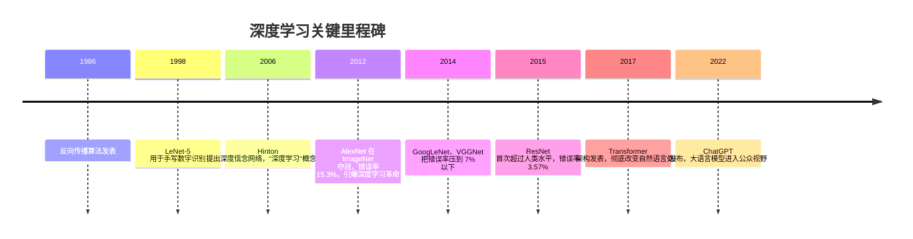

---
tags:
  - AI 基础
---

# 什么是深度学习

**深度学习（Deep Learning）就是让计算机用多层神经网络，一层一层地从数据里抽丝剥茧，学会人类难以用规则描述的复杂模式。**

## 这章解决什么问题

上一章讲了机器学习的基本思路：给计算机看例子，让它自己找规律。但有一个问题没解决——如果规律太复杂、太抽象，怎么办？

举个例子：怎么让计算机识别一张猫的照片？

你可以试着写规则：有尖耳朵的是猫，有胡须的是猫，有圆瞳孔的是猫……但很快你会发现，猫的睡姿千奇百怪，光线角度千变万化，你根本列不完所有规则。更别说「理解一句话的意思」这种任务，规则的复杂度会直接爆炸。

深度学习解决的就是这个问题。它不用人绞尽脑汁写规则，而是让模型自己从原始数据里，一层一层地提炼出越来越抽象的特征。底层识别边缘和颜色，中层识别耳朵和尾巴，高层识别"这是一只猫"。整个过程自动完成，人只需要准备数据和调整结构。

这章帮你理解：深度学习到底是什么？神经网络是怎么「一层一层学」的？它为什么能在图像和语言任务上那么强？以及它和传统机器学习有什么本质区别。

## 神经网络：用「层级流水线」做判断

深度学习的核心是**神经网络（Neural Network）**。这个名字来源于生物学——人脑里有大约 860 亿个神经元，互相连接形成网络。人工神经网络是一种大大简化的数学模拟，但基本思想很像：很多简单的计算单元连在一起，通过层层传递，最终输出一个复杂判断。

不要被「神经」两个字吓到。你可以把神经网络想象成一个**工厂流水线**，每一层工人负责一道工序，层层加工，最后产出结果。

### 三层基本结构

一个最基础的神经网络有三层：

**输入层（Input Layer）**：接收原始数据。如果是图像，输入层的每个节点对应一个像素点的亮度或颜色值。如果是文本，输入的可能是每个词对应的数字编码。

**隐藏层（Hidden Layer）**：真正干活的地方。这一层的每个「神经元」都会对上一层的输出做加权求和，再通过一个**激活函数（Activation Function）**决定是否「开火」——也就是把信号传递给下一层。

你可以把隐藏层理解为流水线的中间工序。第一层可能识别"这里有条横线"，第二层识别"横线加竖线像是个耳朵"，第三层识别"耳朵加圆脑袋大概率是猫"。层数越多，能识别的模式越抽象、越复杂。

**输出层（Output Layer）**：给出最终判断。猫狗分类任务里，输出层有两个节点，分别输出"是猫的概率"和"是狗的概率"。哪个概率高，模型就选哪个。

### 权重：每个连接的「重要性分数」

层与层之间的每条连线，都有一个数值叫**权重（Weight）**。它决定了上一层某个信号对下一层某个神经元的影响有多大。

打个比方：判断一个人会不会违约，你考虑了三个特征——收入、负债率、学历。你觉得收入最重要，给它的权重是 0.6；负债率次之，权重 0.3；学历相对次要，权重 0.1。神经网络里的权重就是这个逻辑，只不过它有成千上万个特征和连接，权重的值是训练过程中自动调整出来的，而不是人定的。

训练神经网络的过程，本质上就是不断调整这些权重的过程。调对了，模型输出就准；调错了，就继续改。算法用来调权重的方法叫**反向传播（Backpropagation）**，你可以理解为：模型做完一题，对照答案算出差多少，然后从输出层往回一层一层地「追责」，告诉每一层该往哪个方向改。

### 激活函数：决定要不要传递信号

如果神经元只是简单地把输入加起来，那多层和一层没什么区别——多层嵌套后仍然是线性运算，学不到复杂规律。

**激活函数（Activation Function）**的作用就是打破这种线性。它像一个开关：输入信号够强，就输出一个非零值；不够强，就输出零或接近零。

一个最直观的比喻是**ReLU（Rectified Linear Unit，修正线性单元）**：输入大于零，原样输出；输入小于等于零，输出零。就像公司里的审批流程——预算申请超过门槛才往上递，不够门槛直接驳回。

这种非线性让神经网络能拟合各种弯曲、复杂的关系，而不是只能画直线。

## 为什么叫「深度」学习

「深度」指的是神经网络的**隐藏层很多**。传统神经网络可能只有 1~2 个隐藏层，而深度学习模型动辄几十层、上百层，甚至上千层。

层数多带来的好处是：**模型能学习不同抽象层次的特征。**

以图像识别为例：

- 第 1~2 层：识别边缘、颜色块、简单纹理
- 第 3~5 层：识别眼睛、耳朵、轮子、翅膀等基本部件
- 第 6~10 层：识别「猫脸」「汽车轮廓」「建筑结构」等整体概念
- 更深层：理解场景关系，比如「一只猫趴在沙发上」

这种从具体到抽象的自动分层，是深度学习的杀手锏。传统机器学习需要人手工设计特征（比如用算法提取图像的 SIFT 特征），而深度学习直接丢原始像素进去，模型自己学出什么特征好用。

## 深度学习的突破：2012 年的那一声惊雷

深度学习不是 2012 年才发明的。早在 1986 年，反向传播算法就被提出来了。但之后的几十年里，神经网络一直被主流学术界冷落——因为层数一多就训练不动，效果还不如传统方法。

转折点发生在 **2012 年**。

那年，Geoffrey Hinton 带着他的两个学生 Alex Krizhevsky 和 Ilya Sutskever，拿一个叫 **AlexNet** 的深度卷积神经网络参加了 **ImageNet 大规模视觉识别挑战赛**。比赛要求对 120 万张图片做 1000 类分类。结果 AlexNet 的 top-5 错误率是 **15.3%**，而第二名用传统方法做的，错误率是 **26.2%**。

这不是小胜，是碾压。领先将近 11 个百分点，在计算机视觉领域简直是天文数字。

AlexNet 的成功有三个关键原因：

1. **数据量够大**：ImageNet 提供了 120 万张标注图片，足够深的网络才能「吃饱」。
2. **GPU 算力**：AlexNet 用了两块 NVIDIA GTX 580 显卡训练，深度网络的训练速度比 CPU 快了几十倍。
3. **技术改进**：ReLU 激活函数和 Dropout 正则化技术，解决了深层网络训练中的梯度消失和过拟合问题。

2012 年之后，深度学习像滚雪球一样席卷了各个 AI 领域：

- **图像识别**：人脸识别、医学影像分析、自动驾驶感知，全部换上了深度神经网络。
- **语音识别**：从传统的高斯混合模型切换成端到端的深度网络，准确率大幅提升。
- **自然语言处理**：2017 年 Transformer 架构出现后，机器翻译、文本生成、问答系统全面转向深度学习，最终催生了今天的大语言模型。

## 深度学习 vs 传统机器学习

很多人困惑：深度学习不也是机器学习的一种吗？为什么要单独拎出来说？

没错，深度学习是机器学习的子集。但两者在实践中有很清晰的边界。

| 对比维度 | 传统机器学习 | 深度学习 |
| --- | --- | --- |
| 特征怎么处理 | 人手工设计，需要领域经验 | 模型自动从原始数据里学 |
| 数据需求量 | 几百到几千条就能跑 | 通常需要几万到几百万条 |
| 模型结构 | 相对简单，可解释性强 | 层数多、参数多，像黑盒 |
| 算力要求 | 普通电脑就能跑 | 通常需要 GPU 加速 |
| 擅长的问题 | 结构化数据（表格、数字） | 图像、语音、文本等非结构化数据 |
| 调参难度 | 相对直接 | 需要设计网络结构、调学习率等，门槛更高 |

打个比方：传统机器学习像「老师手把手教学生」——老师得先把知识点整理成笔记（特征工程），学生照着学。深度学习像「学生自己泡图书馆」——你把它丢进海量资料里，它自己总结出一套理解方式，老师都不用提前整理笔记了。

但这不意味着深度学习处处都更好。如果你的数据只有几千条表格记录，用一个简单的随机森林或 XGBoost，效果可能比硬上深度学习还好，而且训练快、好解释、省资源。选对工具，比盲目追新更重要。

## 最小示例：感受「分层学习」

不用写代码，你可以用下面这个思想实验来理解深度学习是怎么一层一层提炼特征的。

**任务**：教一个「视觉系统」识别「猫」。

**第一层（边缘检测）**：给系统看大量图片，让它找出最基本的视觉元素——横线、竖线、斜线、颜色边界。这层不管猫不猫，只关心"这里有没有一条线"。

**第二层（部件组合）**：把第一层的输出组合起来。横线加竖线可能是个"角"，几条曲线围起来可能是个"圆形"。这层开始识别简单的几何形状。

**第三层（部件识别）**：圆形上面加两个三角形 → 像猫耳朵；椭圆形加两个小圆点 → 像猫眼睛。这层能识别具体的身体部位。

**第四层（整体判断）**：猫耳朵 + 猫眼睛 + 胡须 + 圆脸 → 综合判断"这是猫"。

你可以找一张猫的照片，用画图软件不断模糊它，观察自己是什么时候认不出它是猫的。你会发现：边缘和轮廓最先消失，但整体轮廓还在时你仍然能认出来——这说明你的大脑也在做类似的分层特征提取。

## 常见误区

**误区 1：深度学习就是人工智能**

不是。深度学习只是实现 AI 的众多技术路线之一。除了深度学习，AI 还包括规则系统、传统机器学习、知识图谱、进化算法、符号推理等。今天的大语言模型确实基于深度学习，但自动驾驶里的路径规划、推荐系统里的协同过滤，很多模块用的并不是深度网络。把深度学习等同于 AI，是以偏概全。

**误区 2：层数越多越好**

层数增加确实能提升模型的表达能力，但也有代价。层数太多会导致训练困难（梯度消失或梯度爆炸）、过拟合风险增加、推理速度变慢、消耗更多算力。2015 年的 ResNet 能做到 152 层，靠的是**残差连接（Residual Connection）**这种特殊结构，不是无脑堆层。在实际工程中，够用就好，过度追求层数是新手常见的浪费。

**误区 3：深度学习不需要特征工程**

这话只对了一半。深度学习确实能自动从原始数据里学特征，省去了人手工设计特征的麻烦。但「准备数据」这件事并没有消失——你需要决定输入什么、怎么清洗、怎么增强、怎么标注。而且，在某些领域，把领域知识融入网络结构（比如 CNN 的卷积操作就是利用了图像的空间局部性）本身就是一种高级的特征工程。说深度学习完全不需要特征工程，是一种过度简化。

**误区 4：深度学习什么都能做，传统方法已经过时了**

大错特错。在数据量小、需要强可解释性、资源受限的场景下，传统机器学习仍然是不二之选。银行的风控模型、医院的辅助诊断系统、制造业的异常检测，很多核心模块用的仍然是逻辑回归、随机森林、SVM 这些「老技术」。深度学习更像一把重锤，适合砸硬骨头，但不是所有问题都是硬骨头。

## 延伸阅读

- [什么是机器学习](machine-learning.md) —— 回顾机器学习的大框架，理解深度学习在其中的位置
- [什么是 LLM](what-is-llm.md) —— 了解深度学习在语言方向上的最新产物：大语言模型

## 练习题 / 小实验

**思考题**：深度学习在图像和语言任务上表现特别好，但在表格数据（比如 Excel 里的销售记录）上往往不如传统机器学习。结合本章内容，想想这是为什么？

> 💡 提示：从「特征的结构化程度」「数据量」「特征的层次性」三个角度思考。图像和语言有什么共同点，是表格数据不具备的？

**实验**：打开一个你常用的带人脸识别的 App（比如手机相册的人脸分组功能）。找一张你戴墨镜的照片、一张侧脸照片、一张光线很暗的照片，看看它还能不能认出你。思考一下：深度学习模型在训练时「学」到了哪些不变特征（比如五官的相对位置），让它对墨镜、角度、光线有一定容忍度？
