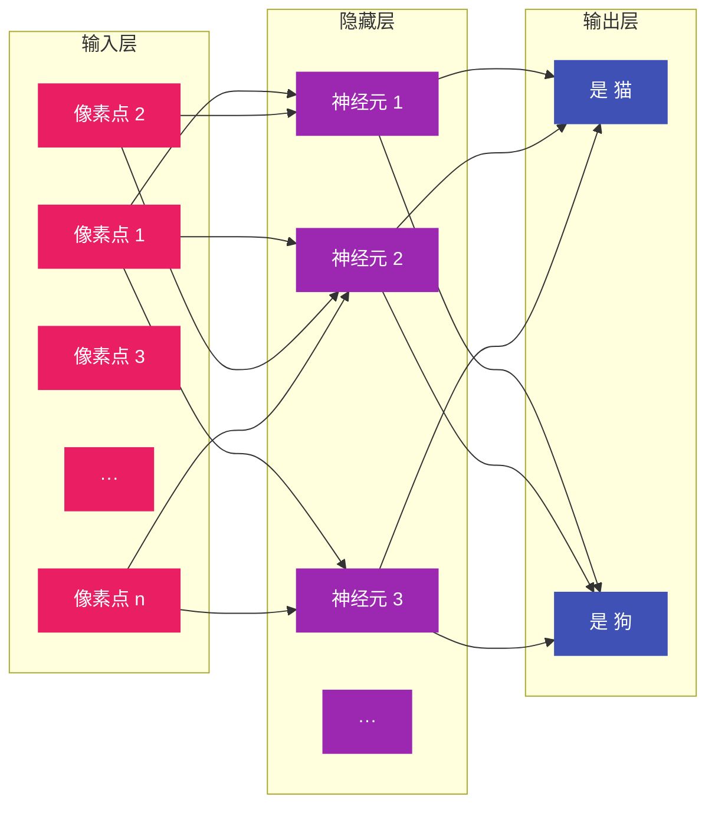

---
tags:
  - AI 基础
---

# 什么是深度学习

AI 基础 · 第 3 站

深度学习（Deep Learning）就是让计算机用多层神经网络，一层一层地从数据里抽丝剥茧，学会人类难以用规则描述的复杂模式。

<strong>输入</strong> 原始数据（像素/声波/文字）

<strong>层层提炼</strong> 自动学出抽象特征

<strong>输出</strong> 复杂任务判断

## 这章解决什么问题

上一章讲了机器学习的基本思路：给计算机看例子，让它自己找规律。但如果规律太复杂、太抽象，人根本写不出规则，怎么办？

举个例子：怎么让计算机识别一张猫的照片？

你可以试着写规则：有尖耳朵的是猫，有胡须的是猫，有圆瞳孔的是猫……但很快你会发现，猫的睡姿千奇百怪，光线角度千变万化，你根本列不完所有规则。更别说「理解一句话的意思」这种任务，规则的复杂度会直接爆炸。

深度学习解决的就是这个问题。它不用人绞尽脑汁写规则，而是让模型自己从原始数据里，一层一层地提炼出越来越抽象的特征。底层识别边缘和颜色，中层识别耳朵和尾巴，高层识别"这是一只猫"。整个过程自动完成，人只需要准备数据和调整结构。

这章帮你搞懂：深度学习是什么、神经网络怎么层层学习、它为什么在图像和语言任务上那么强、以及它和传统机器学习的本质区别。

<strong>1. 先搞懂原理</strong> 神经网络基本结构与层级分工

<strong>2. 理解「深度」</strong> 层数与特征抽象的关系

<strong>3. 了解历史</strong> 2012 年 AlexNet 改变了一切

<strong>4. 分清边界</strong> 深度学习 vs 传统机器学习

## 神经网络：用「层级流水线」做判断

深度学习的核心是**神经网络（Neural Network）**。这个名字来源于生物学——人脑里有大约 860 亿个神经元，互相连接形成网络。人工神经网络是一种大大简化的数学模拟，但基本思想很像：很多简单的计算单元连在一起，通过层层传递，最终输出一个复杂判断。

不要被「神经」两个字吓到。你可以把神经网络想象成一个**工厂流水线**，每一层工人负责一道工序，层层加工，最后产出结果。

### 三层基本结构

一个最基础的神经网络有三层：

**输入层（Input Layer）**：接收原始数据。如果是图像，输入层的每个节点对应一个像素点的亮度或颜色值。如果是文本，输入的是每个词对应的数字编码。

**隐藏层（Hidden Layer）**：真正干活的地方。这一层的每个「神经元」都会对上一层的输出做加权求和，再通过一个**激活函数**决定是否「开火」——把信号往下传递。

你可以把隐藏层理解为流水线的中间工序。第一层可能识别"这里有条横线"，第二层识别"横线加竖线像是个耳朵"，第三层识别"耳朵加圆脑袋大概率是猫"。层数越多，能识别的模式越抽象、越复杂。

**输出层（Output Layer）**：给出最终判断。猫狗分类任务里，输出层有两个节点，分别输出"是猫的概率"和"是狗的概率"。哪个概率高，模型就选哪个。

### 权重：每个连接的「重要性分数」

层与层之间的每条连线，都有一个数值叫**权重（Weight）**。它决定上一层某个信号对下一层某个神经元的影响有多大。

打个比方：判断一个人会不会违约，你考虑了三个特征——收入、负债率、学历。你觉得收入最重要，给它的权重是 0.6；负债率次之，权重 0.3；学历相对次要，权重 0.1。神经网络里的权重就是这个逻辑，只不过它有成千上万个特征和连接，权重的值是训练过程中自动调整出来的，而不是人定的。

训练神经网络的过程，本质上就是不断调整这些权重的过程。调对了，模型输出就准；调错了，就继续改。算法用来调权重的方法叫**反向传播（Backpropagation）**：模型做完一题，对照答案算出差多少，然后从输出层往回一层一层地「追责」，告诉每一层该往哪个方向改。

### 激活函数：决定要不要传递信号

如果神经元只是简单地把输入加起来，那多层和一层没什么区别——多层嵌套后仍然是线性运算，学不到复杂规律。

**激活函数（Activation Function）**的作用就是打破这种线性。它像一个开关：输入信号够强，就输出一个非零值；不够强，就输出零或接近零。

ReLU（修正线性单元）是最常用的激活函数之一：输入大于零，原样输出；输入小于等于零，输出零。就像公司审批流程——预算超过门槛才往上递，不够门槛直接驳回。

这种非线性让神经网络能拟合各种弯曲、复杂的关系，而不是只能画直线。

### 梯度消失与梯度爆炸：深层网络的「走极端」问题

层数多了之后，有一个训练上的大麻烦——**梯度消失与梯度爆炸**。

反向传播时，梯度要从输出层一层一层往回传。如果每层都乘以一个小于 1 的系数，传到最前面几层时梯度就接近零了，权重根本得不到更新，这就是**梯度消失**。反过来，如果每层乘以一个大于 1 的系数，梯度会越乘越大，变成天文数字，权重一下子蹦飞了，这就是**梯度爆炸**。

2015 年微软亚洲研究院提出 **ResNet（残差网络）**，通过「跳过连接」让梯度直接从后面的层流到前面的层，解决了这个难题。ResNet 做到了 152 层，在图像分类任务上首次超越人类水平。

## 为什么叫「深度」学习

「深度」指的是神经网络的隐藏层很多。传统神经网络可能只有 1~2 个隐藏层，而深度学习模型动辄几十层、上百层，甚至上千层。

层数多带来的好处是：**模型能学习不同抽象层次的特征。**

以图像识别为例：

- 第 1~2 层：识别边缘、颜色块、简单纹理
- 第 3~5 层：识别眼睛、耳朵、轮子、翅膀等基本部件
- 第 6~10 层：识别「猫脸」「汽车轮廓」「建筑结构」等整体概念
- 更深层：理解场景关系，比如「一只猫趴在沙发上」

这种从具体到抽象的自动分层，是深度学习的杀手锏。传统机器学习需要人手工设计特征（比如用算法提取图像的 SIFT 特征），而深度学习直接丢原始像素进去，模型自己学出什么特征好用。

## 深度学习的突破：2012 年的那一声惊雷

深度学习不是 2012 年才发明的。早在 1986 年，反向传播算法就被提出来了。但之后的几十年里，神经网络一直被主流学术界冷落——因为层数一多就训练不动，效果还不如传统方法。

转折点发生在 **2012 年**。

那年，Geoffrey Hinton 带着他的两个学生 Alex Krizhevsky 和 Ilya Sutskever，拿一个叫 **AlexNet** 的深度卷积神经网络参加了 **ImageNet 大规模视觉识别挑战赛**。比赛要求对 120 万张图片做 1000 类分类。结果 AlexNet 的 top-5 错误率是 **15.3%**，而第二名用传统方法做的，错误率是 **26.2%**。

这不是小胜，是碾压。领先将近 11 个百分点，在计算机视觉领域简直是天文数字。

深度学习的关键里程碑：

| 年份 | 里程碑 | 意义 |
| --- | --- | --- |
| 1943 | McCulloch-Pitts 神经元模型 | 神经网络的数学鼻祖 |
| 1958 | 感知机（Perceptron） | 第一个能「学习」的算法模型 |
| 1986 | 反向传播算法（Backpropagation） | 让多层网络训练成为可能 |
| 1998 | LeNet-5 用于手写数字识别 | 第一个商用的卷积神经网络 |
| 2006 | Hinton 提出深度信念网络 | 「深度学习」概念复兴的起点 |
| 2012 | AlexNet 在 ImageNet 夺冠 | 深度学习革命元年，GPU算力觉醒 |
| 2014 | GoogLeNet、VGGNet | 错误率压到 7% 以下 |
| 2015 | ResNet（残差网络）| 152层首次超越人类，残差连接解决梯度问题 |
| 2017 | Transformer 架构发表 | 彻底改变自然语言处理走向 |
| 2020 | GPT-3 1750亿参数 | 大语言模型暴力美学时代开启 |
| 2022 | ChatGPT 发布 | 大模型进入公众视野，AIGC 爆发 |

AlexNet 的成功有三个关键原因：

1. **数据量够大**：ImageNet 提供了 120 万张标注图片，足够深的网络才能「吃饱」。
2. **GPU 算力**：AlexNet 用了两块 NVIDIA GTX 580 显卡训练，深度网络的训练速度比 CPU 快了几十倍。
3. **技术改进**：ReLU 激活函数和 Dropout 正则化技术，解决了深层网络训练中的梯度消失和过拟合问题。

2012 年之后，深度学习像滚雪球一样席卷了各个 AI 领域：

- **图像识别**：人脸识别、医学影像分析、自动驾驶感知，全部换上了深度神经网络。
- **语音识别**：从传统的高斯混合模型切换成端到端的深度网络，准确率大幅提升。
- **自然语言处理**：2017 年 Transformer 架构出现后，机器翻译、文本生成、问答系统全面转向深度学习，最终催生了今天的大语言模型。

## 深度学习就在你身边

深度学习已经渗透到很多日常产品的底层。

| 领域 | 常见产品 | 背后的深度学习技术 |
| --- | --- | --- |
| **相册搜索** | 手机相册自动分人、分场景 | 卷积神经网络（CNN）做图像分类 |
| **语音助手** | Siri、小爱同学、小度 | 循环神经网络（RNN）/Transformer 做语音识别和语义理解 |
| **推荐系统** | 抖音/小红书/淘宝的推荐流 | 深度学习推荐模型（DIN/DSSM） |
| **机器翻译** | Google 翻译、DeepL | 序列到序列（Seq2Seq）/Transformer |
| **美颜滤镜** | 相机的夜景模式、人像模式 | 图像分割网络（U-Net/Mask R-CNN） |
| **自动驾驶** | Tesla FSD、Waymo | 感知融合网络 + 决策规划模型 |

## 深度学习 vs 传统机器学习

| 对比维度 | 传统机器学习 | 深度学习 |
| --- | --- | --- |
| 特征怎么处理 | 人手工设计，需要领域经验 | 模型自动从原始数据里学 |
| 数据需求量 | 几百到几千条就能跑 | 通常需要几万到几百万条 |
| 模型结构 | 相对简单，可解释性强 | 层数多、参数多，像黑盒 |
| 算力要求 | 普通电脑就能跑 | 通常需要 GPU 加速 |
| 擅长的问题 | 结构化数据（表格、数字） | 图像、语音、文本等非结构化数据 |
| 调参难度 | 相对直接 | 需要设计网络结构、调学习率等，门槛更高 |

传统机器学习像「老师手把手教学生」——老师得先把知识点整理成笔记（特征工程），学生照着学。深度学习像「学生自己泡图书馆」——你把它丢进海量资料里，它自己总结出一套理解方式，老师都不用提前整理笔记了。

但这不意味着深度学习处处都更好。如果你的数据只有几千条表格记录，用一个简单的随机森林或 XGBoost，效果可能比硬上深度学习还好，而且训练快、好解释、省资源。选对工具，比盲目追新更重要。

## 最小示例：感受「分层学习」

不用写代码，你可以用下面这个思想实验来理解深度学习是怎么一层一层提炼特征的。

**任务**：教一个「视觉系统」识别「猫」。

- **第一层（边缘检测）**：找出最基本的视觉元素——横线、竖线、斜线、颜色边界。这层不管猫不猫，只关心"这里有没有一条线"。
- **第二层（部件组合）**：把第一层的输出组合起来。横线加竖线可能是个"角"，几条曲线围起来可能是个"圆形"。这层开始识别简单的几何形状。
- **第三层（部件识别）**：圆形上面加两个三角形 → 像猫耳朵；椭圆形加两个小圆点 → 像猫眼睛。这层能识别具体的身体部位。
- **第四层（整体判断）**：猫耳朵 + 猫眼睛 + 胡须 + 圆脸 → 综合判断"这是猫"。

你可以找一张猫的照片，用画图软件不断模糊它，观察自己是什么时候认不出它是猫的。你会发现：边缘和轮廓最先消失，但整体轮廓还在时你仍然能认出来——这说明你的大脑也在做类似的分层特征提取。

## 需要警惕的事：算法偏见与深度伪造

深度学习强大的特征提取能力，带来两个普通人必须知道的风险。

### 算法偏见：COMPAS 再犯预测系统

2016 年，美国非营利组织 ProPublica 调查了法院常用的 **COMPAS（Correctional Offender Management Profiling for Alternative Sanctions）** 系统——它用深度学习模型预测被告的再犯风险分数，法官依据这个分数做出判决。

调查发现了一个严重问题：**黑人被告被模型预测为高风险的概率，是白人被告的近两倍**（45% vs 23%），而实际上两群体的再犯率几乎相同。

问题的根源不在于代码，而在于训练数据：历史上美国刑事司法系统对黑人社区存在系统性歧视，这些偏见数据喂给模型后，模型学会了把「种族相关的历史因素」当成预测因子。这是一个活生生的技术正义问题——当深度学习进入司法、贷款、招聘这些高风险领域时，训练数据里的历史偏见会被算法放大。

### 深度伪造：你的脸可能被用来造假

**DeepFake（深度伪造）** 是深度学习在视频领域的阴暗面。GAN（生成对抗网络）能生成高度逼真的假视频——换脸、表情操纵、口型同步，全都不需要专业技能就能做到。

2019 年，有人在社交媒体上散布伪造的名人视频，内容全由 AI 生成。2022 年，有人用深度伪造冒充公司 CEO 要求转账，导致中国香港一家公司被骗 2 亿港元。

深度伪造的可怕之处在于：它让「眼见为实」变得不再可靠。应对方案是**内容溯源**——用数字水印和 AI 检测工具来识别伪造内容，但这是一场持续的猫鼠游戏。

## 在线体验

<strong>🔍 CNN Explainer</strong> 
可视化理解卷积神经网络每一层在学什么，交互式演示 
👉 poloclub.github.io/cnn-explainer

<strong>🧠 TensorFlow Playground</strong> 
拖拽调整网络结构/激活函数/学习率，实时看模型学习曲线 
👉 playground.tensorflow.org

<strong>📐 Distill.pub</strong> 
用交互式可视化解释梯度消失、Transformer 注意力机制等核心概念 
👉 distill.pub

## 常见误区

<strong>误区 1：深度学习 = 人工智能</strong> 
深度学习只是实现 AI 的众多技术之一。AI 还包括规则系统、知识图谱、进化算法等。今天的大语言模型基于深度学习，但自动驾驶里的路径规划、推荐系统里的协同过滤，很多模块用的并不是深度网络。

<strong>误区 2：层数越多越好</strong> 
层数增加能提升表达能力，但代价是训练困难（梯度消失/爆炸）、过拟合风险增加、推理速度变慢。ResNet 能做到 152 层，靠的是残差连接这种特殊结构，不是无脑堆层。

<strong>误区 3：深度学习不需要特征工程</strong> 
深度学习能自动从原始数据里学特征，省去了人手工设计特征的麻烦。但「准备数据」这件事并没有消失——你需要决定输入什么、怎么清洗、怎么增强、怎么标注。

<strong>误区 4：传统方法已经过时了</strong> 
在数据量小、需要强可解释性、资源受限的场景下，传统机器学习仍然是不二之选。银行风控、医院辅助诊断、制造业异常检测，核心模块往往还是逻辑回归、随机森林这些老技术。

## 学完这章，你应该掌握

<strong>✅</strong> 能用自己的话解释「神经网络」是什么，知道输入层、隐藏层、输出层各自的作用

<strong>✅</strong> 理解权重、激活函数、反向传播的核心概念，不用会写代码

<strong>✅</strong> 能说明「深度」是什么意思，以及为什么层数多能处理更复杂的问题

<strong>✅</strong> 能讲出 AlexNet 2012 年为什么是深度学习里程碑

<strong>✅</strong> 分清深度学习和传统机器学习的各自适用场景

<strong>✅</strong> 知道深度学习有哪些主要风险（算法偏见、DeepFake）

## 延伸阅读

- [什么是机器学习](machine-learning.md) —— 回顾机器学习的大框架，理解深度学习在其中的位置
- [什么是 LLM](what-is-llm.md) —— 了解深度学习在语言方向上的最新产物：大语言模型

## 练习题 / 小实验

**练习 1：深度学习在图像和语言任务上表现特别好，但在表格数据（比如 Excel 里的销售记录）上往往不如传统机器学习。结合本章内容，想想这是为什么？**

> 💡 提示：从「特征的结构化程度」「数据量」「特征的层次性」三个角度思考。图像和语言有什么共同点，是表格数据不具备的？

??? question "参考答案"
    **思路 1：从数据的结构化程度看**
    
    图像和语言是典型的**非结构化数据**——像素和文字没有固定的格式，无法用表格的行列直接表达。深度学习恰恰擅长从非结构化数据里自动提炼特征，而传统机器学习需要人先把数据整理成结构化格式（特征工程）。表格数据本身就是结构化的，两者的优势正好反转。
    
    **思路 2：从数据量看**
    
    深度学习需要海量数据才能发挥威力。互联网上的图片和文本唾手可得，但企业的销售记录、生产数据往往只有几千到几万条——根本不够深度学习「吃饱」。数据量不足时，深度学习容易过拟合，传统机器学习反而更稳健。
    
    **思路 3：从特征的层次性看**
    
    图像和语言有天然的层次结构（像素→边缘→部件→概念；字→词→句→段），深度神经网络能很好地捕捉这种层次。表格数据的特征之间往往没有这种嵌套的层次关系，用简单的线性模型或树模型就足够了，强行用深度学习反而增加复杂度。
    
    **综合结论**：图像和语言的本质是非结构化、海量数据、有层次结构的；表格数据是结构化、小数据、无层次结构的。深度学习擅长的，恰好是传统机器学习不擅长的，所以两者在不同场景下各领风骚。

---

**练习 2：残差连接（Skip Connection）解决了什么问题？它是怎么工作的？**

??? question "参考答案"
    **要解决的核心问题：梯度消失**
    
    反向传播时，梯度从输出层往回传，每经过一层就乘以一个系数（激活函数的导数）。层数多了之后，如果每层的系数都小于 1，梯度会指数级衰减到接近零，导致前面几层根本学不到东西。
    
    **残差连接的工作方式**
    
    正常情况下，每一层的输入 x 会通过权重层变成 Wx，然后经过激活函数输出 f(Wx)。
    
    残差连接在此基础上加了一条「捷径」：直接让输入 x 绕过权重层，和激活后的输出加在一起：`输出 = f(Wx) + x`。
    
    这条捷径让梯度可以直接流回去——求导时 `d/dx (f(Wx) + x) = f'(Wx)·W + 1`，那个 +1 保证梯度至少是 1，不会消失。就好像在一条拥堵的路上开了一条应急车道，让信息畅通无阻。

---

**练习 3：假设你要训练一个深度学习模型做猫狗分类，但发现训练 loss 一直在下降，验证 loss 却开始上升。这是什么问题？你会怎么解决？**

??? question "参考答案"
    **问题定性：过拟合（Overfitting）**
    
    训练 loss 下降说明模型在「记住」训练数据；验证 loss 上升说明模型在训练数据上表现好，但在没见过的新数据上表现变差——这正是过拟合的典型特征。
    
    **可能的原因**
    
    - 模型太复杂（层数太多/参数太多），相对于数据量来说模型容量过大
    - 训练数据不够多，数据增强不够
    - 训练轮次（epoch）太多，没有提前停止
    
    **解决思路**
    
    1. **增加数据量**：用数据增强（翻转、裁剪、颜色抖动）扩充训练集
    2. **正则化**：Dropout（训练时随机关闭部分神经元）、L2 正则化
    3. **简化模型**：减少层数或每层的神经元数量
    4. **早停（Early Stopping）**：监控验证 loss，在它开始上升前停止训练
    5. **批归一化（Batch Normalization）**：让每层的输入分布更稳定，加速训练也略有正则化效果

---

**练习 4（实验题）：打开一个你常用的带人脸识别的 App（比如手机相册的人脸分组功能）。找一张你戴墨镜的照片、一张侧脸照片、一张光线很暗的照片，看看它还能不能认出你。思考一下：深度学习模型在训练时「学」到了哪些不变特征，让它对墨镜、角度、光线有一定容忍度？**

??? question "参考思路"
    **观察现象**
    
    大多数现代手机的人脸识别对上述三种情况都有不错的鲁棒性——墨镜挡了半张脸，侧脸只有一半轮廓，暗光条件下噪点很多，但系统仍然能认出你。
    
    **背后的原因：深度学习学到了「不变特征」**
    
    传统的规则系统需要人写「眼睛的位置」「鼻子和嘴巴的距离」这种规则，一旦墨镜遮住了眼睛，规则就失效了。深度学习不需要人设计这些规则，它会自己从数据里学出哪些特征真正对识别有用。
    
    模型在训练过程中会自然地学到：
    
    - **五官的几何关系**（而非绝对位置）：两眼之间的距离、口鼻之间的相对位置，这些关系在侧脸、遮挡、暗光下仍然保持
    - **整体轮廓和肤色分布**：即使光线很暗，面部的整体形状和颜色分布仍然是有效的信号
    - **上下文信息**：背景、发型、衣着等辅助信息也在参与判断
    
    这是因为训练数据里包含了各种角度、光照、遮挡条件下的人脸照片，模型被迫去学习那些「跨条件仍然成立」的特征，而不是「特定条件才成立」的特征。这是深度学习相对于手工规则的核心优势之一。