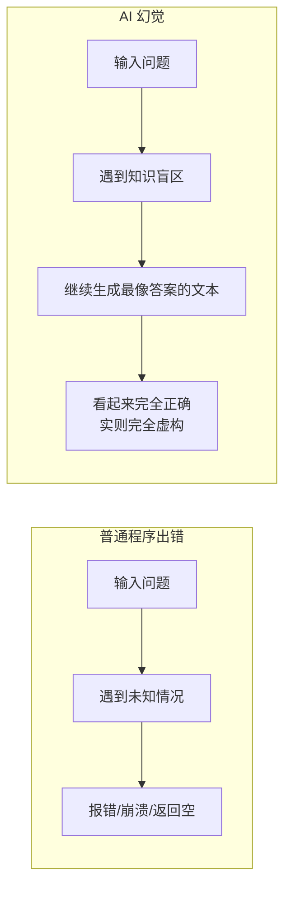
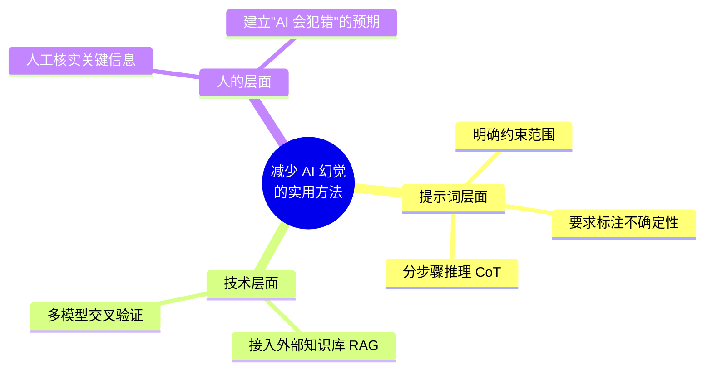

---
tags:
  - AI 基础
---

# 为什么模型会胡说

你有没有遇到过这种情况：问 AI 一个看起来很普通的问题，它回答得头头是道，甚至引用了论文、举了例子，但你一查发现——论文根本不存在，例子也是编的。

这不是你运气差，也不是模型专门针对你。这是大语言模型（Large Language Model，简称 LLM，中文叫「大语言模型」，指在海量文本上训练出来的、参数规模巨大的语言生成模型）的通病，业内叫它「AI 幻觉」（Hallucination，中文叫「幻觉」，指 AI 生成了形式上像真的、逻辑上似乎通顺，但实际上错误、虚构或不存在的内容）。

## AI 幻觉是什么

AI 幻觉是指 —— AI 生成了"形式上像真的、逻辑上似乎通顺，但实际上错误、虚构、失真或不存在"的内容。

这不仅仅是"回答错误"。普通程序出错的时候，要么崩溃，要么报错，要么返回空值，至少你能意识到"出问题了"。但大语言模型不一样：



AI 不会说"我不知道"，它会继续尝试生成一条看似逻辑正常的回答链条。可怕的是，这条链条往往看起来特别像真的——有数据、有引用、有专业术语、有因果关系。

## 为什么模型会"编"而不是"停"

要理解这一点，你得先明白 LLM 的本质。

**本质上，AI 并不知道什么是"事实"。**

现代大模型的核心机制是"超大规模的概率语言生成器"。当你输入：

```
现在的天气如何？
```

AI 并不会抬头看看窗外。它的工作方式是：根据你输入的这句话，在自己的训练数据里找到"最像正确答案"的文本模式，然后一个字一个字地"预测"出来。它生成的是"统计上最可能的回答"，而不是"经过验证的事实"。

打个比方：你让一个从没去过北京的人，根据他读过的所有书来描述北京今天的天气。他能说出"今天北京多云，气温 25 度"这样听起来很像真的话，但他其实一无所知，只是在拼凑他见过的文本模式。

**那为什么 AI 总是"宁可编，也不断"？**

这要从训练目标说起。模型在训练时被鼓励"生成连贯、有帮助的回答"。如果它总是说"我不知道"，从训练效果和用户体验上都会被打低分。所以模型学到的是：继续输出通常比停下来奖励更高。这就导致了一个结果——遇到不懂的，它不会停，而是会"补全"出一个看起来最合理的答案。

而且，因为模型学习的是"人类语言的统计结构"，它能精准掌握真实内容通常长什么样。一篇伪造的论文引用，会有正确的作者名格式、期刊名格式、年份；一段编造的代码，会有合理的函数名和参数结构。这种"形式上的高度仿真"，让幻觉很难一眼看穿。

## AI 幻觉最常见的几种类型

| 类型 | 具体表现 | 举个真实的例子 |
| --- | --- | --- |
| **事实幻觉** | 编造历史事件、人物经历、数据 | "2023 年诺贝尔物理学奖颁给了张三"——获奖者名字完全捏造 |
| **引用幻觉** | 凭空捏造论文、书籍、期刊，且格式逼真 | "根据《自然》杂志 2022 年一篇论文……"——这篇论文根本不存在 |
| **代码幻觉** | 编造 API、参数、函数名 | 给出一个看起来合理的 Python 函数，但调用的库不存在 |
| **推理幻觉** | 步骤看起来流畅，但中间偷换概念或逻辑断裂 | 数学证明中前几步都对，第四步悄悄改了条件，最后结论错误 |
| **记忆幻觉** | 虚构对话上下文，假装记住了你之前说过的话 | "你刚才说你是医生"——你从来没说过 |

其中**引用幻觉**尤其狡猾。因为学术论文的引用格式是高度结构化的，模型在训练数据里见过 millions of 引用，所以它编出来的引用往往"格式完全正确"，让你误以为内容也正确。

## 为什么你需要了解 AI 幻觉

你可能会想："我又不拿 AI 写论文，知道这些有什么用？"

用处大了。不了解幻觉，你会在不知不觉中被误导。

**第一，避免被假信息带偏。**

假设你让 AI 帮你查"某种保健品的副作用"，它编了几条看似专业的医学解释。你要是真信了，可能会影响健康决策。AI 的幻觉不是"回答得不太准"，而是"一本正经地胡说"，这种可信度反而更危险。

**第二，建立对 AI 的正确预期。**

很多人把 AI 当成"全知全能的搜索引擎"或"权威顾问"，这是个危险的心态。知道 AI 会幻觉，你才会在它回答关键问题时多留个心眼，而不是直接复制粘贴。

**第三，更安全地使用 AI。**

在工作中用 AI 辅助写邮件、改文案，幻觉可能只是小麻烦；但如果你用 AI 辅助医疗诊断、法律咨询、财务决策，幻觉的后果可能是灾难性的。了解边界，才能知道什么时候必须人工复核。

## 如何减少 AI 幻觉

幻觉无法 100% 消除，因为它是 LLM 概率生成机制的固有特性。但你可以通过以下方法大幅降低它的发生概率。

### 1. 给出更明确的提示词，约束范围

模型在开放域里最容易放飞自我。你把问题范围缩得越窄，它胡编的空间就越小。

❌ 模糊提问：
```
介绍一下量子计算
```

✅ 明确约束：
```
请基于 IBM 2024 年公开的技术白皮书，介绍量子计算在药物研发中的三个具体应用案例。如果你不确定信息来源，请明确说明。
```

### 2. 要求模型标注不确定性

你可以在提示词里直接加一条："如果你不确定某个信息，请标注出来，不要猜测。"

这不会完全消除幻觉，但至少能让模型在"编"的时候有所收敛，也方便你后续核查。

### 3. 分步骤推理（Chain of Thought，中文叫「思维链」，指让模型一步一步展示推理过程，而不是直接给结论）

直接要答案，模型可能跳步、漏条件、偷换概念。让它"一步一步想"，你能更容易发现哪里出了问题。

```
请一步一步解答这道数学题，并在每一步注明依据：
[题目]
```

这种技巧叫 Chain of Thought Prompting（思维链提示）。它的好处是：即使最终答案错了，你也能通过检查中间步骤发现错误在哪。

### 4. 接入外部知识库 / RAG

RAG 是 Retrieval-Augmented Generation（检索增强生成）的缩写，中文叫「检索增强生成」。它的做法是：不直接让模型凭记忆回答，而是先从一个可靠的知识库里检索相关资料，再把检索到的内容和你的问题一起喂给模型，让它基于这些资料来回答。


因为模型回答时"有凭有据"，幻觉会大幅减少。这也是现在很多企业 AI 应用的核心架构。

### 5. 人工核实关键信息

对于涉及健康、法律、财务、安全的重要信息，**永远要人工核实**。具体做法：

- 让 AI 提供信息来源
- 自己去原始出处验证
- 交叉比对多个可靠来源

### 6. 用多个模型交叉验证

同一个问题，扔给 ChatGPT、Claude、DeepSeek 等多个模型。如果它们的回答一致，可信度较高；如果差异很大，至少有一个在胡说，需要你自己查证。



## 对 AI 幻觉的常见误区

**误区 1：只有大语言模型会幻觉**

不是。图像 AI 也会"幻觉"——比如生成一张"猫有六根胡子但另一边只有两根"的图片；语音 AI 可能把没说过的话"识别"出来；自动驾驶的视觉系统可能把阴影误判为障碍物。只要基于概率和模式匹配的 AI 系统，都有产生幻觉的可能。

**误区 2：模型更新后，幻觉就会消失**

不会。新模型确实在减少幻觉方面做得更好，但幻觉是概率生成机制的固有特性，不是 bug。就像再聪明的"猜词游戏"玩家，也有猜错的时候。只要 LLM 还在用"预测下一个词"的方式工作，幻觉就不可能 100% 消除。

**误区 3：幻觉 = 模型坏了**

不是。幻觉不是模型"故障"，而是它的**工作方式的副作用**。模型被训练成"生成连贯、合理的文本"，它在认真执行这个任务——只是它无法区分"合理的虚构"和"真实的事实"。你可以把它理解为：模型太擅长"编故事"了，而这不是它故意的。

**误区 4：只要 prompt 写得好，就不会幻觉**

prompt 工程确实能大幅减少幻觉，但无法消除。再好的提示词，遇到模型训练数据里没有覆盖到的知识盲区，它依然可能编造。Prompt 是"减少风险"的手段，不是"杜绝风险"的保险。

## 练习题

下面这个提示词，非常容易产生幻觉。你可以在 ChatGPT、Claude 或 DeepSeek 里试一试，看看模型会怎么回答：

```
请详细介绍一下中国宋代科学家沈括在《梦溪笔谈》中记载的"石油制墨"技术的具体工艺流程，包括温度、配比和工具名称。要求引用原文。
```

**思考题：**

1. 模型给出的"原文引用"是真的吗？去搜索一下验证。
2. 如果模型给出了具体的"温度"和"配比"数字，这些数字有史料依据吗？
3. 试着修改上面的提示词，加入"如果不确定，请明确说明"，看看回答有什么不同？

> 💡 提示：《梦溪笔谈》确实提到了石油制墨，但沈括的记载非常简略。如果 AI 给出了一套详细的"工艺流程"，那大概率是在基于有限信息合理"脑补"。

## 延伸阅读

如果你想更深入地了解 AI 幻觉，可以去看：

- [如何评测 AI 幻觉](../eval/hallucination.md) —— 了解业界用什么指标和方法来检测、量化模型的幻觉问题
- [什么是 LLM](what-is-llm.md) —— 深入了解大语言模型的工作原理，理解为什么"预测下一个词"必然带来幻觉
- [RAG 入门](../rag/index.md) —— 学习如何通过检索增强生成，让 AI 基于可靠资料回答，而不是凭记忆瞎编
