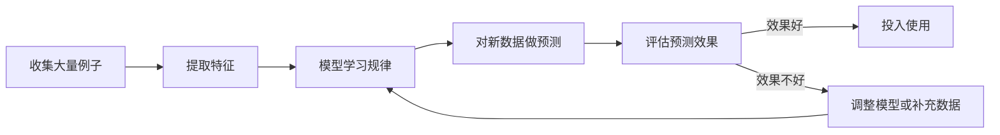
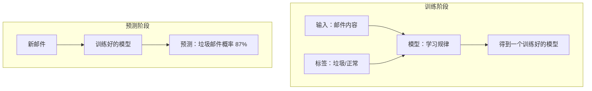
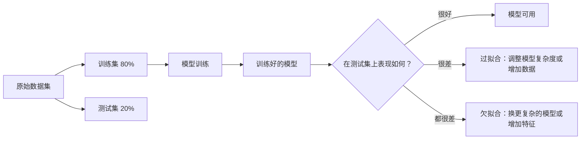

---
tags:
  - AI 基础
---

# 什么是机器学习

**机器学习（Machine Learning）就是让计算机从例子里找规律，而不是让人一条一条写规则。**

## 这章解决什么问题

你有没有想过，垃圾邮件过滤器是怎么工作的？

早期的方式很直接：程序员列出一堆关键词——"中奖""免费""点击链接"——如果邮件里出现了，就判为垃圾邮件。这种方法叫**规则系统**，简单、可控，但很容易被绕过去。骗子把"免费"写成"免.费"，规则就失效了。

那有没有更好的办法？

有。与其让人去琢磨骗子会用什么词，不如让计算机自己看几百万封邮件，自己总结"垃圾邮件长什么样"。这就是**机器学习（Machine Learning，ML）**——一类让计算机从数据中自动学习规律的技术。你不需要告诉它具体规则，你只需要给它足够多的例子，它自己会找规律。

这章帮你搞清楚：机器学习到底在做什么？它是怎么「学习」的？有哪些不同的学习方式？以及新手最容易踩的坑。

## 机器学习的核心思路

想象你要教一个从没见过猫的人识别猫。你不会给他念一本《猫学百科》，而是直接给他看成千上万张猫和狗的图片，告诉他"这是猫""这是狗"。看多了，他自己就能总结出规律：尖耳朵、圆脸、胡须、竖瞳孔的，大概率是猫。

机器学习就是这个逻辑。

整个过程可以拆成三步：

1. **准备数据**：收集大量例子，每个例子包含「输入」和「正确答案」。
2. **训练模型**：让算法在数据里找规律，得到一个能做题的「模型」。
3. **预测新数据**：把模型没见过的数据丢进去，看它猜得准不准。

这里有一个关键概念：**模型（Model）**不是实物，而是一个数学函数。你可以把它理解为一道复杂的公式，输入一张照片，输出"猫"或"狗"。训练的过程，就是在调这道公式里的参数，让它在已知数据上猜得越来越准。

## 三种学习方式

机器学习不是只有一种玩法。根据「有没有标准答案」，可以分成三大类。

### 监督学习：有人告诉你对错

**监督学习（Supervised Learning）**是最常见的一种。它的特点是：训练数据里既有问题，也有正确答案。模型像学生做题一样，对着答案改错，慢慢学会规律。

生活中到处都是监督学习的例子：

- 垃圾邮件过滤：给你 10 万封邮件，每封都标好了「垃圾」或「正常」。模型学会之后，能自动判断新邮件。
- 房价预测：给你几千套房的面积、地段、房龄和真实成交价。模型学会之后，输入一套新房的信息，能猜出大概值多少钱。
- 医疗诊断：给你几万张标了「良性/恶性」的肿瘤影像。模型学会之后，能帮医生辅助判断新片子。

监督学习里有两个词你会反复见到：

- **特征（Feature）**：用来判断的「线索」。在房价预测里，面积、地段、房龄就是特征。在邮件过滤里，发件人、关键词频率、有没有附件都是特征。
- **标签（Label）**：你要预测的「正确答案」。房价预测里，标签是真实成交价；邮件过滤里，标签是「垃圾」或「正常」。

### 无监督学习：没人告诉你答案，自己找规律

**无监督学习（Unsupervised Learning）**的情况是：只有数据，没有标签。模型需要自己琢磨这些数据里有没有隐藏的结构。

举个例子：你是电商平台的运营，手里有几百万用户的购买记录，但没有用户画像。你让模型自己去分群，它可能会发现：

- 一群人总爱买婴儿用品和绘本 → 大概是新手爸妈
- 一群人总买游戏设备和二次元周边 → 大概是年轻宅家人群
- 一群人买高端护肤品和健身卡 → 大概是注重品质的中产

这叫**聚类（Clustering）**，是无监督学习的典型应用。模型不知道这些群该叫什么，它只是把行为相似的人自动归到一起，命名的事交给人类。

另一种常见的无监督学习是**降维（Dimensionality Reduction）**。当你的数据有几百个特征时，模型帮你压缩成几个最关键的维度，让你能可视化和理解。

### 强化学习：在试错中学习

**强化学习（Reinforcement Learning）**的学习方式更像训练宠物。你没有标准答案，只有一个「环境」和一个「奖励机制」。模型（通常叫**智能体，Agent**）不断试错，做对了给奖励，做错了给惩罚，慢慢学会最优策略。

最经典的例子是 AlphaGo 下围棋。没人能告诉它"这一步是最好的一手"，但它每走一步，棋局都会变化。赢了，整条路径上的决策都得到奖励；输了，相关决策被削弱。经过几百万盘自我对弈，它找到了人类棋手都没想到的下法。

另一个身边的例子：短视频 App 的推荐算法。推荐了一条视频，你点赞了 → 这个推荐方向加分；你秒划走了 → 扣分。算法在无数次互动中，慢慢摸清你的口味。

| 学习方式 | 有没有标准答案 | 典型场景 |
| --- | --- | --- |
| 监督学习 | 有 | 垃圾邮件识别、房价预测、图像分类 |
| 无监督学习 | 没有 | 用户分群、异常检测、数据压缩 |
| 强化学习 | 延迟的奖励信号 | 游戏 AI、机器人控制、推荐系统 |

## 训练集、测试集与过拟合

机器学习里有一个经典的坑：**你在课本上背得滚瓜烂熟，不代表考试能考好。**

为了避免这个问题，数据通常被拆成两份：

- **训练集（Training Set）**：用来让模型学习的课本，通常占 70%~80%。
- **测试集（Test Set）**：用来检验模型真本事的考卷，模型在训练时绝对看不到。

如果模型在训练集上表现很好，但在测试集上表现很差，说明它可能**过拟合（Overfitting）**了——它把课本里的每道题都死记硬背了下来，包括噪声和特例，但没有真正理解规律。换个说法：它「学得太死」了。

反过来，如果模型在训练集和测试集上表现都很差，可能是**欠拟合（Underfitting）**——它「学得太浅」，连基本规律都没抓到。

打个比方：过拟合就像一个学生把模拟题的答案连标点符号都背下来了，但高考换了道题就不会；欠拟合就像学生只学了第一章，连基础概念都没掌握。

## 最小示例：手动体验一次「训练」

不用写代码，你可以用纸笔体验机器学习的核心逻辑。

**任务**：判断一条微博是不是带货广告。

**步骤**：

1. 收集 20 条微博，自己标注「广告」或「正常」。
2. 列出你能想到的特征，比如：
   - 有没有「点击链接」「限时抢购」这类词？
   - 有没有带商品图片？
   - 有没有 @ 多个账号？
   - 字数是不是特别多（为了塞关键词）？
3. 对着这 20 条，总结规律：同时具备「促销词 + 商品图 + 多 @」的，大概率是广告。
4. 拿 5 条没见过的微博来测试，看你的规律准不准。

这就是一次微型监督学习。你做的「列特征、找规律、验证」三件事，和真实机器学习项目的流程一模一样，只不过真实项目用算法代替了你的人脑总结。

## 常见误区

**误区 1：机器学习 = AI**

不对。机器学习是 AI 的一个重要分支，但不是全部。AI 还包括规则系统、知识图谱、进化算法、符号推理等路线。而且，机器学习内部也分很多种——前面讲的监督学习、无监督学习、强化学习，都只是其中一部分。把机器学习等同于 AI，就像把「电动汽车」等同于「交通工具」，忽略了燃油车、自行车、轮船的存在。

**误区 2：有数据就能训练出好模型**

数据只是原材料，质量比数量更重要。如果数据里有大量错误标注、样本严重不平衡（比如 99% 是正常邮件，1% 是垃圾邮件）、或者采集过程有偏差，模型学出来的就是歪的。业内有句话：**Garbage in, garbage out**（垃圾进，垃圾出）。你喂给模型什么质量的数据，它就产出什么质量的结果。

**误区 3：模型越复杂越好**

很多人以为，神经网络层数越多、参数越大，效果就越好。其实不然。模型太复杂容易过拟合，而且训练成本极高。选对模型复杂度是一门艺术——够用就好。有时候，一个简单到只有几行代码的决策树，效果比几百层的深度网络还好，尤其是在数据量不大的场景下。

**误区 4：机器学习是全自动的，不需要人参与**

恰恰相反。从数据清洗、特征选择、模型选型、调参到结果解释，每一步都需要人的判断。机器学习不是「把数据倒进去，好模型就自己冒出来」的魔法。它更像一个需要反复打磨的工具，人的经验和直觉在各个环节都不可或缺。

## 延伸阅读

- [什么是 AI](what-is-ai.md) —— 从更大的视角理解 AI、机器学习、深度学习的关系
- [什么是深度学习](deep-learning.md) —— 了解机器学习中最热门的一条技术路线

## 练习题 / 小实验

**思考题**：举一个你生活中的监督学习例子。明确说出：输入是什么？输出（标签）是什么？模型可能用到的特征有哪些？

> 💡 提示：可以是「预测明天会不会下雨」「判断一条评论是好评还是差评」「预测一首歌你会不会喜欢」等。试着用一句话描述清楚特征和标签。

**实验**：打开你手机上的某个 App（如音乐、视频、购物），观察它的推荐内容。想一想：它用的可能是监督学习、无监督学习，还是强化学习？它的「奖励信号」可能是什么？（比如：你点开了 = 奖励，划走了 = 惩罚）
