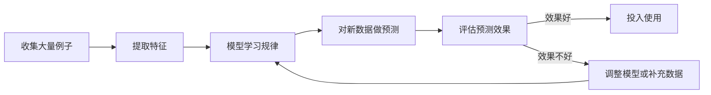
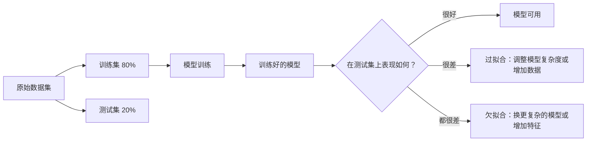

---
tags:
  - AI 基础
---

# 什么是机器学习

AI 基础 · 第 2 站

<strong>机器学习（Machine Learning）</strong>就是让计算机从例子里找规律，而人不用一条一条写规则。

<strong>输入</strong> 大量样本和线索

<strong>学习</strong> 从数据里找规律

<strong>输出</strong> 对新情况做预测

## 这章解决什么问题

你有没有想过，垃圾邮件过滤器是怎么工作的？

早期的方式很直接：程序员列出一堆关键词——"中奖""免费""点击链接"——如果邮件里出现了，就判为垃圾邮件。这种方法叫**规则系统**，简单、可控，但很容易被绕过去。骗子把"免费"写成"免.费"，规则就失效了。

那有没有更好的办法？

有。别让人去琢磨骗子会用什么词，直接让计算机自己看几百万封邮件，自己总结"垃圾邮件长什么样"。这就是**机器学习（Machine Learning，ML）**——一类让计算机从数据中自动学习规律的技术。你不需要告诉它具体规则，你只需要给它足够多的例子，它自己会找规律。

这章帮你搞清楚：机器学习到底在做什么？它是怎么「学习」的？有哪些不同的学习方式？以及新手最容易踩的坑。

<strong>1. 先看历史</strong> 从跳棋程序到 AlphaGo

<strong>2. 再看流程</strong> 数据、特征、训练、预测

<strong>3. 分清类型</strong> 监督、无监督、强化学习

<strong>4. 识别风险</strong> 过拟合、数据偏见、误用

## 机器学习发展里程碑：从跳棋到 AlphaGo

1959 年，IBM 的 **Arthur Samuel** 在一台 IBM 701 电脑上写了一个西洋跳棋程序。它没有明确的棋谱规则，只有一套评估函数——每次下完一盘棋，程序会根据输赢调整函数里的参数，下次走得更好。就这样，程序自己下了几万盘，最后打败了它的创造者。

Samuel 第一次给这种能力起了名字：**Machine Learning**——让计算机在没有明确编程的情况下自己学会。

从那之后，机器学习经历了几次起落：

```mermaid
flowchart LR
    A1959["1959<br/>Arthur Samuel<br/>跳棋程序<br/>机器学习诞生"]
    A1986["1986<br/>反向传播算法<br/>重新流行"]
    A1995["1995<br/>支持向量机 SVM<br/>统计学习时代"]
    A1998["1998<br/>LeNet-5<br/>手写数字识别<br/>准确率 99%"]
    A2006["2006<br/>Hinton 发表论文<br/>深度学习元年"]
    A2012["2012<br/>AlexNet 夺冠<br/>错误率 15.3%<br/>深度学习爆发"]
    A2016["2016<br/>AlphaGo 击败<br/>李世石"]
    A2017["2017<br/>Transformer<br/>提出"]
    A2020["2020<br/>GPT-3 发布<br/>1750 亿参数"]
    A2022["2022<br/>ChatGPT<br/>2 个月用户破亿"]
    A2024["2024<br/>o1 推理模型<br/>强化学习驱动"]

    A1959 --> A1986 --> A1995 --> A1998 --> A2006 --> A2012 --> A2016 --> A2017 --> A2020 --> A2022 --> A2024

    class A1959,A1986 wave1
    class A1995,A1998 wave2
    class A2006,A2012,A2016,A2017,A2020,A2022,A2024 wave3
    classDef wave1 fill:#fff3e0,stroke:#fb8c00,stroke-width:2px,color:#3e2723;
    classDef wave2 fill:#e3f2fd,stroke:#1e88e5,stroke-width:2px,color:#0d47a1;
    classDef wave3 fill:#fce4ec,stroke:#e91e63,stroke-width:2px,color:#880e4f;
    linkStyle default stroke:#9e9e9e,stroke-width:2px;
```

几个值得记住的关键节点：

| 年份 | 事件 | 为什么重要 |
|------|------|-----------|
| 1959 | Arthur Samuel 跳棋程序 | 首次让机器通过自我对弈学习，"Machine Learning"一词诞生 |
| 1986 | 反向传播算法（Backpropagation） | Hinton 等人重新推广，解决了多层神经网络的训练难题，为深度学习奠定基础 |
| 1995 | 支持向量机（SVM） | Vapnik 在 AT&T 贝尔实验室提出，基于统计学习理论，成为 90 年代最流行的算法之一 |
| 1998 | LeNet-5 卷积神经网络 | Yann LeCun 开发的手写数字识别系统，准确率达 99.05%，是第一个真正商用的 CNN |
| 2006 | Hinton 深度信念网络 | 在《Science》发表论文，提出逐层预训练方法，**深度学习时代正式开启** |
| 2012 | AlexNet 夺冠 ImageNet | 多伦多大学团队用 8 层 CNN 把错误率从 26% 压到 15.3%，引爆工业界投入 |
| 2016 | AlphaGo 击败李世石 | 围棋被公认是 AI 最难攻克的棋类，AlphaGo 用深度学习 + 强化学习攻破了这个"人类最后的堡垒"，全球 3 亿人观看 |
| 2020 | GPT-3 发布 | 1750 亿参数，few-shot learning，**大模型时代元年** |
| 2022 | ChatGPT 发布 | 2 个月月活破亿，AI 从学术圈正式走向大众，**AI 平民化元年** |
| 2024 | o1 / o3 推理模型 | 用强化学习驱动"慢思考"，在数学竞赛和代码调试上接近人类专家水平 |

<strong>规律：</strong>每次爆发都是算法突破（能训练更深）+ 数据增多（互联网产生海量数据）+ 算力提升（GPU/TPU）的共振结果。

## 机器学习的核心思路

想象你要教一个从没见过猫的人识别猫。你不会给他念一本《猫学百科》，而是给他看成千上万张猫和狗的图片，告诉他"这是猫""这是狗"。看多了，他自己就能总结出规律。

机器学习就是这个逻辑。

整个过程可以拆成三步：

1 
<strong>准备数据</strong> 收集大量例子，每个例子包含「输入」和「正确答案」。

2 
<strong>训练模型</strong> 让算法在数据里找规律，得到一个能做题的「模型」。

3 
<strong>预测新数据</strong> 把模型没见过的数据丢进去，看它猜得准不准。

这里有一个关键概念：**模型（Model）**其实是一道数学函数。你把它理解成一道复杂的公式，输入一张照片，输出"猫"或"狗"。训练的过程，就是在调这道公式里的参数，让它在已知数据上猜得越来越准。

## 机器学习就在你身边：真实案例

和 AI 一样，机器学习已经渗透到日常生活的方方面面。下面六类任务，每一类都能在日常产品里找到：

| 机器学习任务 | 你可能在用的产品 | 背后的技术 |
|---------|----------------|-----------|
| **识别分类** | 手机人脸解锁、支付宝刷脸支付 | 计算机视觉 + CNN（卷积神经网络） |
| **垃圾邮件识别** | Gmail / QQ 邮箱自动过滤 | 文本分类（朴素贝叶斯、逻辑回归） |
| **房价预测** | 贝壳 / 链家给出房屋估价区间 | 回归模型（随机森林、XGBoost） |
| **用户分群** | 淘宝 / 京东给用户打标签分组 | 聚类（K-Means） |
| **推荐系统** | 抖音推荐、B 站首页、网易云音乐 | 协同过滤 + 深度推荐模型 |
| **异常检测** | 银行信用卡欺诈预警、工厂设备故障预警 | 孤立森林、自编码器 |

你不需要记住这些技术名词——后面会逐个展开。现在只要意识到：机器学习已经是你每天在用的东西。

## 三种学习方式

机器学习不是只有一种玩法。根据「有没有标准答案」，可以分成三大类。

<strong>监督学习</strong> 有标准答案 垃圾邮件、房价预测、图像分类

<strong>无监督学习</strong> 没有标签 用户分群、异常检测、数据压缩

<strong>强化学习</strong> 试错奖励 游戏 AI、机器人控制、推荐系统

### 监督学习：有人告诉你对错

**监督学习（Supervised Learning）**是最常见的一种。它的特点是：训练数据里既有问题，也有正确答案。模型像学生做题一样，对着答案改错，慢慢学会规律。

生活中到处都是监督学习的例子：

- 垃圾邮件过滤：给你 10 万封邮件，每封都标好了「垃圾」或「正常」。模型学会之后，能自动判断新邮件。
- 房价预测：给你几千套房的面积、地段、房龄和真实成交价。模型学会之后，输入一套新房的信息，能猜出大概值多少钱。
- 医疗诊断：给你几万张标了「良性/恶性」的肿瘤影像。模型学会之后，能帮医生辅助判断新片子。

监督学习里有两个词你会反复见到：

<strong>特征（Feature）</strong> 用来判断的「线索」。在房价预测里，面积、地段、房龄就是特征。在邮件过滤里，发件人、关键词频率、有没有附件都是特征。

<strong>标签（Label）</strong> 你要预测的「正确答案」。房价预测里，标签是真实成交价；邮件过滤里，标签是「垃圾」或「正常」。

监督学习内部又分两大家族：

<strong>分类（Classification）</strong> 输出是类别。比如判断邮件是「垃圾」还是「正常」，判断肿瘤是「良性」还是「恶性」。

<strong>回归（Regression）</strong> 输出是连续数值。比如预测房价是 500 万还是 800 万，预测明天气温是 22°C 还是 35°C。

### 无监督学习：没人告诉你答案，自己找规律

**无监督学习（Unsupervised Learning）**的情况是：只有数据，没有标签。模型需要自己琢磨这些数据里有没有隐藏的结构。

举个例子：你是电商平台的运营，手里有几百万用户的购买记录，但没有用户画像。你让模型自己去分群，它可能会发现：

总爱买婴儿用品和绘本 <strong>大概是新手爸妈</strong>

总买游戏设备和二次元周边 <strong>大概是年轻宅家人群</strong>

买高端护肤品和健身卡 <strong>大概是注重品质的中产</strong>

这叫**聚类（Clustering）**，是无监督学习的典型应用。模型不知道这些群该叫什么，它只是把行为相似的人自动归到一起，命名的事交给人类。

另一种常见的无监督学习是**降维（Dimensionality Reduction）**。当你的数据有几百个特征时，模型帮你压缩成几个最关键的维度，让你能可视化和理解。

### 强化学习：在试错中学习

强化学习（Reinforcement Learning）的学习方式就像训练宠物。你没有标准答案，只有一个「环境」和一个「奖励机制」。模型（通常叫**智能体，Agent**）不断试错，做对了给奖励，做错了给惩罚，慢慢学会最优策略。

最经典的例子是 AlphaGo 下围棋。没人能告诉它"这一步是最好的一手"，但它每走一步，棋局都会变化。赢了，整条路径上的决策都得到奖励；输了，相关决策被削弱。经过几百万盘自我对弈，它找到了人类棋手都没想到的下法。

另一个身边的例子：短视频 App 的推荐算法。推荐了一条视频，你点赞了 → 这个推荐方向加分；你秒划走了 → 扣分。算法在无数次互动中，慢慢摸清你的口味。

| 学习方式 | 有没有标准答案 | 典型场景 |
| --- | --- | --- |
| 监督学习 | 有 | 垃圾邮件识别、房价预测、图像分类 |
| 无监督学习 | 没有 | 用户分群、异常检测、数据压缩 |
| 强化学习 | 延迟的奖励信号 | 游戏 AI、机器人控制、推荐系统 |

## 训练集、测试集与过拟合

机器学习里有一个经典的坑：**你在课本上背得滚瓜烂熟，不代表考试能考好。**

为了避免这个问题，数据通常被拆成两份：

<strong>训练集（Training Set）</strong> 用来让模型学习的课本，通常占 70%~80%。

<strong>测试集（Test Set）</strong> 用来检验模型真本事的考卷，模型在训练时绝对看不到。

如果模型在训练集上表现很好，但在测试集上表现很差，说明它可能**过拟合（Overfitting）**了——它把课本里的每道题都死记硬背了下来，包括噪声和特例，但没有真正理解规律。换个说法：它「学得太死」了。

反过来，如果模型在训练集和测试集上表现都很差，可能是**欠拟合（Underfitting）**——它「学得太浅」，连基本规律都没抓到。

打个比方：过拟合就像一个学生把模拟题的答案连标点符号都背下来了，但高考换了道题就不会；欠拟合就像学生只学了第一章，连基础概念都没掌握。

> **图**：三类数据集拟合状态——欠拟合（未捕捉规律）、良好拟合（刚好学到本质）、过拟合（记住了噪声）。

## 算法偏见：一个真实的危险

机器学习不只有关于模型的美好，它还有黑暗的一面：**算法会把人类的偏见学进去，然后规模化地放大**。

一个广为人知的例子是 **COMPAS 犯罪风险评估系统**。

在美国司法体系里，法官在量刑前会用 COMPAS 给嫌疑人打一个"再犯风险分"（1~10 分），用来辅助判断要不要保释、要不要判缓刑。

2016 年，调查媒体 **ProPublica** 拿到了这个系统的数据，做了一次独立分析。他们把 COMPAS 的预测和真实结果做了对比，发现了令人不安的数字：

<strong>高风险标记</strong> 近 2 倍 黑人被告被标记为「高风险」的比例接近白人被告两倍。

<strong>真实再犯率</strong> 51% vs 37% 同样被标为高风险后，黑人被告真实再犯率为 51%，白人被告为 37%。

<strong>误报问题</strong> 明显更高 COMPAS 对黑人的误报率更高：更容易把低风险的人标成高风险。

问题出在哪里？COMPAS 用了包括「年龄、犯罪史、教育水平、居住社区」这些变量来预测再犯风险。这些变量本身看起来和"种族"无关——但它们和美国社会中的结构性种族歧视高度相关。贫困社区的警力更密集，居民更容易被逮捕；低收入意味着犯罪记录更难洗清；教育水平低是因为教育资源分配不均。

**模型没有直接看种族，但种族信息已经藏在它看得到的数据里了。**

这就是机器学习里最危险的偏见陷阱：删掉明显的敏感字段没用，深层的偏见早就渗透在其他变量里了。开发人员希望这些系统能够提供客观的、基于数据的司法结果，但是这些算法通常依赖的是存在缺陷的、历史性的数据——这些数据里，带着过去几十年甚至更久的结构性歧视。

<strong>核心教训：</strong>机器学习模型不是客观的——它忠实地反映了训练数据里的世界。如果这个世界本身是不公平的，模型就会把不公平当成规律来学。

## 动手试试：在线体验机器学习

光看概念不如上手试一试。以下是几个免费的在线体验，不需要安装任何软件，打开浏览器就能玩：

??? example "🎯 Teachable Machine —— 训练你自己的图像分类模型"

    **地址**：[teachablemachine.withgoogle.com](https://teachablemachine.withgoogle.com/)
    
    用摄像头拍几张照片作为「类别 A」，再拍几张作为「类别 B」，几秒钟就能训练出一个能区分它们的 AI。
    
    **背后的技术**：迁移学习（Transfer Learning）。AI 已经在海量图片上预训练过，你只需要提供少量样本就能让它识别新类别。
    
    **试试看**：分别拍「举手」和「不举手」两组照片，然后用举手来控制网页播放/暂停。体会一下「少量数据就能训练」是什么感觉。

??? example "📊 TensorFlow Playground —— 可视化神经网络如何学习"

    **地址**：[playground.tensorflow.org](https://playground.tensorflow.org/)
    
    在网页上直接调整神经网络的层数、神经元数量、激活函数，然后点击播放，看模型如何一步步学会分类数据点。
    
    **背后的技术**：前馈神经网络 + 反向传播。
    
    **试试看**：先把隐藏层从 2 层改成 6 层，观察训练速度和效果的变化。这就是「模型越深越强，但也越容易过拟合」的直观感受。

??? example "🏠 Kaggle 房价预测竞赛 —— 真实数据集练手"

    **地址**：[kaggle.com/competitions/house-prices-advanced-regression-techniques](https://www.kaggle.com/competitions/house-prices-advanced-regression-techniques)
    
    这是 Kaggle 上最适合新手的竞赛之一。你会拿到一套房价数据（面积、地段、房间数等），目标是预测成交价。
    
    **试试看**：不用急着写代码。先打开数据文件看看有哪些列，试着凭直觉判断哪个特征对价格影响最大。

??? example "🔍 Quick, Draw! —— 让 AI 猜你画什么"

    **地址**：[quickdraw.withgoogle.com](https://quickdraw.withgoogle.com/)
    
    你有 20 秒时间画一个物体（猫、自行车、杯子……），AI 会实时猜你画的是什么。
    
    **背后的技术**：神经网络图像识别。AI 从数百万张简笔画中学会了「猫大概长什么样」的模式。
    
    **试试看**：故意画得潦草一点，观察 AI 还能不能认出来。想想：为什么 AI 猜得比普通人还准？

## 最小示例：手动体验一次「训练」

不用写代码，你可以用纸笔体验机器学习的核心逻辑。

<strong>任务：</strong>判断一条微博是不是带货广告。

**步骤**：

1. 收集 20 条微博，自己标注「广告」或「正常」。
2. 列出你能想到的特征，比如：
   - 有没有「点击链接」「限时抢购」这类词？
   - 有没有带商品图片？
   - 有没有 @ 多个账号？
   - 字数是不是特别多（为了塞关键词）？
3. 对着这 20 条，总结规律：同时具备「促销词 + 商品图 + 多 @」的，大概率是广告。
4. 拿 5 条没见过的微博来测试，看你的规律准不准。

这就是一次微型监督学习。你做的「列特征、找规律、验证」三件事，和真实机器学习项目的流程一模一样，只不过真实项目用算法代替了你的人脑总结。

## 常见误区

<strong>误区 1：机器学习 = AI</strong> 不对。机器学习是 AI 的一个重要分支，但不是全部。AI 还包括规则系统、知识图谱、进化算法、符号推理等路线。

<strong>误区 2：有数据就能训练出好模型</strong> 数据只是原材料，质量比数量更重要。错误标注、样本不平衡、采集偏差都会把模型带歪。

<strong>误区 3：模型越复杂越好</strong> 模型太复杂容易过拟合，而且训练成本极高。数据量不大的场景里，简单模型经常更稳。

<strong>误区 4：机器学习全自动</strong> 从数据清洗、特征选择、模型选型、调参到结果解释，每一步都需要人的判断。

## 这章学完之后，你应该能做什么

读完这一章，先做到这几件事就够了：

-   **说清机器学习是什么**

    能用一句话解释清楚：机器学习就是让计算机从大量例子中自动找规律，人不用一条一条写规则。

-   **区分三种学习方式**

    能分清监督学习（有标签）、无监督学习（无标签）、强化学习（试错奖励）的核心区别，并各举一个生活例子。

-   **理解过拟合是什么**

    能用学生考试的比喻解释过拟合和欠拟合的区别，并知道增加数据或调整模型复杂度是常见的应对方法。

-   **意识到算法偏见的存在**

    知道机器学习模型不是客观的——它忠实地反映了训练数据里的世界，如果这个世界本身有偏见，模型会把偏见规模化放大。

## 练习题 / 小实验

??? question "练习 1：概念分类"

    以下哪些是监督学习，哪些是无监督学习，哪些是强化学习？为什么？
    
    - (a) 给你一堆新闻文章，按「科技 / 财经 / 娱乐」分类——但分类标签是你自己定的
    - (b) 推荐系统根据你点了哪个视频，来调整下一次给你推什么
    - (c) 教孩子认识猫和狗，拿着一堆标好的照片给他看
    - (d) 淘宝把用户按购买行为自动分组，每组人特点相似但没有预设标签
    
    ??? done "参考思路"
    
        - (a) 监督学习——有标签（科技/财经/娱乐是人为设定的标准答案），模型按标签分类
        - (b) 强化学习——有点击行为构成奖励信号（点了 = 正反馈，没点 = 负反馈），系统根据反馈调整策略
        - (c) 监督学习——有标准答案的照片（这是猫/这是狗），模型对照答案学习
        - (d) 无监督学习——没有预设标签，模型自动发现数据中的相似性并聚类

??? question "练习 2：特征与标签识别"

    假设你要训练一个模型来预测「一个学生会不会挂科」。
    
    - (a) 哪些信息可以作为「特征」？
    - (b) 「标签」是什么？
    - (c) 如果你发现训练数据里「女生都标注为不会挂科」，模型可能会学到什么偏见？
    
    ??? done "参考思路"
    
        - (a) 特征可以是：过去几学期的平均绩点、出勤率、作业提交率、每天学习时长、考试前复习次数等
        - (b) 标签是：期末考试是否挂科（挂 / 没挂，二分类）
        - (c) 模型可能学到「性别影响挂科概率」的虚假规律。原因：训练数据里性别和挂科记录相关（可能是历史数据中女生的平均成绩确实更好），但这种相关性不等于因果关系。如果真实原因（比如学习方法、家庭支持）才是关键，模型就会学到错误的方向。修正方法：检查训练数据中性别和标签的相关性，确保数据采集过程没有系统性偏差。

??? question "练习 3：过拟合识别"

    你训练了一个房价预测模型，在训练集上的误差是 2 万元，但在测试集上的误差是 18 万元。
    
    - (a) 这最可能是过拟合还是欠拟合？
    - (b) 如果是过拟合，可能的原因是什么？
    - (c) 你会怎么修复？
    
    ??? done "参考思路"
    
        - (a) 过拟合。训练误差极低但测试误差极高，说明模型在训练集上学得太好了——好到把训练集里的噪声也记住了。
        - (b) 可能的原因：模型太复杂（比如用了十几层神经网络来预测一个简单问题）；训练数据太少；训练迭代次数过多，模型在训练集上"反复刷题直到记住答案"。
        - (c) 常见修复方向：减少模型复杂度（降低层数或参数）；增加训练数据量或做数据增强；加入正则化（限制模型的自由参数）；提前停止训练（监控验证集误差，在它开始上升前停止）；用更多验证集监控训练过程。

??? question "练习 4：动手实验"

    打开 [Teachable Machine](https://teachablemachine.withgoogle.com/)，完成以下任务：
    
    1. 用摄像头拍两组照片：「向左看」「向右看」，每组各 20 张，训练模型
    2. 测试：用不同角度、不同光线重新测试，看模型还能不能认出来
    3. 思考：模型在什么情况下开始失效了？
    
    ??? done "参考思路"
    
        正常光线下拍摄 → 训练 → 正常测试 → 基本都能识别。但如果换到训练时没覆盖到的条件测试，比如光线变暗、背景变复杂、换了个人的脸——准确率会明显下降。模型学到的是特定拍摄条件下的规律，不是「向左看」和「向右看」的本质规律。这就是过拟合的直观体验，模型在训练集上表现好，换了新场景就失效。

## 延伸阅读

<a href="what-is-ai.md" style="display:block;padding:0.95rem 1rem;border-radius:0.8rem;background:var(--md-default-bg-color);text-decoration:none;border:1px solid var(--md-default-fg-color--lightest);">
<strong>什么是 AI</strong> 从更大的视角理解 AI、机器学习、深度学习的关系。
</a>
<a href="deep-learning.md" style="display:block;padding:0.95rem 1rem;border-radius:0.8rem;background:var(--md-default-bg-color);text-decoration:none;border:1px solid var(--md-default-fg-color--lightest);">
<strong>什么是深度学习</strong> 了解机器学习中最热门的一条技术路线。
</a>
<a href="https://developers.google.com/machine-learning/crash-course/" style="display:block;padding:0.95rem 1rem;border-radius:0.8rem;background:var(--md-default-bg-color);text-decoration:none;border:1px solid var(--md-default-fg-color--lightest);">
<strong>Google 机器学习速成课程</strong> 谷歌出品的免费入门课，含交互式练习和可视化。
</a>
<a href="https://www.kaggle.com/learn/intro-to-machine-learning" style="display:block;padding:0.95rem 1rem;border-radius:0.8rem;background:var(--md-default-bg-color);text-decoration:none;border:1px solid var(--md-default-fg-color--lightest);">
<strong>Kaggle 官方入门教程</strong> 从真实数据集出发，带你一步步完成房价预测竞赛。
</a>

## 下一步

分清了机器学习的概念之后，下一站建议看：

<a href="deep-learning.md" style="display:block;margin-top:0.75rem;padding:0.85rem 1rem;border-radius:0.65rem;background:var(--md-default-bg-color);text-decoration:none;border:1px solid var(--md-default-fg-color--lightest);">
  <strong>深度学习 →</strong> 
  了解机器学习中最热门的一条技术路线——用多层神经网络处理复杂任务。
</a>

