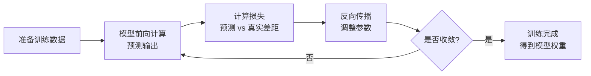
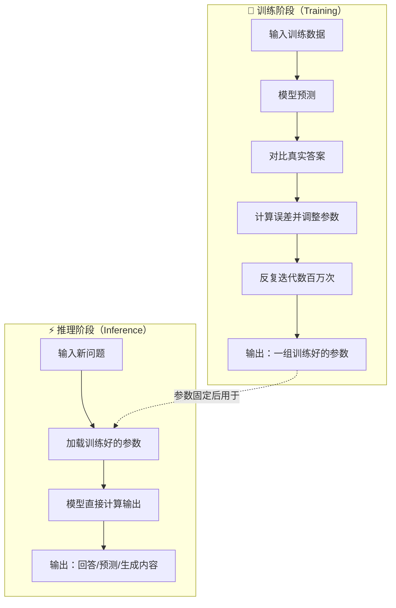

---
tags:
  - AI 基础
---

# 模型、数据、训练与推理

如果你只想用一个结论，那这句话就够了：**模型是函数，数据是教材，训练是刷题改错，推理是考试答题。**

这四个概念贯穿了 AI 的整条技术链路。理解它们，你就能看懂新闻里说的「某模型参数量突破万亿」「某产品基于某某模型微调」到底是什么意思，也能避免被营销话术忽悠。

## 为什么需要搞清楚这些

很多人第一次接触 AI，直接跳到了「怎么提问」「怎么写 Prompt」。这没问题，但很快就会遇到困惑：

- 为什么同一个问题，不同产品的回答质量差很多？
- 为什么有的模型「更聪明」，有的却「更笨」？
- 为什么公司宣传里总说「基于某某模型微调」，微调到底是什么？
- 训练一次要花几千万美元，钱到底花在哪了？

这些问题的答案，都藏在模型、数据、训练、推理这四个概念里。

## 模型（Model）：一个超级复杂的数学函数

**模型（Model）**本质上是一个数学函数：输入一些东西，输出一些东西。

你可以把它想象成一个黑盒子：

```
输入：一张猫的图片 → [模型] → 输出：这是猫，置信度 99%
输入：一段中文句子 → [模型] → 输出：对应的英文翻译
输入：「今天天气怎么样」→ [模型] → 输出：「今天晴，气温 25 度」
```

这个函数不是人写出来的。没有人一行一行地敲代码告诉模型「如果看到尖耳朵和胡须，就是猫」。模型的内部结构是一个巨大的神经网络（Neural Network），由成亿上千亿的参数（Parameter）组成。每个参数就像一个可以调节的旋钮，所有旋钮的组合决定了模型的行为。

参数的数量级决定了模型的「容量」。打个比方：

- 一个 10 亿参数的模型，像一个小笔记本，能记一些基本规律。
- 一个 700 亿参数的模型（如 LLaMA 3 70B），像一个大书架，能装下更多领域的知识。
- 一个 6,710 亿参数的模型（如 DeepSeek-V3），像一座图书馆，能处理更复杂的关联和推理。

但记住：**容量大不等于学得好**。一个空的大图书馆，如果没有书（数据），也没有读者整理（训练），就只是个空壳。

## 数据（Data）：训练原料，质量决定上限

**数据（Data）**是模型学习的原材料。没有数据，模型就是一个空壳函数，什么都做不了。

数据的形式多种多样：

| 数据类型 | 例子 |
| --- | --- |
| 文本 | 维基百科、书籍、网页、论文、代码 |
| 图片 | ImageNet、自主采集的照片、医学影像 |
| 音频 | 语音录音、音乐、环境音 |
| 结构化数据 | 表格、数据库、用户行为日志 |
| 标注数据 | 「这张图片是猫」——人工打好的标签 |

对于 LLM 来说，训练数据主要是**文本**。这些文本被切成一个个词元（Token），然后喂给模型学习。比如 DeepSeek-V3 的训练数据量是 14.8 万亿词元，LLaMA 3 是 15 万亿词元。如果把一个词元 roughly 对应为一个汉字，这相当于读了数千万本书。

但这里有一个关键点：**数据质量比数据数量更重要**。

垃圾数据喂得越多，模型学得越偏。想象一下：如果一个学生刷的题库里有一半是错题，他越努力刷题，错得越离谱。现实中，低质量网页、重复内容、错误信息、偏见言论，都会成为训练数据里的「毒药」。

这也是为什么各个 AI 实验室都在数据清洗上投入大量人力——**数据的门槛，往往比模型的门槛更高**。

## 训练（Training）：不断调旋钮，让输出更接近预期

**训练（Training）**就是调整模型内部参数的过程。

想象模型有 billions 个旋钮，一开始这些旋钮都是随机设置的。你给它输入「今天天气」，它可能输出「香蕉苹果」。显然不对。训练的过程就是：告诉它「错了，应该是别的答案」，然后微调那些旋钮，让下次输出更接近正确答案。

具体来说，训练分为几个关键步骤：



1. **前向计算**：把数据输入模型，得到预测结果。
2. **计算损失（Loss）**：衡量预测结果和真实答案的差距。差距越大，损失越高。
3. **反向传播（Backpropagation）**：根据损失，计算每个参数该往哪个方向调、调多少。
4. **参数更新**：调整旋钮。
5. **循环往复**：一遍又一遍，直到损失降到足够低，或者不再明显改进。

这个过程需要消耗巨大的计算资源。DeepSeek-V3 的训练花了约 278.8 万 H800 GPU 小时，按市价折合数百甚至上千万美元。这也是为什么大模型训练被称为「烧卡」—— literally 在烧显卡、烧电费。

## 推理（Inference）：训练好的模型出来干活

**推理（Inference）**也叫预测或生成，是模型训练完成后真正「干活」的阶段。

训练时，模型在反复学习；推理时，模型已经「毕业」了，你给它新输入，它直接给出输出。比如你打开 ChatGPT 输入问题，这个过程中发生的计算就是推理。

训练和推理的区别可以用一张图直观对比：



关键区别：

| 维度 | 训练 | 推理 |
| --- | --- | --- |
| 目标 | 学习规律，调整参数 | 使用已学规律，生成结果 |
| 参数变化 | 持续更新 | 固定不变 |
| 计算量 | 极大（需要集群训练数周） | 相对较小（单卡或少量卡即可） |
| 成本 | 一次性高投入 | 按使用量持续支出 |
| 举例 | 用海量文本教会模型说中文 | 用户输入问题，模型生成回答 |

训练是一次性的「上学」，推理是日复一日的「上班」。

## 最小示例：教小孩认狗

用一个生活化的例子串起这四个概念：

假设你要教一个从来没见过狗的小孩认识什么是狗。

- **模型**：小孩的大脑——有学习的能力，但一开始什么都不知道。
- **数据**：你找来的一千张动物照片，其中 300 张是狗，200 张是猫，500 张是其他动物。每张照片你都标注了「这是狗」或「这不是狗」。
- **训练**：你一张张给小孩看照片。看到狗时你点头，看到猫时你摇头。小孩开始总结规律：有四条腿、毛茸茸、吐舌头、摇尾巴的，大概率是狗。每次猜错，你就纠正他，他下次就调整判断标准。
- **推理**：训练结束后，你带小孩去公园。远处跑来一只他从来没见过的金毛犬，他看了一眼说：「这是狗！」——这就是推理，用学到的规律处理没见过的新情况。

这个例子还隐藏了一个重要道理：**如果训练数据有问题，推理结果就会出错**。比如你的一千张照片里，所有狗都是棕色的，没有黑狗和白狗。那小孩学到规律可能是「狗都是棕色的」，下次看到黑狗就可能不认识。这就是**数据偏见**导致的模型偏见。

## 预训练（Pre-training）与微调（Fine-tuning）

在实际工程中，训练通常分两个阶段。

**预训练（Pre-training）**像是**通识教育**。模型在海量的通用数据上学习，掌握语言的基本规律、世界的常识、各个领域的皮毛知识。预训练出来的模型叫基座模型（Base Model），它什么都能聊一点，但不够专精，也可能说话太生硬、不够安全。

**微调（Fine-tuning）**像是**专业培训**。拿预训练好的基座模型，用特定领域的高质量数据再训练一轮，让它在特定任务上表现更好。

打个比方：

- 预训练 = 读完九年义务教育，语文数学英语都懂一点。
- 微调 = 之后去医学院读五年，专门变成医生；或者去法学院读三年，专门变成律师。

同一个基座模型，经过不同的微调，可以变成完全不同的产品：

- 有的微调让它更擅长写代码（如 GitHub Copilot 的底层）
- 有的微调让它更擅长医学问答（如某些医疗 AI 助手）
- 有的微调让它说话更安全、更礼貌（如 ChatGPT 的对话风格）

这也解释了为什么市面上有很多产品都说「基于 GPT-4」或「基于 LLaMA」——它们用的是同一个「义务教育毕业生」，但后续「专业培训」的方向不同，出来的能力也不同。

## 常见误区

**误区 1：模型越大越好**

不完全是。参数量只是上限，不是保证。一个训练粗糙的千亿模型，可能不如一个训练精良的百亿模型。而且模型越大，推理成本越高、响应越慢。实际选型时，要在能力、速度、成本之间找平衡。

**误区 2：训练数据越多越好**

数量重要，但质量更重要。10 万亿高质量 token 的效果，可能远好于 100 万亿低质量 token。重复内容、错误信息、偏见数据，都会污染模型。数据清洗（Data Cleaning）是 AI 工程里最关键也最耗时的环节之一。

**误区 3：训练一次就永远对**

模型的知识截止到训练完成那一刻。之后世界发生变化、出现新概念、产生新词汇，模型是不知道的。所以需要定期重新训练，或者在推理时给它补充最新信息（这就是 RAG 和实时搜索的价值）。

**误区 4：训练和推理是一回事**

训练是在「学习」，推理是在「应用」。训练消耗巨大算力，推理消耗相对较小。很多公司自己不做训练，只买别人训练好的模型来做推理——这在商业上叫「模型即服务」（Model-as-a-Service）。

**误区 5：微调能解决一切问题**

微调只能在基座模型的能力范围内做优化。如果基座模型本身数学能力很弱，你再怎么微调，也很难让它变成数学天才。微调是「锦上添花」，不是「点石成金」。

## 延伸阅读

- [什么是 LLM](what-is-llm.md) —— 了解大语言模型的具体能力和边界
- [深度学习基础](deep-learning.md) —— 深入神经网络的工作原理
- [搭建你的第一个 AI 应用](../build/index.md) —— 把模型、训练、推理的概念转化为实际动手操作

## 练习题

1. 思考：为什么同样是基于开源的 LLaMA 模型，不同公司微调出来的聊天机器人，有的说话很机械，有的却很自然？微调数据和方法的差异会如何影响最终产品？
2. 观察：打开你常用的 AI 对话产品，问它一个训练截止日期之后的新闻事件。注意它是直接答错、坦诚说不知道，还是试图编造。这体现了「训练数据截止时间」对推理的直接影响。
3. 类比：用「学开车」的比喻重新解释模型、数据、训练、推理四个概念。训练数据对应什么？训练过程对应什么？推理过程对应什么？
