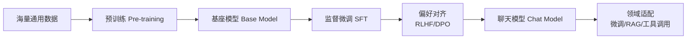
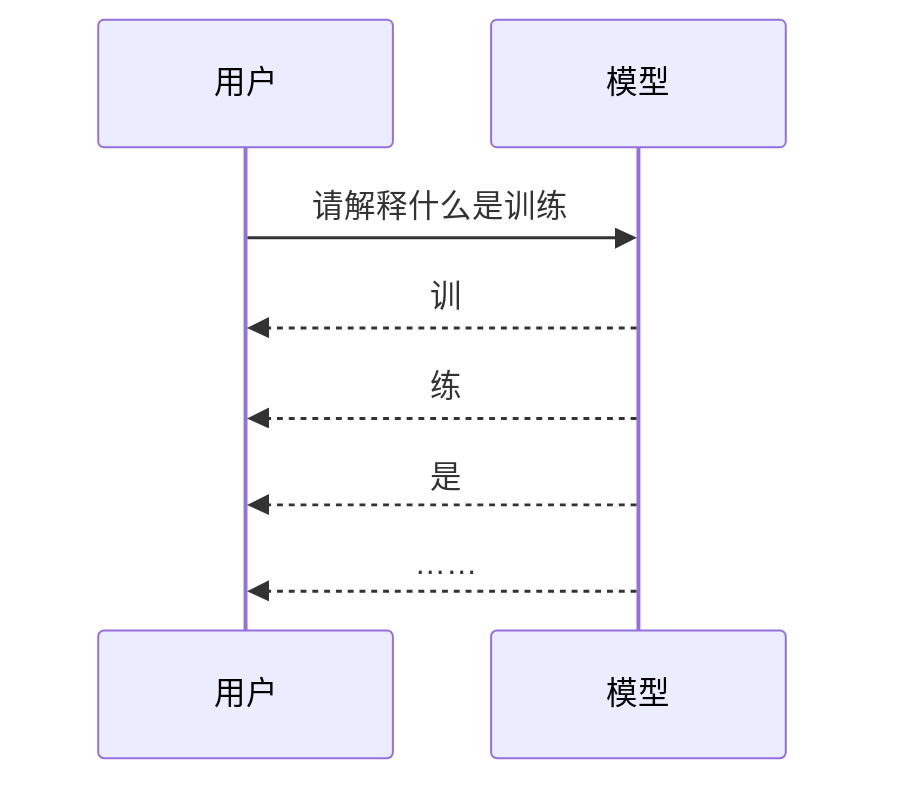
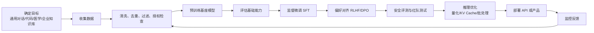

---
tags:
  - AI 基础
---

# 模型、数据、训练与推理

<div markdown="1" style="position:relative;overflow:hidden;border:1px solid rgba(255,112,67,0.28);border-radius:1rem;padding:1.25rem 1.35rem;margin:0.8rem 0 1.5rem;background:linear-gradient(135deg,rgba(255,112,67,0.14),rgba(63,81,181,0.08) 46%,rgba(0,188,212,0.10));box-shadow:0 0.65rem 1.8rem rgba(0,0,0,0.10);">
<div style="position:absolute;right:-3.8rem;top:-4.2rem;width:12rem;height:12rem;border-radius:50%;background:radial-gradient(circle,rgba(255,112,67,0.26),rgba(255,112,67,0));"></div>
<div style="position:absolute;left:-4rem;bottom:-5rem;width:14rem;height:14rem;border-radius:50%;background:radial-gradient(circle,rgba(33,150,243,0.18),rgba(33,150,243,0));"></div>
<div style="position:relative;z-index:1;">
<span style="display:inline-block;padding:0.18rem 0.55rem;border-radius:999px;background:rgba(255,112,67,0.16);color:#e65100;font-size:0.78rem;font-weight:700;letter-spacing:0.02em;">AI 基础 · 第 6 站</span>

<strong>模型（Model）</strong>像一套会计算的规则，<strong>数据（Data）</strong>是它看过的材料，<strong>训练（Training）</strong>负责把规则调出来，<strong>推理（Inference）</strong>就是训练好的模型真正开始回答问题。

<div markdown="1" style="display:grid;grid-template-columns:repeat(auto-fit,minmax(9rem,1fr));gap:0.75rem;margin-top:1rem;">
<div style="padding:0.8rem;border-radius:0.75rem;background:var(--md-default-bg-color);border:1px solid var(--md-default-fg-color--lightest);">
<strong>数据</strong><br><span style="color:var(--md-default-fg-color--light);font-size:0.9rem;">文本、代码、图片、音频</span>
</div>
<div style="padding:0.8rem;border-radius:0.75rem;background:var(--md-default-bg-color);border:1px solid var(--md-default-fg-color--lightest);">
<strong>训练</strong><br><span style="color:var(--md-default-fg-color--light);font-size:0.9rem;">预测、算误差、调参数</span>
</div>
<div style="padding:0.8rem;border-radius:0.75rem;background:var(--md-default-bg-color);border:1px solid var(--md-default-fg-color--lightest);">
<strong>推理</strong><br><span style="color:var(--md-default-fg-color--light);font-size:0.9rem;">把新输入变成回答</span>
</div>
</div>
</div>
</div>

> 这一页帮你把「模型怎么学会东西」「数据为什么这么贵」「训练和推理差在哪」「微调到底改了什么」串成一条线。

## 这章解决什么问题

很多人刚开始用 AI，最先学的是 Prompt。怎么问，怎么给例子，怎么让模型按格式输出。

这当然有用。

但你很快会碰到更底层的问题：

- 为什么同一个问题，不同模型回答差这么多？
- 为什么有的模型参数更多，实际体验却未必更好？
- 为什么公司宣传里总说「基于某某模型微调」？
- 为什么训练大模型那么贵，推理调用也要按 token 收费？
- 为什么模型会一本正经地胡说，或者对新事件完全不知道？

这些问题都绕不开四个词：**模型、数据、训练、推理**。

你可以先记住一个不严谨但好用的类比：

<div markdown="1" style="display:grid;grid-template-columns:repeat(auto-fit,minmax(11rem,1fr));gap:0.8rem;margin:1.2rem 0 1.6rem;">
<div style="padding:0.9rem;border-radius:0.8rem;border:1px solid var(--md-default-fg-color--lightest);background:var(--md-default-bg-color);box-shadow:0 0.25rem 0.9rem rgba(0,0,0,0.06);">
<strong>模型</strong><br><span style="color:var(--md-default-fg-color--light);font-size:0.9rem;">学生的大脑结构</span>
</div>
<div style="padding:0.9rem;border-radius:0.8rem;border:1px solid var(--md-default-fg-color--lightest);background:var(--md-default-bg-color);box-shadow:0 0.25rem 0.9rem rgba(0,0,0,0.06);">
<strong>数据</strong><br><span style="color:var(--md-default-fg-color--light);font-size:0.9rem;">教材、题库和错题本</span>
</div>
<div style="padding:0.9rem;border-radius:0.8rem;border:1px solid var(--md-default-fg-color--lightest);background:var(--md-default-bg-color);box-shadow:0 0.25rem 0.9rem rgba(0,0,0,0.06);">
<strong>训练</strong><br><span style="color:var(--md-default-fg-color--light);font-size:0.9rem;">刷题、判错、调整思路</span>
</div>
<div style="padding:0.9rem;border-radius:0.8rem;border:1px solid var(--md-default-fg-color--lightest);background:var(--md-default-bg-color);box-shadow:0 0.25rem 0.9rem rgba(0,0,0,0.06);">
<strong>推理</strong><br><span style="color:var(--md-default-fg-color--light);font-size:0.9rem;">考试现场答题</span>
</div>
</div>

这套类比不完美，但足够帮你过第一关。

## 一张图看懂整条链路

<div markdown="1" style="overflow-x:auto;padding:0.5rem 0 0.8rem;margin:1rem 0;">
<div markdown="1" style="min-width:1650px;">


</div>
</div>

这张图里有两个阶段最容易混：

- **训练阶段**：模型还在学习，参数会被更新。
- **推理阶段**：模型已经训练好，参数通常固定，只是在根据输入计算输出。

这也是为什么「训练一个模型」和「调用一个模型」完全不是一回事。

## 模型：一套会计算的复杂规则

**模型（Model）**可以先理解成一个数学函数：你给它输入，它给你输出。

```text
输入：一张猫的图片 → [模型] → 输出：猫，置信度 99%
输入：一段中文句子 → [模型] → 输出：对应英文翻译
输入：请解释量子计算 → [模型] → 输出：一段解释文字
```

传统程序是人写规则。比如写一个垃圾邮件过滤器，人可以手动规定：邮件里出现「中奖」「点击链接」「免费领取」，就提高垃圾邮件分数。

机器学习不这么干。它不靠人一条条写规则，而是让模型从大量例子里把规律调出来。

现代大语言模型大多基于 **Transformer** 架构。Transformer 来自 2017 年论文 [Attention Is All You Need](https://arxiv.org/abs/1706.03762)。这篇论文提出一种完全基于注意力机制（Attention Mechanism）的网络结构，去掉了以前序列模型常用的循环结构和卷积结构。它的好处很直接：更适合并行训练，也更容易在大规模数据和算力上扩展。

你现在看到的 GPT、Claude、LLaMA、DeepSeek、Gemini，很大一部分技术根基都能追到 Transformer。

### 参数是什么

模型内部有很多**参数（Parameter）**。你可以把参数想成一堆旋钮。训练前，旋钮的状态基本是随机的；训练中，系统会不断调整这些旋钮；训练后，旋钮组合就变成了模型的能力。

参数越多，模型能表达的模式通常越复杂。比如：

| 模型 | 参数规模 | 适合理解成什么 |
| --- | ---: | --- |
| 小模型 | 几亿到几十亿参数 | 一本薄教材，够做轻量任务 |
| 中型模型 | 数十亿到上百亿参数 | 一个专业书架，能处理常见复杂任务 |
| 大模型 | 数百亿到数千亿参数 | 一座图书馆，容量更大，但维护成本也更高 |

几个真实例子：

- [GPT-3 论文](https://arxiv.org/abs/2005.14165)公开了 **175B** 参数规模，并展示了 few-shot learning，也就是只靠提示和少量示例完成任务。
- [Llama 3 模型卡](https://github.com/meta-llama/llama3/blob/main/MODEL_CARD.md)显示，Llama 3 有 **8B** 和 **70B** 两种规模，预训练数据超过 **15T tokens**。
- [DeepSeek-V3 技术报告](https://arxiv.org/abs/2412.19437)显示，它是一个 MoE 模型，总参数 **671B**，每个 token 激活约 **37B** 参数，预训练使用 **14.8T tokens**。

参数很重要，但它不是唯一答案。

[Chinchilla 论文](https://arxiv.org/abs/2203.15556)给过一个很关键的提醒：很多大模型卡住，不一定缺参数，更可能缺足够多的训练数据。DeepMind 的 Chinchilla 只有 **70B** 参数，却用和 **280B** 参数 Gopher 相同的计算预算、更多数据训练，在多项任务上超过了 Gopher。它提醒行业一件事：模型大小和训练 token 数要一起看。

<div markdown="1" style="border-left:4px solid #ff7043;padding:0.85rem 1rem;margin:1rem 0;background:rgba(255,112,67,0.08);border-radius:0.55rem;">
<strong>记法：</strong>参数像脑容量，数据像读过的材料，训练像学习方法。脑容量大、材料差、学习方法乱，最后也可能考不好。
</div>

## 数据：模型真正吃进去的东西

**数据（Data）**是模型学习的原料。

对于大语言模型来说，最常见的数据是文本和代码；对于多模态模型，还会加入图片、音频、视频。数据进入模型前，通常会先被处理成 token、图像块、音频特征等形式。

| 数据类型 | 例子 | 常见用途 |
| --- | --- | --- |
| 文本 | 网页、书籍、百科、新闻、论坛 | 学语言、常识、写作、问答 |
| 代码 | GitHub 代码、文档、Issue | 学编程、补全、调试 |
| 图片 | 照片、截图、扫描件、图表 | OCR、图像理解、文生图 |
| 音频 | 录音、播客、会议音频 | 语音识别、语音对话 |
| 人类标注数据 | 人写的理想回答、偏好排序 | 让模型更会对话、更安全 |

数据有三个层次：

1. **规模**：模型到底看过多少 token。
2. **质量**：里面有多少高质量文本、代码、数学、推理材料。
3. **覆盖**：有没有覆盖不同语言、领域、风格、长尾问题。

Llama 3 的官方模型卡提到，它用超过 **15T tokens** 的公开在线数据预训练，微调数据还包括公开 instruction datasets 和超过 **10M human-annotated examples**。DeepSeek-V3 技术报告则写到预训练数据量是 **14.8T tokens**。

这些数字很大，但大不等于干净。

训练数据里可能混着重复网页、低质量采集内容、错误答案、偏见表达、广告软文、过期信息、测试集泄漏。模型吃进去什么，后面就可能吐出来什么。

### 数据清洗为什么值钱

数据清洗（Data Cleaning）就是把训练材料整理干净。常见工作包括：

- 去掉重复内容；
- 过滤低质量网页和乱码；
- 删除明显违法、有害或隐私内容；
- 做语言识别和领域分类；
- 处理版权和授权边界；
- 从海量材料里挑出高质量样本。

很多人以为大模型竞争只是在拼 GPU。其实数据也在拼，而且更难复制。GPU 可以买，公开数据可以抓，真正高质量、干净、可授权、能稳定提升模型能力的数据，没那么容易拿到。

### 数据污染和模型崩塌

这里要认识两个坑。

第一个叫**数据污染（Data Contamination）**。它指训练数据里混进了评测题、测试集答案，或者高度相似的改写内容。模型考试时看起来很强，可能不是会推理，只是见过答案。

所以你看大模型榜单时，要多问一句：这个 benchmark 有没有被训练数据污染？如果模型训练前已经见过题，分数就会虚高。

第二个叫**模型崩塌（Model Collapse）**。论文 [The Curse of Recursion](https://arxiv.org/abs/2305.17493)研究了一个问题：如果未来互联网上充满 AI 生成内容，后来的模型又拿这些内容继续训练，会发生什么？论文摘要给出的结论很直白：使用模型生成内容训练，会让新模型出现不可逆缺陷，原始数据分布的长尾会消失。

说得人话一点：

模型会越来越像在吃自己吐出来的东西。

短期看，合成数据（Synthetic Data）能补充训练材料，尤其适合生成数学题、代码题、偏好数据。长期看，如果合成数据没有筛选、没有真实人类数据校准，模型会逐渐丢掉真实世界里那些少见但重要的细节。

## 训练：预测、犯错、改参数

**训练（Training）**就是让模型从数据中学习规律，并不断调整参数。

对语言模型来说，最基础的训练任务很朴素：预测下一个 token。

比如给模型一句话：

```text
深圳今天的天气很
```

模型会猜下一个 token 可能是「热」「好」「潮湿」。训练系统会拿模型预测和真实文本对比，算出误差，再通过反向传播（Backpropagation）调整参数。


GPT-4 技术报告也明确写到，GPT-4 是基于 Transformer 的模型，预训练目标是预测文档中的下一个 token。只是 OpenAI 没有公开 GPT-4 的参数量、训练 token 数、训练数据组成和总计算量，这一点在写作或引用时要说清楚，别把网上猜测当官方事实。

### 训练到底贵在哪

训练贵在三个地方：

| 成本 | 花在哪里 |
| --- | --- |
| 算力 | 大量 GPU/TPU 长时间计算 |
| 数据 | 采集、清洗、授权、标注、筛选 |
| 工程 | 分布式训练、故障恢复、监控、调参 |

DeepSeek-V3 技术报告披露，完整训练用了约 **2.788M H800 GPU hours**。这个数字可以帮你感受训练规模：一张显卡跑几天解决不了，需要一个大规模集群长时间协作。

训练还会遇到各种工程问题：显存不够、通信瓶颈、训练不稳定、数据管线跟不上、某些样本导致 loss 异常、跑了几天才发现配置错了。对普通学习者来说，没必要现在掌握这些细节，但要知道一件事：大模型训练不是「按一下开始」那么简单。

## 预训练、后训练、微调：三件事别混

现在的大模型通常不是一次训练完就直接拿来聊天。它大致会经历几层加工。

<div markdown="1" style="overflow-x:auto;padding:0.5rem 0 0.8rem;margin:1rem 0;">
<div markdown="1" style="min-width:980px;">



</div>
</div>

### 预训练：先学通用能力

**预训练（Pre-training）**像通识教育。模型先读海量文本、代码和多模态材料，学语言规律、常识、知识关联和基础推理能力。

预训练得到的模型叫**基座模型（Base Model）**。基座模型通常会续写文本，但未必适合直接聊天。你问它「帮我总结这篇文章」，它可能顺着你的话继续补一篇文章，没有按你的要求给摘要。

### SFT：先看人类怎么答

**监督微调（Supervised Fine-Tuning，SFT）**像看标准答案。人类准备一批「指令 → 理想回答」样本，让模型学习应该怎样回应用户。

比如：

```text
用户：请用三句话解释什么是 Transformer。
理想回答：Transformer 是一种基于注意力机制的神经网络架构……
```

SFT 能让模型从「会续写」变成「会听指令」。

### RLHF：再学人类更喜欢哪个答案

**RLHF（Reinforcement Learning from Human Feedback，基于人类反馈的强化学习）**是让模型从人类偏好里学习。

[InstructGPT 论文](https://arxiv.org/abs/2203.02155)给过一个经典流程：

1. 收集标注员写的 prompt 和用户通过 API 提交的 prompt；
2. 让标注员写出理想回答，用来做监督微调；
3. 对同一个问题生成多个回答，让人类排序；
4. 用这些偏好排序继续训练模型。

这篇论文里还有一个很有意思的结果：**1.3B 参数的 InstructGPT 输出，在人类评估中优于 175B 参数 GPT-3**。这说明指令遵循能力不能只靠堆参数，训练目标也很关键。

### DPO：更简单的偏好优化

RLHF 很强，但工程上比较复杂。后来出现了 **DPO（Direct Preference Optimization，直接偏好优化）**。[DPO 论文](https://arxiv.org/abs/2305.18290)把传统 RLHF 里「训练奖励模型 + 强化学习优化」的流程，改成直接用偏好数据优化语言模型，目标是更简单、更稳定、更轻量。

你现在不需要推公式，只要记住：

- SFT 教模型「怎样答像个人」；
- RLHF / DPO 教模型「哪种回答更符合人类偏好」。

### LoRA 和 QLoRA：普通人更常听到的微调

很多企业说「我们基于开源模型微调了一个行业模型」，大概率没有从零训练，只是在已有基座模型上做参数高效微调。

**LoRA（Low-Rank Adaptation，低秩适配）**就是常见方法之一。[LoRA 论文](https://arxiv.org/abs/2106.09685)的做法是冻结原模型权重，只训练额外加入的小矩阵。论文摘要里提到，对 GPT-3 175B 这类规模模型，LoRA 相比全量微调可以把可训练参数减少 **10,000 倍**，GPU 显存需求降低 **3 倍**。

**QLoRA（Quantized LoRA，量化 LoRA）**进一步把大模型以 4-bit 形式量化，再训练 LoRA 适配器。[QLoRA 论文](https://arxiv.org/abs/2305.14314)提到，它能把 **65B** 参数模型微调压到单张 **48GB GPU** 上，还提出了 NF4、double quantization、paged optimizers 等技巧。

这就是为什么普通团队也能「微调大模型」。它们通常没有重新训练整个模型，只是在已有模型旁边加了一层便宜得多的适配器。

## 推理：模型真正开始干活

**推理（Inference）**就是训练好的模型接收新输入并生成输出。

你打开 ChatGPT、Claude、DeepSeek、通义、豆包，输入一句话，等待它一个字一个字吐出来，这个过程就是推理。

训练和推理的区别可以这样看：

| 维度 | 训练 | 推理 |
| --- | --- | --- |
| 目标 | 学习规律，调整参数 | 使用规律，生成结果 |
| 参数 | 会更新 | 通常固定 |
| 成本 | 一次投入巨大 | 按调用持续消耗 |
| 时间尺度 | 几天到几个月 | 毫秒到分钟 |
| 典型场景 | 训练 GPT、LLaMA、DeepSeek | 用户聊天、代码补全、RAG 问答 |

推理还有一个很容易被忽略的点：大语言模型通常是一个 token 一个 token 生成的。



它不会在脑子里一次性写完整篇答案再贴出来，而是根据上下文一步步预测下一个 token。这个机制解释了很多现象：

- 回答越长，耗时越久；
- 输出到一半可能跑偏；
- 上下文越长，推理成本越高；
- 复杂推理题里，让模型写中间步骤有时会更稳。

[Chain-of-Thought 论文](https://arxiv.org/abs/2201.11903)就研究过这件事：在 prompt 里给少量带中间推理步骤的示例，可以显著提升大模型在算术、常识和符号推理任务上的表现。它的关键点不在训练，而在推理时引导模型生成中间步骤。

### 推理为什么也贵

推理的成本主要来自：

1. **模型大**：参数越多，计算越重；
2. **上下文长**：输入和历史对话越长，注意力计算和显存占用越高；
3. **输出长**：每生成一个 token 都要继续算；
4. **并发高**：很多用户同时请求，需要服务系统调度。

工程上有很多推理优化方法。

比如 **KV Cache**。模型生成第 100 个 token 时，不想把前 99 个 token 的注意力结果全部重算一遍，于是会缓存前面的 Key/Value。这样速度更快，但显存压力也会变大。

[vLLM / PagedAttention 论文](https://arxiv.org/abs/2309.06180)专门解决 KV Cache 内存管理问题。它借鉴操作系统分页机制，减少碎片化和重复存储；论文摘要称，在相同延迟水平下，vLLM 相比 FasterTransformer、Orca 等系统可把主流 LLM 吞吐量提升 **2–4 倍**。

还有 **投机解码（Speculative Decoding）**。[Speculative Sampling 论文](https://arxiv.org/abs/2302.01318)的做法是让一个更快的小模型先草拟几个 token，再让大模型并行验证。论文在 Chinchilla 70B 上报告了 **2–2.5 倍**解码加速，而且不修改目标模型本身。

这些优化听起来离新手很远，但它们决定了你日常体验里的几个东西：模型响应快不快、价格贵不贵、长文本会不会卡、多人同时用会不会排队。

## 最小示例：教一个模型认识「猫」

用一个小例子把这几个概念串起来。

假设你要做一个识别猫的模型。

| 环节 | 在这个例子里是什么 |
| --- | --- |
| 模型 | 一个能处理图片的神经网络 |
| 数据 | 很多猫、狗、兔子、鸟的照片 |
| 标签 | 每张图对应的答案，比如「猫」或「狗」 |
| 训练 | 模型猜答案，猜错就调参数 |
| 推理 | 看到一张新照片，判断里面是不是猫 |

如果训练数据里所有猫都是橘猫，模型可能会学偏：它以为「橘色」才是猫的关键特征。下次看到黑猫，它可能犹豫。

这就是数据偏见。

如果训练数据里混进了很多错误标签，比如狗被标成猫，模型也会被带歪。

这就是数据质量问题。

如果你只拿公开网上的猫图训练，结果测试集里的图早就出现在训练集里，模型分数很好看，但真实拍摄的新图表现一般。

这就是数据污染。

所以模型能力不是凭空长出来的。它背后永远有数据、训练目标、工程约束和评估方式。

## 一个大模型从训练到上线，大概会经历什么

<div markdown="1" style="overflow-x:auto;padding:0.5rem 0 0.8rem;margin:1rem 0;">
<div markdown="1" style="min-width:1650px;">




</div>
</div>

真实流程会更复杂，但这张图足够帮你识别行业新闻里的话术。

比如：

- 「我们训练了一个千亿模型」：重点问数据、训练成本、评测、推理成本。
- 「我们基于 LLaMA 微调」：重点问微调数据、任务范围、安全边界。
- 「我们做了行业大模型」：重点问有没有行业高质量数据，是否只是套壳 RAG。
- 「我们模型榜单第一」：重点问 benchmark 有没有污染，真实场景是否验证过。

## 训练、微调、RAG、Prompt，到底该选哪个

很多新手会以为，想让模型懂公司资料，就必须微调。

实际开发里不一定。

| 需求 | 更常见的做法 | 原因 |
| --- | --- | --- |
| 想让回答风格固定 | Prompt / 系统提示词 | 成本低，改起来快 |
| 想让模型查公司知识库 | RAG | 知识经常变，不适合写死进参数 |
| 想让模型稳定执行某类格式任务 | SFT / LoRA 微调 | 有大量高质量样本时效果更稳 |
| 想让模型学会全新领域能力 | 继续预训练 + 微调 | 成本高，需要大量数据和算力 |
| 想降低推理成本 | 量化 / 蒸馏 / 小模型 | 面向部署和成本控制 |

**RAG（Retrieval-Augmented Generation，检索增强生成）**后面会单独讲。这里先记住：RAG 是推理时把外部资料检索出来塞给模型，不需要把所有知识重新训练进参数里。

企业知识库、产品文档、客服 FAQ、内部制度，很多时候先用 RAG 更合理。因为这些资料会更新，今天训练进模型，明天制度改了，参数里的旧知识就变成负债。

微调更适合改变行为模式，比如固定输出格式、专业术语风格、特定任务步骤。RAG 更适合补充最新知识和私有资料。

## 常见误区

??? warning "误区 1：参数越多，模型一定越好"

    参数量代表容量，但效果还取决于数据、训练配比、后训练、推理策略和评测方式。Chinchilla 的案例已经说明，70B 模型在数据和计算预算配得更合理时，可以超过 280B 模型。

??? warning "误区 2：数据越多越好"

    数据多有用，前提是质量过关。重复内容、错误信息、垃圾网页、测试集泄漏、AI 生成内容泛滥，都会影响模型。高质量数据比单纯堆数量更稀缺。

??? warning "误区 3：微调可以解决所有问题"

    微调更像专业培训。基座模型不会的东西，微调很难凭空变出来。数学推理弱、事实知识缺失、工具调用设计混乱，都不能只靠几千条样本补上。

??? warning "误区 4：模型训练完就永远知道最新知识"

    模型知识通常停在训练数据截止时间。Llama 3 模型卡就明确列了知识截止时间：8B 到 2023 年 3 月，70B 到 2023 年 12 月。之后发生的事，要靠联网搜索、RAG 或新一轮训练补上。

??? warning "误区 5：推理只是调用一下，不怎么花钱"

    大模型推理要加载参数、处理上下文、维护 KV Cache、逐 token 生成。用户越多、上下文越长、输出越长，成本越高。很多 AI 产品真正长期烧钱的地方就在推理。

??? warning "误区 6：榜单分高就等于真实好用"

    榜单只能说明模型在某些测试集上表现好。测试集可能被污染，题型可能太固定，真实业务里还有延迟、成本、安全、稳定性和上下文限制。选模型时要用自己的任务复测。

## 使用和开发时的安全边界

模型、数据、训练、推理听起来是技术概念，落到实际使用里，风险很具体。

1. **不要把敏感数据随手拿去训练或微调。** 客户资料、合同、源代码、内部会议纪要、个人身份信息，一旦进入训练集，后续很难彻底删除。
2. **上传数据前看清服务条款。** 有些平台默认不会用你的 API 数据训练，有些产品可能会用于改进服务。以官方说明为准。
3. **别把模型输出直接当事实。** 模型在推理时可能幻觉，尤其是时间敏感、专业高风险、资料不足的问题。
4. **自动化执行要加确认。** 如果模型能调用工具、发邮件、删文件、改权限，关键动作必须有人确认。
5. **商业使用要注意版权和授权。** 训练数据、微调数据、生成内容都可能涉及版权、隐私和合规问题。

## 练习题 / 小实验

??? question "练习 1：判断是哪一层的问题"

    下面几个问题分别更像模型、数据、训练还是推理问题？
    
    - 模型回答公司旧制度，没引用最新文件；
    - 模型数学题经常算错；
    - 模型在固定格式输出上总是不稳定；
    - 同一个模型在短回答时很快，长报告生成很慢。
    
    ??? done "参考思路"
    
        - 公司旧制度：更像知识更新问题，可考虑 RAG 或重新训练；
        - 数学题算错：可能是基座能力和推理策略问题；
        - 固定格式不稳定：可考虑 Prompt、SFT 或结构化输出约束；
        - 长报告很慢：推理阶段输出 token 多、上下文长，成本和延迟都会上升。

??? question "练习 2：选方案"

    你有一份每周都会更新的公司产品文档，希望 AI 能回答员工问题。你会优先选择微调还是 RAG？为什么？
    
    ??? done "参考思路"
    
        优先考虑 RAG。因为文档频繁更新，适合在推理时检索最新资料。微调会把某一时刻的知识写进参数，更新成本高，还容易保留旧答案。

??? question "练习 3：改写一个更稳的需求"

    下面这个需求有什么问题？
    
    ```text
    帮我训练一个公司内部大模型。
    ```
    
    ??? done "参考思路"
    
        它没有说明目标、数据、预算、风险边界和验收方式。可以改成：
    
        ```text
        我们想做一个内部知识库问答助手，资料包括产品文档、FAQ 和售后案例，每周更新。请先判断用 RAG、微调还是二者结合更合适。回答时需要比较成本、更新难度、数据安全和上线周期，并给出最小可行方案。
        ```

## 下一步

<div markdown="1" style="border:1px solid var(--md-default-fg-color--lightest);border-left:4px solid var(--md-accent-fg-color);border-radius:0.85rem;padding:1rem 1.1rem;margin:0.9rem 0;background:linear-gradient(135deg,var(--md-code-bg-color),rgba(255,112,67,0.06));">

理解了模型、数据、训练和推理之后，下一站建议看：

<a href="token-embedding-context.md" style="display:block;margin-top:0.75rem;padding:0.85rem 1rem;border-radius:0.65rem;background:var(--md-default-bg-color);text-decoration:none;border:1px solid var(--md-default-fg-color--lightest);">
  <strong>Token、Embedding 与上下文窗口 →</strong><br>
  <span style="color:var(--md-default-fg-color--light);font-size:0.92rem;">继续拆开模型输入输出的基本单位，理解 token、向量和上下文窗口为什么影响价格、速度和效果。</span>
</a>

</div>
