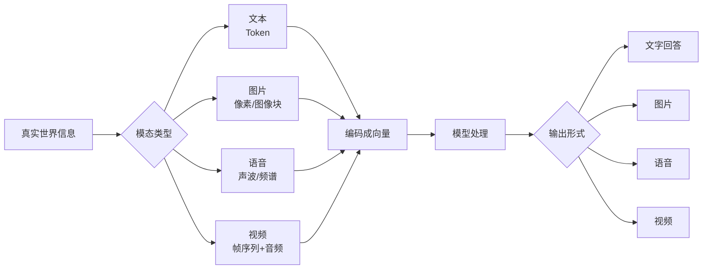
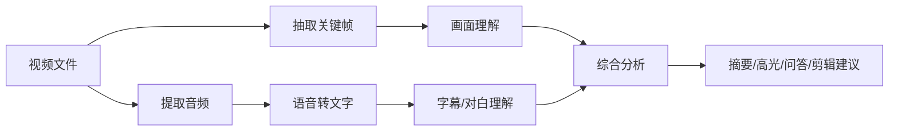
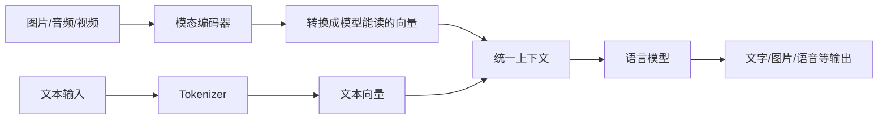
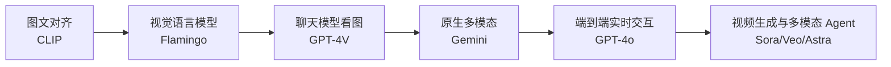

---
tags:
  - AI 基础
---

# 多模态 AI：文字、图片、语音和视频

<div markdown="1" style="position:relative;overflow:hidden;border:1px solid rgba(255,112,67,0.28);border-radius:1rem;padding:1.25rem 1.35rem;margin:0.8rem 0 1.5rem;background:linear-gradient(135deg,rgba(255,112,67,0.14),rgba(63,81,181,0.08) 46%,rgba(0,188,212,0.10));box-shadow:0 0.65rem 1.8rem rgba(0,0,0,0.10);">
<div style="position:absolute;right:-3.8rem;top:-4.2rem;width:12rem;height:12rem;border-radius:50%;background:radial-gradient(circle,rgba(255,112,67,0.26),rgba(255,112,67,0));"></div>
<div style="position:absolute;left:-4rem;bottom:-5rem;width:14rem;height:14rem;border-radius:50%;background:radial-gradient(circle,rgba(33,150,243,0.18),rgba(33,150,243,0));"></div>
<div style="position:relative;z-index:1;">
<span style="display:inline-block;padding:0.18rem 0.55rem;border-radius:999px;background:rgba(255,112,67,0.16);color:#e65100;font-size:0.78rem;font-weight:700;letter-spacing:0.02em;">AI 基础 · 第 5 站</span>

<strong>多模态 AI（Multimodal AI）</strong>就是让 AI 同时处理文字、图片、语音和视频，把不同形式的信息放到同一张理解地图里。

<div markdown="1" style="display:grid;grid-template-columns:repeat(auto-fit,minmax(9rem,1fr));gap:0.75rem;margin-top:1rem;">
<div style="padding:0.8rem;border-radius:0.75rem;background:var(--md-default-bg-color);border:1px solid var(--md-default-fg-color--lightest);">
<strong>输入</strong><br><span style="color:var(--md-default-fg-color--light);font-size:0.9rem;">文字、图片、语音、视频</span>
</div>
<div style="padding:0.8rem;border-radius:0.75rem;background:var(--md-default-bg-color);border:1px solid var(--md-default-fg-color--lightest);">
<strong>理解</strong><br><span style="color:var(--md-default-fg-color--light);font-size:0.9rem;">把不同模态对齐</span>
</div>
<div style="padding:0.8rem;border-radius:0.75rem;background:var(--md-default-bg-color);border:1px solid var(--md-default-fg-color--lightest);">
<strong>输出</strong><br><span style="color:var(--md-default-fg-color--light);font-size:0.9rem;">回答、生成、转写、剪辑</span>
</div>
</div>
</div>
</div>

> 这一页帮你把「会聊天的 AI」「会看图的 AI」「会听声音的 AI」「会生成视频的 AI」放到同一张地图里。

## 这章解决什么问题

很多人第一次接触 AI，是从聊天窗口开始的：输入一句话，模型回一段文字。

可你很快会遇到另一堆产品：上传图片让模型分析、把语音转成文字、用一句话生成图片、给视频自动加字幕、让模型看一张网页截图再写代码。它们看起来像四种完全不同的产品，但底层都在处理同一个问题：**怎样把不同形式的信息，变成模型能理解、能计算、能生成的东西。**

读完这一页，你应该能分清：

- 多模态 AI 到底在处理什么；
- 文本、图片、语音、视频进入模型前会经历什么；
- 看图问答、文生图、语音识别、视频理解分别属于哪类任务；
- 为什么多模态模型越来越像一个「统一入口」，几种能力在底层是打通的；
- 多模态能力有哪些边界，哪些场景必须人工复核。

## 先认识「模态」

**模态（Modality）** 指信息的表现形式。

人接收世界，靠眼睛、耳朵、语言、触觉。AI 处理信息，也会遇到不同模态：

| 模态 | 典型输入 | 常见任务 |
| --- | --- | --- |
| 文本 | 文章、聊天记录、代码、表格 | 总结、翻译、问答、写作、代码生成 |
| 图片 | 照片、截图、海报、医学影像 | 识别物体、读图、OCR、图像生成 |
| 语音 | 录音、会议音频、播客 | 语音识别、语音合成、说话人识别 |
| 视频 | 电影片段、监控、课程录像 | 视频理解、动作识别、自动剪辑、字幕生成 |

**多模态 AI（Multimodal AI）** 就是能处理两种或更多模态的 AI 系统。

比如：

- 你上传一张冰箱照片，让模型判断能做什么菜；
- 你发一段会议录音，让模型整理纪要；
- 你给模型一张网页截图，让它指出按钮设计哪里别扭；
- 你输入一句「赛博朋克风格的猫」，模型生成一张图片；
- 你让模型看一个短视频，再问「这个动作发生在第几秒」。

这些都属于多模态能力。

## 一张图看懂多模态流程



不用被这张图吓到。核心就一句话：**不同模态进入模型前，都会先被转换成模型能计算的数字表示。**

文本会被切成 Token，图片会被拆成图像块，语音会被转成声学特征，视频会被拆成一帧一帧的图像，再加上声音和时间顺序。

这里还有一个词需要提前认识：**编码器（Encoder）**。编码器就是把原始信息转换成向量表示的模块。图像编码器负责把图片变成向量，音频编码器负责把声音变成向量，文本编码器负责把文字变成向量。模型真正处理的是这些转换后的表示——它从来没有直接「看到」图片或「听到」声音。

## 文本：LLM 的主战场

文本是目前最成熟、最常见的 AI 输入。

你在聊天框里输入一句话，模型会先把它切成 Token，再通过 Embedding 变成向量。这个过程在 [Token、Embedding 与上下文窗口](token-embedding-context.md) 里会详细讲。

文本 AI 擅长：

- 总结文章；
- 改写表达；
- 提取信息；
- 写代码；
- 分析一段材料；
- 根据已有内容生成草稿。

文本的好处很明显：信息密度高，结构清楚，方便复制、引用和检索。

它的短板也很明显：很多现实问题一开始就不长成文字。比如一张报错截图、一段访谈录音、一段监控视频。只靠文本，模型看不到这些材料。

## 图片：让模型「看见」东西

图片进入模型时，通常会被拆成许多小块。你可以把它理解为：模型把一张图切成很多格子，再分析这些格子之间的关系。

这里有一个常见词：**OCR（Optical Character Recognition，光学字符识别）**，意思是从图片里识别文字。

图片 AI 常见任务有几类：

| 任务 | 例子 | 成熟度 |
| --- | --- | --- |
| 图像分类 | 判断一张图片是猫、狗还是汽车 | 比较成熟 |
| 目标检测 | 找出图里的行人、车辆、路牌 | 比较成熟，但复杂场景会错 |
| OCR | 从截图、票据、扫描件里读出文字 | 清晰文字较成熟，小字和斜拍容易错 |
| 看图问答 | 上传一张图，问「这张图哪里有问题」 | 可用，但要防幻觉 |
| 图像生成 | 根据文字生成图片，或把一张图改成另一种风格 | 创意场景可用，细节要审 |

一个很实用的场景：你把一张代码报错截图发给模型，让它帮你看哪里出错。这里模型要同时做两件事：先从图片里读出文字，再理解错误信息。

??? example "小例子：一张菜单照片能做什么"

    假设你拍了一张英文菜单。

    多模态模型可以做几件事：

    1. 识别菜单里的英文；
    2. 翻译成中文；
    3. 按口味帮你推荐；
    4. 提醒哪些菜可能含坚果或乳制品；
    5. 估算大概价格。

    但过敏原、价格、食材来源这些信息不能只听模型一句话。菜单没有写清楚时，模型可能会猜。

图片理解有边界。[OpenAI 的视觉模型文档](https://developers.openai.com/api/docs/guides/images-vision)明确提醒，模型可能在小字、旋转文字、非拉丁文字、图表、精确空间定位、计数、全景图、鱼眼图像和专业医学图像上出错，不能用于医学建议。也就是说，模型能「读图」，不等于它能稳定完成所有视觉任务。

## 语音：从声音到文字，再从文字到声音

语音 AI 主要有两条路线。

第一条是 **语音识别（Automatic Speech Recognition, ASR）**，把声音转成文字。

常见例子：

- 会议录音转写；
- 视频自动字幕；
- 语音输入法；
- 客服电话质检。

OpenAI 在 2022 年发布的 [Whisper](https://openai.com/index/whisper/) 就是一个典型 ASR 系统。它使用 68 万小时多语言、多任务监督数据训练，可以做语音转写、语言识别、短语级时间戳预测，以及把非英语语音翻译成英语。

第二条是 **语音合成（Text-to-Speech, TTS）**，把文字读成声音。

常见例子：

- 有声书朗读；
- 导航播报；
- 数字人配音；
- AI 客服语音回复。

语音比文本多了一些麻烦：口音、背景噪声、多人同时说话、停顿、语气、笑声，都会影响识别结果。

??? example "小例子：会议纪要为什么容易出错"

    你把一段会议录音交给 AI，让它生成纪要。

    这个任务至少有三步：

    1. 先把语音转成文字；
    2. 再从文字里区分发言人和议题；
    3. 最后总结结论和待办。

    第一阶段听错一个关键词，后面的总结就可能跟着偏。比如「下周三上线」被识别成「下周上线」，风险一下就变了。

现在的语音能力正在从「转写工具」走向「实时对话」。传统语音助手经常是三段式：ASR 先把声音转文字，语言模型再处理文字，TTS 最后把文字读出来。OpenAI 在 [GPT-4o 介绍](https://openai.com/index/hello-gpt-4o/)里说，旧 Voice Mode 正是这样的三模型流水线，所以主模型会丢掉语气、多个说话人、背景声，也无法直接输出笑声、歌唱或情绪。GPT-4o 则把文本、视觉和音频放进一个端到端模型里，音频平均响应约 320 毫秒，最快 232 毫秒。

## 视频：图片、声音和时间一起处理

视频最复杂。它是一连串图像，再叠上声音、字幕、镜头切换和时间顺序。

视频 AI 常见任务：

- 自动加字幕；
- 从长视频里找高光片段；
- 判断某个动作是否发生；
- 分析课程视频的知识点；
- 根据文字生成短视频；
- 给已有视频做风格化处理。

视频理解难在「时间」。

一张图只能告诉模型某一刻发生了什么。视频还要知道前后顺序：谁先动，谁后动，哪个动作导致了哪个结果。



这也是为什么长视频分析通常比文章总结更慢、更贵。模型要处理的信息多，步骤也多。

视频生成也一样。[Sora 的 system card](https://openai.com/index/sora-system-card/) 里写到，它可以接收文本、图片、视频输入并生成新视频，产品能力包括最高 1080p、最长 20 秒的视频，还支持 remix、blend、storyboard、延展和补帧等编辑能力。[Google Veo](https://deepmind.google/models/veo/) 也强调文本到视频、图像到视频、音频生成、角色一致性、摄像机控制、首尾帧控制和 1080p/4K 输出等能力。

但视频生成还没到「想什么就稳定拍出什么」的阶段。画面一致性、物理关系、人物动作、口型同步、短语音自然度、版权和肖像风险，都还需要人工审核。

## 多模态模型和 LLM 是什么关系

可以这样理解：LLM 原本最擅长处理文字。多模态模型在它旁边加上了「看图」「听声音」「处理视频」的能力，再把这些信息接到语言模型里，让模型用文字回答你。

一个简化版结构大概是这样：



你可以把它想成一个团队：

- 图像编码器负责看图；
- 语音模块负责听声音；
- 语言模型负责组织答案；
- 产品层负责把这些能力包装成聊天、生成、编辑等功能。

截至 2026 年，主流 AI 产品已经普遍加入多模态能力。比如 OpenAI 的 GPT-4o 支持文本、图像、音频等交互；Google Gemini 系列强调原生多模态；Claude 也支持图像理解。具体能力会随版本变化，使用前要看产品官方说明。

## 关键演进：从「拼接」到「原生多模态」

多模态 AI 是一步步走到今天的。它经历了一个很清晰的变化：先让不同模态互相对齐，再把视觉接到语言模型上，最后走向端到端实时交互。



几个关键节点可以这样看：

| 时间 | 节点 | 为什么重要 |
| --- | --- | --- |
| 2021 | [CLIP](https://arxiv.org/abs/2103.00020) | OpenAI 用 4 亿图文对训练模型，让图片和文字进入同一个语义空间，证明自然语言可以成为视觉任务的通用接口。 |
| 2022 | [Flamingo](https://deepmind.google/discover/blog/tackling-multiple-tasks-with-a-single-visual-language-model/) | DeepMind 让模型接收交错的图片、视频和文本 prompt，只用少量示例完成新任务，开始接近「看材料后回答」。 |
| 2023 | [GPT-4V](https://openai.com/index/gpt-4v-system-card/) | GPT-4 获得图像输入能力，用户可以让模型分析图片，同时也带来新的图像安全评估问题。 |
| 2023 | [Gemini](https://arxiv.org/abs/2312.11805) | Google 把 Gemini 定义为原生多模态模型家族，面向文本、代码、图像、音频和视频。 |
| 2024 | [GPT-4o](https://openai.com/index/hello-gpt-4o/) | OpenAI 把文本、视觉、音频放进端到端模型，降低实时语音交互延迟。 |
| 2024-2025 | [Sora](https://openai.com/index/sora-system-card/) / [Veo](https://deepmind.google/models/veo/) | 视频生成开始从文生视频走向图生视频、视频编辑、音画同步和更细的创作控制。 |
| 2025 以后 | [Project Astra](https://deepmind.google/models/project-astra/) / [Operator](https://openai.com/index/introducing-operator/) 类 Agent | 多模态能力开始进入 Agent：模型不只看图听声，还能结合记忆、工具和界面控制去行动。 |

为什么会从「单模态拼接」走向「原生多模态」？

因为拼接系统每一步都会丢信息：语音转文字会丢语气，抽关键帧会丢动作过程，OCR 错了会影响后续推理，多个模型串联还会增加延迟。

原生多模态和端到端系统想解决的，就是让文字、图像、声音、视频在同一个上下文里共同参与理解和生成。所以它更适合实时对话、视频理解和 Agent 操作。

但这不代表它已经无所不能。截至 2026 年，很多能力仍受版本、地区、接口、安全策略和产品开放范围限制。写文章、做教程、做产品设计时，最好以官方文档、模型卡和系统卡为准。

## 能力成熟度地图

小白最容易误会的一点是：只要产品宣传「多模态」，就以为所有能力都一样成熟。

现实情况差得远。

| 能力 | 现在大概到什么程度 | 最容易踩的坑 |
| --- | --- | --- |
| 文本总结和问答 | 很成熟 | 材料不全时会补脑 |
| 清晰图片 OCR | 比较成熟 | 小字、斜拍、反光、复杂排版容易错 |
| 看图问答 | 可用 | 会把猜测说得像事实 |
| 语音转文字 | 比较成熟 | 口音、噪声、多人重叠、专有名词会影响结果 |
| 文字转语音 | 可用 | 授权声音、AI 声音披露、情绪自然度要注意 |
| 视频理解 | 正在快速进步 | 时间顺序、因果关系、长视频一致性更难 |
| 文生图 / 图生图 | 创意草图很强 | 手、文字、品牌标识、真实人物肖像要审 |
| 文生视频 / 图生视频 | 很适合概念片和分镜 | 物理一致性、人物连续性、口型、版权风险仍明显 |
| 多模态 Agent | 早期但潜力大 | 看错界面、点错按钮、越权操作都可能带来真实后果 |

所以，更稳的做法是让模型做草稿、辅助理解和检索，关键结果由人复核。

## 多模态 RAG：让图片和图表也能被检索

前面说的很多多模态能力，发生在聊天窗口里。还有一种很重要的用法发生在知识库里：**多模态 RAG（Multimodal Retrieval-Augmented Generation，多模态检索增强生成）**。

RAG 会在后面单独讲。这里先记住一个简单解释：RAG 就是先从资料库里找材料，再让模型基于材料回答。

普通 RAG 主要检索文字。多模态 RAG 要处理的问题是：如果答案藏在 PDF 里的流程图、产品截图、扫描表单、架构图里，怎么办？

一种常见做法是：

1. 从 PDF、PPT、Word 里提取正文；
2. 把文档里的图片、图表、截图也提取出来；
3. 用视觉模型给图片生成文字描述；
4. 把正文和图片描述一起做向量化；
5. 用户提问时，同时检索文字片段和图片描述；
6. 最后让模型基于检索结果回答，并给出来源。

[Microsoft Azure AI Search 的多模态搜索文档](https://learn.microsoft.com/en-us/azure/search/multimodal-search-overview)就提到，可以从文档中提取文本和图片，为图片生成自然语言描述，再把这些内容放进同一套搜索和 RAG 管道里。这样，即使答案藏在 PDF 里的流程图中，也有机会被检索出来。

这对企业知识库很有用。很多公司的关键知识就藏在截图、流程图、架构图、表格图片和扫描件里，正文里反而未必找得到。

## 多模态 AI 的常见误区

??? warning "误区 1：模型能看图，就等于它理解了现实世界"

    模型能识别图片里的物体、文字和关系，但它没有亲身经验。它看到的是像素、图像块和训练数据里的模式。

    一张「杯子放在桌边」的图片，人会立刻想到杯子可能掉下去。模型也可能说出这点，不过它依赖的是图像模式和语言关联，不是生活经验。

??? warning "误区 2：图片里有文字，模型就一定能读准"

    小字、斜拍、反光、遮挡、手写字，都会影响识别。票据、合同、医学报告这类材料，要保留原图和人工复核环节。

??? warning "误区 3：语音转文字以后，后面就不会错了"

    语音识别只是第一步。转写里一旦出现错字、漏字、说话人混淆，后面的总结和判断都会受影响。

??? warning "误区 4：视频生成已经可以完全替代拍摄"

    视频生成适合做概念片、氛围片、分镜预览。涉及真实人物、品牌素材、产品细节、事实场景时，仍然需要审核版权、肖像权和真实性。

??? warning "误区 5：多模态 Agent 看得见界面，就一定能操作对"

    Agent 可以看网页截图、理解按钮、操作浏览器，但它仍可能误读页面、点错按钮、遗漏确认信息。涉及付款、发邮件、删文件、改权限这类动作时，必须保留人工确认。

## 最小示例：同一个需求，四种模态怎么处理

假设你的目标是「了解一台咖啡机怎么用」。

| 你给 AI 的材料 | AI 可以怎么帮你 | 风险点 |
| --- | --- | --- |
| 说明书文字 | 总结步骤、提取注意事项 | 说明书过长时可能遗漏细节 |
| 咖啡机照片 | 识别按钮、解释图标含义 | 看错型号或按钮位置 |
| 操作视频 | 总结操作流程、生成字幕 | 镜头没拍清时容易猜 |
| 你的语音描述 | 转成文字，再给排查建议 | 口音、噪声会影响转写 |

比较稳的做法是：把说明书、照片和你的问题一起给模型。材料越完整，模型越少靠猜。

??? example "可以直接复制的 Prompt"

    我想学习这台咖啡机怎么用。  
    我会上传说明书截图和机器照片。  
    请你按下面格式回答：

    1. 先判断机器型号和主要按钮，但不确定的地方要标注「不确定」；
    2. 给出最小操作步骤，不超过 6 步；
    3. 列出 3 个容易误操作的地方；
    4. 如果图片看不清，不要猜，直接告诉我需要补拍哪里。

这个 Prompt 的重点是给模型设了边界：不确定就说不确定，看不清就要求补充材料。

## 使用多模态 AI 的安全边界

多模态输入经常包含更敏感的信息：身份证照片、病历截图、合同扫描件、会议录音、公司内部视频、客户聊天记录、员工人脸、办公地点、地理位置、屏幕里的账号信息。

[NIST AI Risk Management Framework](https://www.nist.gov/itl/ai-risk-management-framework) 把 AI 风险管理目标表述为管理 AI 对个人、组织和社会带来的风险，并把可信性考量纳入 AI 产品、服务和系统的设计、开发、使用和评估。多模态 AI 正好是一个典型场景：它处理的远超文字，还可能处理脸、声音、位置、合同、病历和视频证据。

使用前先想五件事：

1. **这份材料能不能上传到外部平台？** 公司内部资料、客户数据、未公开代码、会议录音，别随手丢进网页产品。
2. **里面有没有可识别个人的信息？** 人脸、声音、身份证号、手机号、住址、工牌、车牌、定位截图都算。
3. **输出会不会被直接拿去做决策？** 医疗、法律、财务、人事、风控场景必须人工复核。
4. **有没有版权和肖像风险？** 用图片、声音、视频生成内容时，注意人物肖像、品牌标识、音乐、影视片段和受版权保护的素材。
5. **模型会不会替你执行动作？** 多模态 Agent 如果能操作网页、文件或系统，关键动作必须加确认。

版权风险也要单独提一下。美国版权局[关于生成式 AI 训练的报告](https://www.copyright.gov/ai/Copyright-and-Artificial-Intelligence-Part-3-Generative-AI-Training-Report-Pre-Publication-Version.pdf)讨论了一个核心争议：AI 训练常涉及大量受版权保护作品，未经授权训练是否构成 fair use 需要个案判断；训练阶段和输出阶段也可能分别产生风险。对普通用户来说，稳妥做法是：不要上传自己无权使用的图片、音乐、视频素材，不要要求模型模仿在世艺术家的独特风格，商业发布前保留来源、授权和人工审核记录。

## 练习题 / 小实验

??? question "练习 1：判断模态"

    判断下面任务主要涉及哪些模态：

    - 把一张发票截图整理成报销表格
    - 给一段播客生成摘要
    - 根据一句话生成一张海报
    - 从课程视频里提取知识点

    ??? done "参考思路"

        - 发票截图：图片 + 文本
        - 播客摘要：语音 + 文本
        - 文生海报：文本 + 图片
        - 课程视频：视频 + 语音 + 文本

??? question "练习 2：找风险点"

    你准备把一份公司会议录音上传给 AI 生成纪要。上传前至少要检查什么？

    ??? done "参考思路"

        先看会议里有没有客户信息、未公开业务数据、内部决策、个人隐私。再看公司是否允许把录音上传到外部 AI 产品。最后确认生成的纪要要有人复核，尤其是待办、日期、责任人。

??? question "练习 3：设计一个多模态任务"

    选一个你最近真的遇到的问题，想想能不能用两种以上模态来帮 AI 理解它。

    例子：电脑报错时，不只发一句「它坏了」，可以同时提供报错截图、操作步骤、系统版本和你刚刚做过什么。

??? question "练习 4：改写一个更稳的多模态 Prompt"

    下面这个 Prompt 有什么问题？试着改写它。

    ```text
    看看这张图，告诉我怎么处理。
    ```

    ??? done "参考思路"

        它没有说明任务、输出格式和不确定性边界。可以改成：

        ```text
        请分析这张报错截图。请按下面格式回答：
        1. 先读取截图里的错误信息；
        2. 判断最可能的原因，最多列 3 个；
        3. 给出从低风险到高风险的排查步骤；
        4. 看不清或不确定的地方请明确标注，不要猜。
        ```

## 下一步

<div markdown="1" style="border:1px solid var(--md-default-fg-color--lightest);border-left:4px solid var(--md-accent-fg-color);border-radius:0.85rem;padding:1rem 1.1rem;margin:0.9rem 0;background:linear-gradient(135deg,var(--md-code-bg-color),rgba(255,112,67,0.06));">

理解了多模态 AI 之后，下一站建议看：

<a href="model-data-training.md" style="display:block;margin-top:0.75rem;padding:0.85rem 1rem;border-radius:0.65rem;background:var(--md-default-bg-color);text-decoration:none;border:1px solid var(--md-default-fg-color--lightest);">
  <strong>模型、数据、训练与推理 →</strong><br>
  <span style="color:var(--md-default-fg-color--light);font-size:0.92rem;">了解模型能力是怎么从数据、训练和推理流程里长出来的。</span>
</a>

</div>
