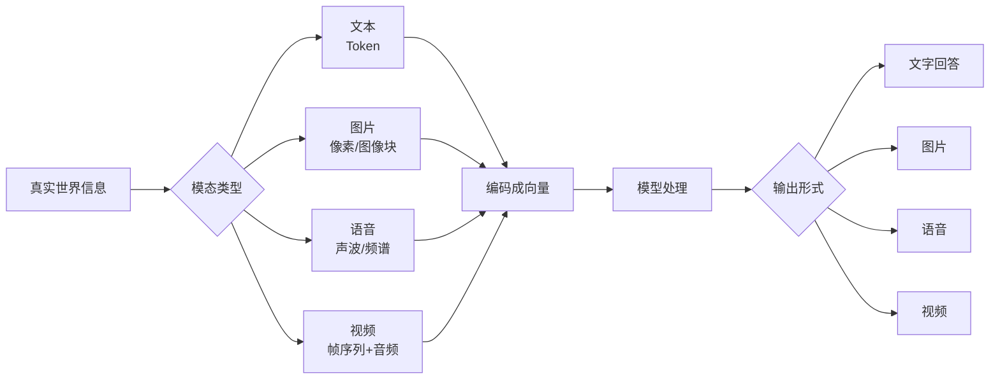
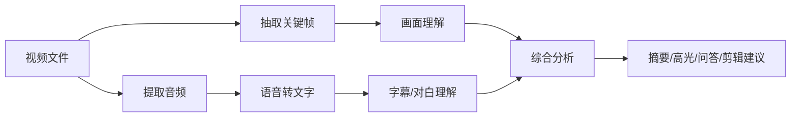
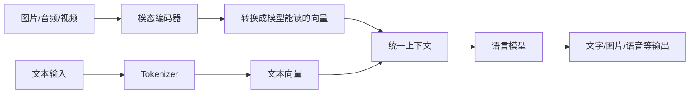

---
tags:
  - AI 基础
---

# 多模态 AI：文字、图片、语音和视频

> 这一页帮你把「会聊天的 AI」「会看图的 AI」「会听声音的 AI」「会生成视频的 AI」放到同一张地图里。

## 这章解决什么问题

很多人第一次接触 AI，是从聊天窗口开始的：输入一句话，模型回一段文字。

可你很快会遇到另一堆产品：上传图片让模型分析、把语音转成文字、用一句话生成图片、给视频自动加字幕、让模型看一张图再写代码。它们看起来差别很大，底层都绕不开一个问题：**模型怎么处理不同类型的信息。**

读完这一页，你应该能分清：

- 多模态 AI 到底在处理什么；
- 文本、图片、语音、视频进入模型前会经历什么；
- 看图问答、文生图、语音识别、视频理解分别属于哪类任务；
- 为什么多模态能力强，不代表模型真的「像人一样看见世界」。

## 先认识「模态」

**模态（Modality）** 指信息的表现形式。

人接收世界，靠眼睛、耳朵、语言、触觉。AI 处理信息，也会遇到不同模态：

| 模态 | 典型输入 | 常见任务 |
| --- | --- | --- |
| 文本 | 文章、聊天记录、代码、表格 | 总结、翻译、问答、写作、代码生成 |
| 图片 | 照片、截图、海报、医学影像 | 识别物体、读图、OCR、图像生成 |
| 语音 | 录音、会议音频、播客 | 语音识别、语音合成、说话人识别 |
| 视频 | 电影片段、监控、课程录像 | 视频理解、动作识别、自动剪辑、字幕生成 |

**多模态 AI（Multimodal AI）** 就是能处理两种或更多模态的 AI 系统。

比如：

- 你上传一张冰箱照片，让模型判断能做什么菜；
- 你发一段会议录音，让模型整理纪要；
- 你给模型一张网页截图，让它指出按钮设计哪里别扭；
- 你输入一句「赛博朋克风格的猫」，模型生成一张图片。

这些都属于多模态能力。

## 一张图看懂多模态流程

不用被这张图吓到。核心就一句话：**不同模态进入模型前，都会先被转换成模型能计算的数字表示。**

文本会被切成 Token，图片会被拆成图像块，语音会被转成声学特征，视频会被拆成一帧一帧的图像，再加上声音和时间顺序。

## 文本：LLM 的主战场

文本是目前最成熟、最常见的 AI 输入。

你在聊天框里输入一句话，模型会先把它切成 Token，再通过 Embedding 变成向量。这个过程在 [Token、Embedding 与上下文窗口](token-embedding-context.md) 里会详细讲。

文本 AI 擅长：

- 总结文章；
- 改写表达；
- 提取信息；
- 写代码；
- 分析一段材料；
- 根据已有内容生成草稿。

文本的好处很明显：信息密度高，结构清楚，方便复制、引用和检索。

它的短板也很明显：很多现实问题一开始就不长成文字。比如一张报错截图、一段访谈录音、一段监控视频。只靠文本，模型看不到这些材料。

## 图片：让模型「看见」东西

图片进入模型时，通常会被拆成许多小块。你可以把它理解为：模型把一张图切成很多格子，再分析这些格子之间的关系。

图片 AI 常见任务有几类：

| 任务 | 例子 |
| --- | --- |
| 图像分类 | 判断一张图片是猫、狗还是汽车 |
| 目标检测 | 找出图里的行人、车辆、路牌 |
| OCR | 从截图、票据、扫描件里读出文字 |
| 看图问答 | 上传一张图，问「这张图哪里有问题」 |
| 图像生成 | 根据文字生成图片，或把一张图改成另一种风格 |

一个很实用的场景：你把一张代码报错截图发给模型，让它帮你看哪里出错。这里模型要同时做两件事：先从图片里读出文字，再理解错误信息。

??? example "小例子：一张菜单照片能做什么"

    假设你拍了一张英文菜单。

    多模态模型可以做几件事：

    1. 识别菜单里的英文；
    2. 翻译成中文；
    3. 按口味帮你推荐；
    4. 提醒哪些菜可能含坚果或乳制品；
    5. 估算大概价格。

    但过敏原、价格、食材来源这些信息不能只听模型一句话。菜单没有写清楚时，模型可能会猜。

## 语音：从声音到文字，再从文字到声音

语音 AI 主要有两条路线。

第一条是 **语音识别（Automatic Speech Recognition, ASR）**，把声音转成文字。

常见例子：

- 会议录音转写；
- 视频自动字幕；
- 语音输入法；
- 客服电话质检。

第二条是 **语音合成（Text-to-Speech, TTS）**，把文字读成声音。

常见例子：

- 有声书朗读；
- 导航播报；
- 数字人配音；
- AI 客服语音回复。

语音比文本多了一些麻烦：口音、背景噪声、多人同时说话、停顿、语气、笑声，都会影响识别结果。

??? example "小例子：会议纪要为什么容易出错"

    你把一段会议录音交给 AI，让它生成纪要。

    这个任务至少有三步：

    1. 先把语音转成文字；
    2. 再从文字里区分发言人和议题；
    3. 最后总结结论和待办。

    第一阶段听错一个关键词，后面的总结就可能跟着偏。比如「下周三上线」被识别成「下周上线」，风险一下就变了。

## 视频：图片、声音和时间一起处理

视频最复杂。它是一连串图像，再叠上声音、字幕、镜头切换和时间顺序。

视频 AI 常见任务：

- 自动加字幕；
- 从长视频里找高光片段；
- 判断某个动作是否发生；
- 分析课程视频的知识点；
- 根据文字生成短视频；
- 给已有视频做风格化处理。

视频理解难在「时间」。

一张图只能告诉模型某一刻发生了什么。视频还要知道前后顺序：谁先动，谁后动，哪个动作导致了哪个结果。

这也是为什么长视频分析通常比文章总结更慢、更贵。模型要处理的信息多，步骤也多。

## 多模态模型和 LLM 是什么关系

可以这样理解：LLM 原本最擅长处理文字。多模态模型在它旁边加上了「看图」「听声音」「处理视频」的能力，再把这些信息接到语言模型里，让模型用文字回答你。

一个简化版结构大概是这样：

你可以把它想成一个团队：

- 图像编码器负责看图；
- 语音模块负责听声音；
- 语言模型负责组织答案；
- 产品层负责把这些能力包装成聊天、生成、编辑等功能。

截至 2026 年，主流 AI 产品已经普遍加入多模态能力。比如 OpenAI 的 GPT-4o 支持文本、图像、音频等交互；Google Gemini 系列强调原生多模态；Claude 也支持图像理解。具体能力会随版本变化，使用前要看产品官方说明。

## 多模态 AI 的常见误区

??? warning "误区 1：模型能看图，就等于它理解了现实世界"

    模型能识别图片里的物体、文字和关系，但它没有亲身经验。它看到的是像素和训练数据里的模式。

    一张「杯子放在桌边」的图片，人会立刻想到杯子可能掉下去。模型也可能说出这点，不过它依赖的是图像模式和语言关联，不是生活经验。

??? warning "误区 2：图片里有文字，模型就一定能读准"

    小字、斜拍、反光、遮挡、手写字，都会影响识别。票据、合同、医学报告这类材料，要保留原图和人工复核环节。

??? warning "误区 3：语音转文字以后，后面就不会错了"

    语音识别只是第一步。转写里一旦出现错字、漏字、说话人混淆，后面的总结和判断都会受影响。

??? warning "误区 4：视频生成已经可以完全替代拍摄"

    视频生成适合做概念片、氛围片、分镜预览。涉及真实人物、品牌素材、产品细节、事实场景时，仍然需要审核版权、肖像权和真实性。

## 最小示例：同一个需求，四种模态怎么处理

假设你的目标是「了解一台咖啡机怎么用」。

| 你给 AI 的材料 | AI 可以怎么帮你 | 风险点 |
| --- | --- | --- |
| 说明书文字 | 总结步骤、提取注意事项 | 说明书过长时可能遗漏细节 |
| 咖啡机照片 | 识别按钮、解释图标含义 | 看错型号或按钮位置 |
| 操作视频 | 总结操作流程、生成字幕 | 镜头没拍清时容易猜 |
| 你的语音描述 | 转成文字，再给排查建议 | 口音、噪声会影响转写 |

比较稳的做法是：把说明书、照片和你的问题一起给模型。材料越完整，模型越少靠猜。

## 使用多模态 AI 的安全边界

多模态输入经常包含更敏感的信息：身份证照片、病历截图、合同扫描件、会议录音、公司内部视频。

使用前先想三件事：

1. **这份材料能不能上传到外部平台？** 公司内部资料、客户数据、未公开代码，别随手丢进网页产品。
2. **输出会不会被直接拿去做决策？** 医疗、法律、财务、人事场景必须人工复核。
3. **有没有版权和肖像风险？** 用图片或视频生成内容时，注意人物肖像、品牌标识和受版权保护的素材。

## 延伸阅读

- [什么是 LLM](what-is-llm.md) —— 先理解语言模型这台「文字引擎」
- [Token、Embedding 与上下文窗口](token-embedding-context.md) —— 理解模型怎么把信息变成数字
- [Prompt 基础](../prompt/prompt-basic.md) —— 学会把任务说清楚
- [OpenAI GPT-4o 介绍](https://openai.com/index/hello-gpt-4o/) —— GPT-4o 的多模态能力说明
- [Google Gemini 官方介绍](https://deepmind.google/technologies/gemini/) —— Gemini 系列的多模态定位

## 练习题 / 小实验

??? question "练习 1：判断模态"

    判断下面任务主要涉及哪些模态：

    - 把一张发票截图整理成报销表格
    - 给一段播客生成摘要
    - 根据一句话生成一张海报
    - 从课程视频里提取知识点

    ??? done "参考思路"

        - 发票截图：图片 + 文本
        - 播客摘要：语音 + 文本
        - 文生海报：文本 + 图片
        - 课程视频：视频 + 语音 + 文本

??? question "练习 2：找风险点"

    你准备把一份公司会议录音上传给 AI 生成纪要。上传前至少要检查什么？

    ??? done "参考思路"

        先看会议里有没有客户信息、未公开业务数据、内部决策、个人隐私。再看公司是否允许把录音上传到外部 AI 产品。最后确认生成的纪要要有人复核，尤其是待办、日期、责任人。

??? question "练习 3：设计一个多模态任务"

    选一个你最近真的遇到的问题，想想能不能用两种以上模态来帮 AI 理解它。

    例子：电脑报错时，不只发一句「它坏了」，可以同时提供报错截图、操作步骤、系统版本和你刚刚做过什么。
