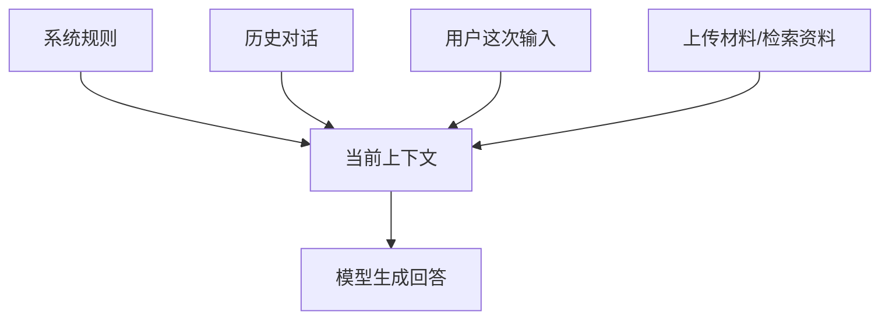

---
tags:
  - AI 基础
---

# Prompt、上下文和记忆

> 这一页讲清楚：你发给 AI 的话、AI 当前能看到的材料、以及产品所谓的「记忆」到底是什么关系。

## 这章解决什么问题

你可能遇到过这些情况：

- 明明前面说过要求，模型后面又忘了；
- 新开一个对话，AI 完全不知道你是谁；
- 同一个 Prompt，换个聊天窗口效果不一样；
- 模型说「我记得你之前提过」，结果它记错了；
- 你给了一大堆材料，模型只抓住了其中一小段。

这些问题通常不是一句「Prompt 写得不好」就能解释。你需要分清三个东西：**Prompt、上下文、记忆。**

它们关系很近，作用完全不同。

## 三个词先放到桌面上

| 概念 | 中文理解 | 它回答的问题 |
| --- | --- | --- |
| Prompt | 你这次给模型的任务说明 | 「你要它做什么？」 |
| 上下文（Context） | 模型这次回答前能看到的全部信息 | 「它现在看到了什么？」 |
| 记忆（Memory） | 产品或系统长期保存的信息 | 「下次它还能不能记得？」 |

先记一句话：**Prompt 是指令，上下文是现场，记忆是档案。**

## Prompt：你这次给模型的任务说明

**Prompt（提示词）** 指你给模型的输入。它可以是一句话，也可以是一整套任务说明。

比如：

```text
帮我把下面这段话改得更适合小白阅读，要求口语化一点，不要删掉技术细节。

原文：……
```

这就是一个 Prompt。它里面至少包含三类信息：

| 信息 | 例子 |
| --- | --- |
| 任务 | 帮我改写这段话 |
| 要求 | 适合小白、口语化、不删技术细节 |
| 材料 | 原文内容 |

一个 Prompt 写得清楚，模型就少猜一点。写得含糊，模型就会用训练中最常见的套路来补。

??? example "同一个任务，Prompt 差别很大"

    比如你想让模型总结一篇文章。

    较弱的写法：

    ```text
    总结一下。
    ```

    更稳的写法：

    ```text
    请把下面这篇文章总结成 5 条要点。
    要求：
    - 每条不超过 40 字
    - 保留关键数字和人名
    - 不要加入原文没有的信息
    - 最后列出 3 个我需要继续核查的问题
    ```

    第二种写法不是「咒语」，只是把任务说清楚了。

## 上下文：模型这次能看到的全部材料

**上下文（Context）** 是模型生成这次回答前能看到的全部信息。

它通常包括：

- 系统规则；
- 当前用户的问题；
- 之前几轮聊天记录；
- 你上传或粘贴的材料；
- 工具检索回来的资料；
- 产品层附加的用户信息或偏好。

模型回答时，不是只看你最后一句话。它会把能看到的上下文一起拿来判断。



这里有个很容易踩的坑：**上下文不是无限长的。**

模型有上下文窗口限制。聊天太长、材料太多，早期内容可能被压缩、截断，或者根本进不了模型当前能看到的范围。这个概念在 [Token、Embedding 与上下文窗口](token-embedding-context.md) 里会展开。

## 记忆：产品帮模型保存的长期信息

**记忆（Memory）** 是产品或系统额外做的长期信息保存功能，裸模型天然没有这套能力。

一个裸模型不会真的「认识你」。它这次能不能记得你，取决于产品有没有把相关信息重新放进上下文里。

比如一个 AI 产品可能保存：

- 你常用中文；
- 你喜欢简洁回答；
- 你正在做某个项目；
- 某个文档的写作规范；
- 你上次让它记住的偏好。

下次对话时，产品把这些记忆塞进上下文，模型看到了，才表现得像「记得」。


说得更直白点：**模型本身不保存你，产品可以帮它带小抄。**

## 三者怎么一起工作

来看一个真实点的例子。

你对 AI 说：

```text
继续按我的风格改这篇文章，别有 AI 味。
```

这句话很短，但模型要答好，至少需要三类信息：

| 需要的信息 | 属于什么 | 如果缺失会怎样 |
| --- | --- | --- |
| 「继续改文章」这个任务 | Prompt | 模型不知道要做什么 |
| 当前文章全文 | 上下文 | 模型没材料可改 |
| 「你的风格」具体是什么 | 记忆或上下文 | 模型只能猜风格 |
| 「AI 味」指哪些句型 | 上下文或规则 | 模型可能只做普通润色 |

如果这些信息都在上下文里，模型表现会很稳。如果缺一块，它就会开始猜。

## 为什么 AI 会「忘」

AI 常见的「忘」有三种。

### 1. 新对话没有旧上下文

你在 A 对话里说过很多背景，切到 B 对话后，模型未必能看到。除非产品有记忆功能，或者你把背景重新贴进去。

### 2. 聊天太长，早期内容被挤掉

上下文窗口满了以后，旧内容可能被截断。你前面说过「全部用中文」，聊到第 80 轮时模型突然开始英文回复，可能就是早期要求已经不在当前上下文里。

### 3. 模型把记忆说错了

模型有时会把上下文里的信息拼错，甚至虚构「你之前说过」。这属于幻觉的一种。遇到这种情况，直接纠正它，不要顺着错记忆聊。

## 好 Prompt 不是咒语

网上有很多 Prompt 模板，看起来像神秘咒语：

```text
你是一名世界顶级专家，请一步一步思考，给出专业、全面、深入、结构化的回答……
```

这种写法有时能改善回答，但新手最该练的是四件事：

| 要素 | 你要说清什么 | 例子 |
| --- | --- | --- |
| 目标 | 最终要得到什么 | 写一版 800 字科普稿 |
| 材料 | 依据哪些内容 | 根据下面这份采访记录 |
| 约束 | 什么不要做 | 不要编数据，避开公式化对仗句 |
| 输出格式 | 怎么交付 | 用 Markdown，分标题和正文 |

一个够用的模板：

```text
请完成这个任务：……

背景：……

材料：……

要求：
- ……
- ……

输出格式：……
```

不用玄学。把现场交代清楚，效果通常就会好很多。

## 常见误区

??? warning "误区 1：聊天记录就是永久记忆"

    聊天记录只是产品界面里能看到的历史。模型当前回答时能不能看到这些内容，要看产品怎么处理上下文。对话太长时，早期内容可能已经不在模型视野里。

??? warning "误区 2：新开对话后，AI 应该知道我之前说过什么"

    不一定。新对话通常是新上下文。除非产品把长期记忆、项目资料或用户画像重新放进去。

??? warning "误区 3：Prompt 越长越好"

    长 Prompt 可以提供更多信息，也会占用上下文窗口。无关要求太多，模型反而更容易抓不住重点。

??? warning "误区 4：模型说它记得，就真的记得"

    模型可能是在根据当前上下文推测。涉及事实、偏好、项目约定时，以明确记录为准。

## 最小示例：把含糊任务改清楚

原始说法：

```text
帮我优化一下这段。
```

改成：

```text
帮我把下面这段文字改成适合 AI 入门小白阅读的版本。

要求：
- 保留技术含义
- 删除公式化对仗句和常见套话
- 每段不超过 120 字
- 不要新增未经核实的数据

原文：
……
```

这段 Prompt 好在三点：任务明确、风格明确、边界明确。模型不用猜「优化」到底是润色、扩写、压缩，还是改口吻。

## 使用建议

1. **长期背景放到项目文档里。** 比如写作规范、术语表、读者画像，不要每次临时口头说。
2. **关键要求放在靠近任务的位置。** 重要限制别埋在很长的聊天记录前面。
3. **材料和指令分开。** 先说任务，再贴材料，模型更容易识别边界。
4. **输出前让模型自查。** 比如「最后检查是否新增了原文没有的数据」。
5. **不要把记忆当事实库。** 记忆适合保存偏好，不适合保存需要精确核查的数据。

## 延伸阅读

- [Token、Embedding 与上下文窗口](token-embedding-context.md) —— 为什么模型会忘，先看上下文窗口
- [温度与采样参数](temperature-sampling.md) —— 为什么同一个 Prompt 会有不同回答
- [为什么模型会胡说](hallucination.md) —— 为什么模型会编造不存在的信息
- [Prompt 基础](../prompt/prompt-basic.md) —— 进入 Prompt 大章继续学具体写法

## 练习题 / 小实验

??? question "练习 1：拆分三要素"

    看下面这句话，分别指出 Prompt、上下文、记忆可能是什么：

    ```text
    按昨天那个风格，继续帮我改第二章。
    ```

    ??? done "参考思路"

        Prompt 是「继续改第二章」。上下文需要包含第二章正文。记忆或上下文里还要有「昨天那个风格」的具体描述。如果没有风格样例，模型只能猜。

??? question "练习 2：改写 Prompt"

    把下面这个 Prompt 改得更清楚：

    ```text
    帮我写一篇关于 AI 的文章，要好一点。
    ```

    ??? done "参考思路"

        可以改成：请写一篇面向高中生的 AI 入门文章，约 1200 字。要求先讲生活例子，再解释 AI、机器学习、深度学习和 LLM 的关系。不要使用未经核实的数据。用 Markdown 输出，包含标题、正文、3 个思考题。

??? question "练习 3：观察上下文丢失"

    找一个 AI 聊天产品，先给它一个明确要求，比如「后续回答都控制在 50 字以内」。连续聊 10 轮后，再问一个开放问题，观察它是否还遵守这个要求。

    如果它忘了，思考一下：这是模型能力问题，还是上下文管理问题？
