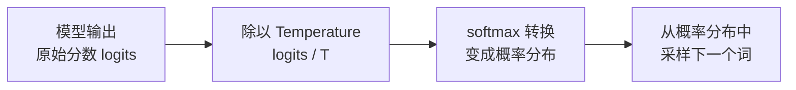
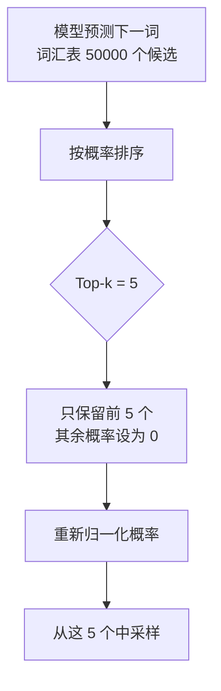
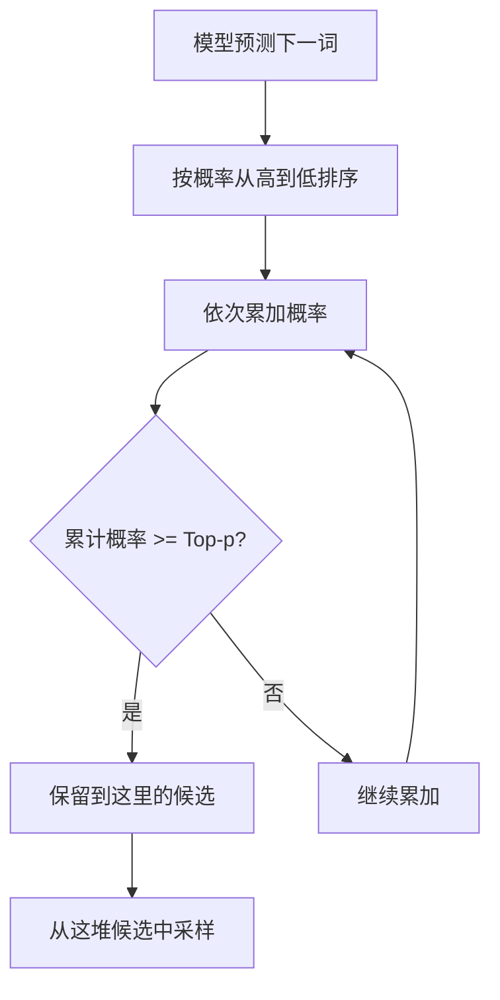
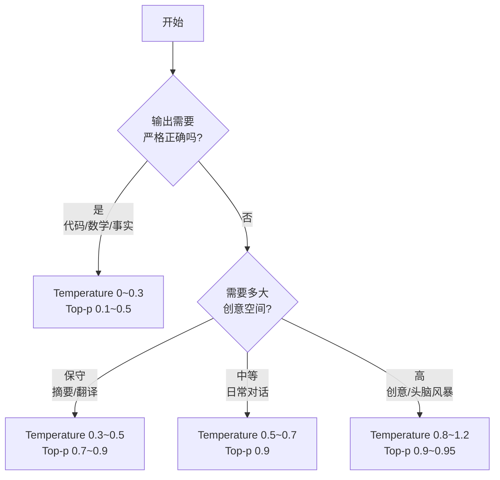

---
tags:
  - AI 基础
---

# 温度与采样参数

你有没有遇到过这种情况：同一个问题问 ChatGPT 两次，两次回答不一样？

这不是 bug，而是 LLM 的"本性"。它生成文字的过程，本质上是一个**概率游戏**——每次选择下一个词时，都是从一堆候选里"抽"出来的。而 **Temperature（温度）**、**Top-k**、**Top-p** 这些参数，就是控制这个"抽奖"规则的旋钮。

理解这些参数，你就能控制模型的输出风格：是要一个严谨确定的答案，还是要一个创意发散的灵感。

## 这些参数解决什么问题

| 场景 | 你需要的输出 | 对应的参数策略 |
| --- | --- | --- |
| 让模型写一段 Python 代码 | 稳定、可运行、别瞎编 | 低温度 + 严格采样 |
| 和模型闲聊 | 自然、有趣、不刻板 | 中等温度 |
| 让模型帮你想 10 个产品名字 | 多样、有创意、意想不到 | 高温度 + 宽松采样 |
| 同一个问题要可复现的结果 | 每次回答都一样 | 温度接近 0 |

一句话：**采样参数决定了模型是"保守派"还是"冒险派"。**

## Temperature：控制输出的"创意旋钮"

**Temperature（温度）** 是控制 LLM 输出随机性的参数，取值范围通常是 0.0 到 2.0，默认值一般在 0.7~1.0 之间。

### 一个直观的比喻

想象你在一家餐厅点菜：

- **温度低（0~0.3）**：你每次都点餐厅最招牌的菜。稳定、不出错，但毫无惊喜。
- **温度中等（0.5~0.7）**：你大多数点招牌菜，偶尔尝试新品。有变化，但总体可控。
- **温度高（0.8~1.2）**：你闭眼随便指菜单。可能点到绝世美味，也可能点到黑暗料理。

在 LLM 里，"招牌菜"就是概率最高的那个词，"黑暗料理"就是概率很低的生僻词。

### 温度具体怎么影响输出

LLM 在生成每个词时，会给词汇表里的所有候选词打分（叫做 logits），然后通过 softmax 转换成概率分布。Temperature 就是在这个环节发挥作用：它把 logits 除以一个温度值，再算概率。

- **T < 1（低温）**：概率分布变"尖锐"，高分词更突出，模型几乎总是选最可能的词
- **T = 1（常温）**：保持模型原始的自信程度
- **T > 1（高温）**：概率分布变"平坦"，低分词也有机会被选中，输出更随机

举个例子，模型预测下一个词，候选词的概率本来是这样的：

| 候选词 | 原始概率（T=1） | T=0.3 时 | T=1.5 时 |
| --- | --- | --- | --- |
| cheese | 68% | 99% | 45% |
| crumb | 25% | ~0% | 32% |
| cable | 5.6% | ~0% | 15% |
| moon | 0.5% | ~0% | 8% |

低温时，模型几乎铁定选 "cheese"；高温时，连 "moon" 都有 8% 的机会被选中——输出就从"老鼠吃了奶酪"变成了"老鼠吃了月亮"的诗意表达（或者胡言乱语）。

## Top-k 与 Top-p：另一种控制随机性的方式

Temperature 调整的是概率分布的"形状"，但并不会把任何候选词彻底排除。如果你希望模型**只从靠谱的候选里选**，就需要 Top-k 和 Top-p。

### Top-k：只保留概率最高的 k 个候选

**Top-k** 的做法很直接：不管词汇表有几万个词，我只看概率最高的前 k 个，其他的全部拉黑。

- Top-k = 1：只选概率最高的那个词，输出完全确定
- Top-k = 10：从前 10 个候选里随机抽
- Top-k = 50：选择范围更宽，多样性更高

打个比方：Temperature 像是调音台的音量推子，Top-k 像是直接拔掉不想要的音轨。

### Top-p（Nucleus Sampling）：按累计概率截断

**Top-p**（也叫 **Nucleus Sampling**，核采样）比 Top-k 更灵活。它不固定保留几个候选，而是保留"累计概率达到 p 的最小候选集合"。

举个例子：

| 候选词 | 概率 | 累计概率 |
| --- | --- | --- |
| blue | 40% | 40% |
| clear | 30% | 70% |
| cloudy | 15% | 85% |
| dark | 10% | 95% |
| purple | 5% | 100% |

如果 Top-p = 0.9，模型会保留累计概率达到 90% 的最小集合，也就是前 4 个词（blue、clear、cloudy、dark），"purple" 被排除。

如果模型对某个词非常自信（比如 "blue" 占了 95% 的概率），那 Top-p = 0.9 可能只保留 1~2 个词。反之，如果概率分散在很多词上，保留的候选就会更多。

这就是 Top-p 的聪明之处：**它根据模型自身的自信程度动态调整候选池的大小。**

### 三个参数怎么配合

实际使用中，这三个参数通常一起出现：

大多数 API 的建议是：**Temperature 和 Top-p 调一个就行，不要同时大幅调整两个**，否则效果难以预测。

## 什么时候用什么参数

下面是一张实用对照表，可以直接参考：

| 任务类型 | 推荐 Temperature | 推荐 Top-p | 原因 |
| --- | --- | --- | --- |
| **代码生成** | 0~0.3 | 0.1~0.3 | 代码要求精确，一个字符错就运行不了 |
| **事实问答 / 数学计算** | 0~0.3 | 0.1~0.5 | 减少幻觉，优先选最可能的正确答案 |
| **文本摘要** | 0.3~0.5 | 0.7~0.9 | 基本忠实原文，允许少量措辞变化 |
| **一般对话 / 写作辅助** | 0.5~0.7 | 0.9 | 平衡自然度和一致性 |
| **创意写作** | 0.8~1.2 | 0.9~0.95 | 允许惊喜和非常规表达 |
| **头脑风暴** | 0.9~1.2 | 0.95 | 最大化多样性，接受偶尔离题 |

### 参数选择的决策流程

如果你不确定该用什么参数，可以按这个流程走：

### 实际调参技巧

1. **先跑默认参数**：大部分场景下，Temperature=0.7、Top-p=0.9 就够用了
2. **观察问题再调整**：
   - 如果输出太死板、每次都一样 → 把温度往上调 0.1~0.2
   - 如果输出太跳脱、经常跑题 → 把温度往下调 0.2~0.3
   - 如果高温下偶尔冒出怪词 → 加 Top-p 限制（如从 0.95 调到 0.9）
3. **别同时拧两个旋钮**：OpenAI 和 Anthropic 都建议，调 Temperature 就保持 Top-p 默认，反之亦然。同时大幅调整两者，效果很难预测

### 最小示例：同一个提示词，不同温度的输出

**提示词**："用一句话描述一只猫。"

- **Temperature = 0.1**：
  > 猫是一种小型食肉哺乳动物，通常被人类当作宠物饲养。

- **Temperature = 0.7**：
  > 猫是一种优雅而独立的宠物，以其柔软的毛发和敏捷的身手深受人们喜爱。

- **Temperature = 1.2**：
  > 那只猫蜷在窗台上，金色的瞳孔里藏着整个午后的秘密。

看到区别了吗？低温像 Wikipedia，高温像散文诗。

## 常见误区

**误区 1：温度越高，模型越"聪明"**

不是。温度高只意味着输出更随机、更多样，不代表质量更好。对于代码和数学题，高温反而容易让模型"乱来"，给出荒谬的答案。

**误区 2：温度 = 0 时输出完全确定**

理论上温度趋近于 0 时，模型会总是选概率最高的词。但在实际工程中，由于浮点数精度和框架实现的差异，有些 API 在 temperature=0 时仍可能有极微小的随机性。如果你需要 100% 可复现，应该查看具体 API 是否提供 seed 参数。

**误区 3：所有任务都应该用默认温度**

默认温度（通常是 0.7~1.0）是为了通用聊天场景设计的。写代码时用默认温度，可能会遇到：

- 同样的函数名每次生成的不一样
- 偶尔冒出语法错误
- 注释风格前后不一致

这些都不是模型"不行"，而是温度没调对。

**误区 4：Top-k 和 Top-p 越小越"安全"**

过度限制候选池（比如 Top-k=1 或 Top-p=0.01）会让模型变成"复读机"，反复说最安全的套话，失去语言的自然流畅感。限制太死，输出会像机器翻译的老旧系统一样生硬。

**误区 5：采样参数可以弥补提示词的不足**

不能。如果你给模型的指令本身含糊不清，调再低的温度也拯救不了输出质量。采样参数控制的是"风格"，提示词控制的是"方向"。方向错了，风格再好也没用。

## 延伸阅读

- [什么是 LLM](what-is-llm.md) —— 了解大语言模型的基本工作原理
- [Prompt 总览](../prompt/index.md) —— 学习如何通过提示词设计引导模型输出

## 练习题

**实验：温度对比测试**

选一个你常用的 LLM（ChatGPT、Claude、DeepSeek 等），用下面这个提示词，分别在三种温度设置下各运行一次：

> 请写一首关于秋天的四行短诗。

记录三次输出的差异：

1. 用词是否相同？
2. 意象（如落叶、寒风、收获）是否有变化？
3. 哪一次的输出你最喜欢？为什么？

**思考题**

1. 如果你在做客服机器人，希望回答准确且风格一致，应该用什么温度？为什么？
2. 为什么大多数 API 建议"Temperature 和 Top-p 不要同时大幅调整"？这两个参数分别控制了什么？
