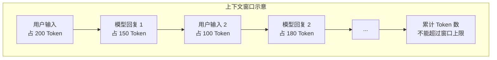

---
tags:
  - AI 基础
---

# Token、Embedding 与上下文窗口

你有没有想过：当你给 ChatGPT 发一句"你好世界"，它看到的并不是这四个汉字，而是另外一些东西？

LLM 不会直接"读"文字。它需要先把你输入的文本切成一块一块（Token），再把每一块变成一串数字（Embedding），然后在有限的记忆长度里处理这些信息（上下文窗口）。这三个概念——Token、Embedding、上下文窗口——是理解 LLM "怎么看文字"的关键。掌握它们，你就能解释清楚为什么同样的文字在不同模型里收费不同，为什么 LLM 能"理解"语义，以及为什么它有时候会"忘掉"你之前说过的话。

## 这三个概念解决什么问题

在深入定义之前，先说说它们各自回答了什么疑问：

| 问题 | 答案 |
| --- | --- |
| 为什么中文调用 API 比英文贵？ | 因为 Token 的切分方式不同，同样的意思中文消耗更多 Token |
| LLM 怎么"理解"一句话的意思？ | 通过 Embedding，把文字变成数学空间里的坐标，意思相近的离得近 |
| 为什么聊到后面模型会"忘掉"开头？ | 因为上下文窗口有上限，超出的部分模型"看不见" |

这三个概念贯穿了 LLM 处理文字的整个流程。接下来逐个拆开讲。

## Token：LLM 处理文本的最小单位

**Token（词元）** 是 LLM 处理文本的最小单位。它不是字，不是词，也不是字节——而是模型用特定算法切出来的"片段"。

可以把它想象成拼图块：一段话被切成若干块，每块就是一个 Token。模型不认识汉字或字母，它只认识这些块的编号。

### 同一个文本，不同模型切法不同

这是最让人意外的一点：**同样的文字，在不同模型的 tokenizer（分词器）里，切出来的 Token 数可能完全不同。**

以 "你好世界" 为例：

| 模型 | Token 数 | 切分结果 |
| --- | --- | --- |
| GPT-4（cl100k_base）| 5 个 | `['你', '好', <乱码字节>, <乱码字节>, '界']` |
| GPT-4o（o200k_base）| 2 个 | `['你好', '世界']` |

看到区别了吗？GPT-4o 因为训练了更好的 tokenizer，能把常见中文词合并成更少的 Token。而 GPT-4 面对同样的文字，反而要把某些字拆成 UTF-8 字节，切出更多块。

再看几个实际例子（基于 GPT-4o 的 tokenizer）：

| 文本 | Token 数 | 切分结果 |
| --- | --- | --- |
| Hello world | 2 个 | `['Hello', ' world']` |
| 人工智能 | 2 个 | `['人工', '智能']` |
| Artificial Intelligence | 2 个 | `['Artificial', ' Intelligence']` |
| 深度学习 | 3 个 | `['深', '度', '学习']` |
| unbelievable | 3 个 | `['un', 'bel', 'ievable']` |

### 中英文 Token 效率差异

从上面的例子能看出一个规律：**中文通常比英文"费 Token"。**

这不是歧视，而是技术原因：

- 英文只有 26 个字母，高频组合（如 "ing"、"tion"）可以被编码为单个 Token
- 汉字有几万个，模型无法为每个字单独编码，常见做法是每个字或常用词作为一个 Token

实际经验值（以 GPT-4o 为例）：

| 语言 | 1 个 Token 约等于 |
| --- | --- |
| 英文 | 0.75 个单词，或 4 个字符 |
| 中文 | 1~2 个汉字 |
| 代码 | 1~3 个字符 |

这意味着：同样表达一个意思，中文文本通常比英文多消耗 30%~50% 的 Token。而 API 是按 Token 计费的，所以中文调用成本更高。

### Token 为什么重要

理解 Token 对你来说有三个实际意义：

1. **计费**：API 按输入 Token + 输出 Token 收费，Token 越多越贵
2. **长度限制**：上下文窗口的上限是按 Token 算的，不是按字数
3. **模型看到的"真相"**：模型并不认识"苹果"这两个字，它认识的是 Token 编号。如果你发现模型对某些词反应奇怪，可能是因为它被切成了你不预期的方式

## Embedding：把文字变成数字向量

计算机不懂"快乐"是什么意思，它只懂数字。那怎么让计算机也能判断"快乐"和"高兴"意思相近？

**Embedding（嵌入/向量表示）** 就是干这件事的：它把一段文字映射成一个高维空间里的数字向量，让语义相近的文字在空间里离得近，语义无关的文字离得远。

### 一个直观的比喻

想象一个巨大的地图，上面有无数个城市：

- "北京"、"上海"、"广州" 都是中国城市，所以在地图的"中国区域"里聚成一团
- "纽约"、"伦敦"、"巴黎" 都是国际大都市，它们在另一个区域
- "苹果（水果）"和 "香蕉" 在"水果区"
- "苹果（公司）"和 "谷歌"、"微软" 在"科技公司区"

Embedding 做的就是：给每个词或每句话在地图上找一个坐标。这个地图不是二维的，而是几百维甚至几千维的（比如 OpenAI 的 text-embedding-3-small 是 1536 维，text-embedding-3-large 是 3072 维）。

### 具体例子

假设用 Embedding 模型处理以下句子，得到的向量在空间中大致是这样的关系：

- "猫坐在垫子上" 和 "一只小猫趴在毯子上" → **距离很近**（意思相近，用词不同）
- "猫坐在垫子上" 和 "量子计算取得了突破" → **距离很远**（完全无关）
- "退款"、"退货"、"还钱"、" reimburse" → **距离较近**（语义相关，甚至跨语言）

这就是 Embedding 的魔力：它捕捉的是**语义**，而不是**字面**。你不需要告诉模型"小猫"和"猫"是近义词，它从海量文本训练中就学会了这件事。

### Embedding 在 LLM 内部的作用

Embedding 不只是外部工具，它是 LLM 处理文字的第一步：

```mermaid
flowchart LR
    A[输入文本<br/>"今天天气很好"] --> B[Tokenizer<br/>切成 Token]
    B --> C[Embedding 层<br/>每个 Token → 向量]
    C --> D[Transformer 模型<br/>计算、推理、生成]
    D --> E[输出 Token]
    E --> F[还原成文字]
```

当你输入一句话时，模型先把每个 Token 查表转换成对应的 Embedding 向量，然后再交给后续的网络层去处理。这个"查表"过程，本质上是把离散的文字符号变成了连续的数学表示，模型才能在上面做加减乘除。

## 上下文窗口：LLM 的短期记忆上限

**上下文窗口（Context Window）** 是 LLM 一次能处理的 Token 总数上限。你可以把它理解为模型的"短期记忆长度"。

### 它到底限制什么

上下文窗口限制的不是你输入的字数，而是**输入 + 输出**的总 Token 数。

举个例子：

> 某模型的上下文窗口是 128K Token。你输入了一篇 100K Token 的长论文，让模型总结。模型最多只能再输出 28K Token。如果你要求输出 30K Token，模型要么中途截断，要么报错。

常见模型的上下文窗口大小：

| 模型 | 上下文窗口 |
| --- | --- |
| GPT-4 | 128K Token |
| Claude 3.5 Sonnet | 200K Token |
| Gemini 1.5 Pro | 128K~1M Token |
| DeepSeek-V3 | 128K Token |

### 上下文窗口的实际影响

上下文窗口小，会带来三个问题：

1. **长文档处理受限**：一本 10 万字的书，可能超过上下文窗口，模型读不完
2. **多轮对话"失忆"**：聊了几十轮后，最早的对话可能被挤出窗口，模型"忘记"了前面的设定
3. **成本上升**：为了处理长文本，你需要用支持更大窗口的模型，通常也更贵



## 三者关系：一张图理清

Token、Embedding、上下文窗口不是孤立的概念，它们组成了 LLM "理解"文字的完整流水线：

```mermaid
flowchart LR
    subgraph 输入阶段
        A[原始文本] --> B[Tokenizer]
        B --> C[Token 序列<br/>如 [你, 好, 世界]]
    end

    subgraph 表示阶段
        C --> D[Embedding 层]
        D --> E[向量序列<br/>每个 Token 变成数字向量]
    end

    subgraph 处理阶段
        E --> F[Transformer 网络]
        F --> G[在上下文窗口内<br/>计算注意力、生成输出]
    end

    subgraph 输出阶段
        G --> H[输出 Token 序列]
        H --> I[还原成文字]
    end
```

- **Token 是输入单元**：文字被切成的最小块
- **Embedding 是内部表示**：Token 被翻译成的数字语言
- **上下文窗口是处理上限**：模型一次能"看"多少 Token，决定了它能处理多长的输入和输出

## 常见误区

**误区 1：1 个汉字 = 1 个 Token**

不一定。在 GPT-4o 的 tokenizer 里，"你好世界"是 2 个 Token，但"我爱北京天安门"是 6 个 Token。而且不同模型的 tokenizer 切法完全不同，不能用字数估算 Token 数。

**误区 2：Embedding 就是把文字翻译成数字**

不完全对。Embedding 不是简单的"编码"（比如 A=1, B=2），而是**语义向量**。它的目标是让意思相近的文字在数学空间里离得近。如果只是编码，"快乐"和"悲伤"可能只相差一个数字；但在 Embedding 空间里，它们会相距很远。

**误区 3：上下文窗口越大越好**

越大确实能处理更长的文本，但代价也很明显：

- **更贵**：长上下文意味着更多的计算量，API 费用更高
- **更慢**：处理 128K Token 比处理 4K Token 慢得多
- **注意力稀释**：窗口太大时，模型可能对中间信息的关注度下降（俗称"中间迷失"）

实际使用中，够用就好。如果你只是问几个短问题，没必要用 128K 窗口的模型。

**误区 4：Token 切分对模型理解没有影响**

有影响。如果一个词被切成了不合理的碎片，模型理解起来会更困难。比如早期的 tokenizer 把某些中文字拆成字节，模型需要先"拼"回字才能理解，这会增加认知负担。

## 延伸阅读

- [什么是 LLM](what-is-llm.md) —— 了解大语言模型的整体工作原理
- [温度与采样参数](temperature-sampling.md) —— 了解模型生成文字时的随机性控制

## 练习题

**实验 1：用在线 tokenizer 观察切分差异**

找一个在线 tokenizer 工具（搜索 "OpenAI Tokenizer" 或 "tiktoken 在线"），输入以下文字，观察不同模型（如 GPT-4 和 GPT-4o）的切分结果：

1. "你好世界"
2. "unbelievable"
3. "深度学习"
4. 复制一段你自己的日常对话

记录：中文和英文哪个 Token 效率更高？同一个词在不同模型中切分是否一致？

**思考题**

1. 如果你要用 LLM 处理一本 20 万字的小说，但模型上下文窗口只有 128K Token，你该怎么办？
2. 为什么 Embedding 能让"退款"和"return policy"在向量空间里离得很近，即使它们是完全不同的语言？
