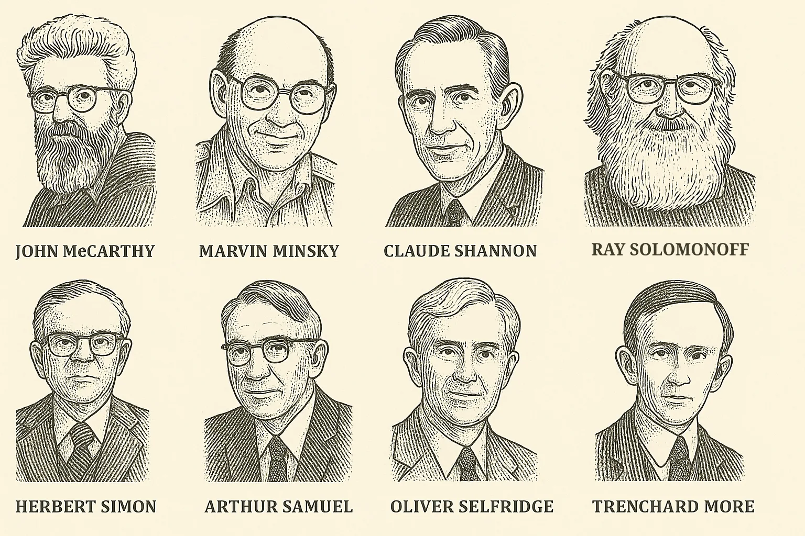
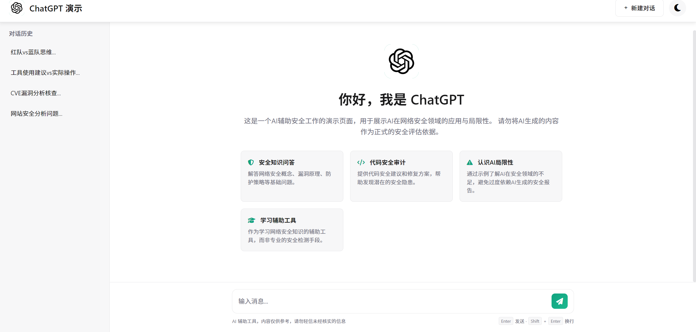
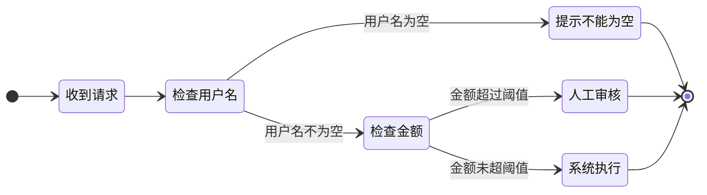
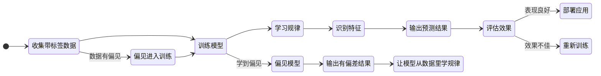
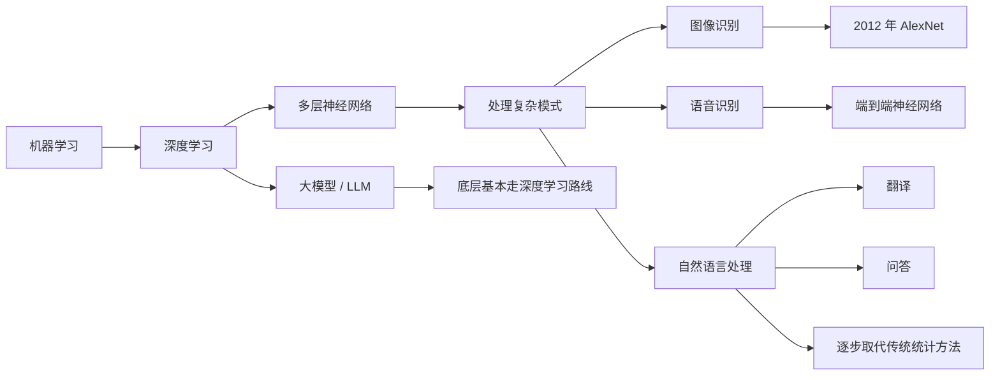
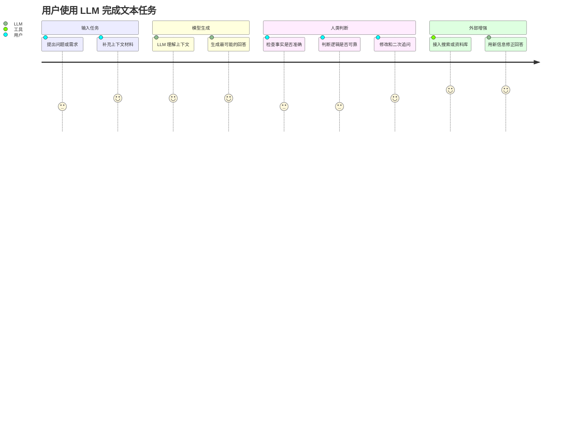

# 什么是 AI

AI 的全称是 Artificial Intelligence，中文叫「人工智能」。

  <strong>先记住一句话：</strong>AI 可以先理解成一组能力，让计算机在某些任务上表现出“类似智能”的行为。

<figure markdown="1" style="margin:1.2rem 0;text-align:center;">
{ style="max-width:100%;border-radius:0.65rem;box-shadow:0 0.35rem 1.2rem rgba(0,0,0,0.16);" }
<figcaption style="margin-top:0.55rem;font-size:0.86rem;color:var(--md-default-fg-color--light);">图1：1956 年达特茅斯会议的八位参会者</figcaption>
</figure>

这个词诞生于 1956 年。那年夏天，一群科学家在美国达特茅斯学院开了两个月的会，第一次把**「让机器像人一样思考」**这件事正式命名为人工智能。参会的人里包括 **John McCarthy、Marvin Minsky、Claude Shannon、Herbert Simon**——每一个名字后来都影响了计算机科学的走向。

AI 到底怎么定义？这个问题从 1956 年一路吵到今天，学界和产业界各有说法。

## AI 发展里程碑：七十年走了多远

从达特茅斯会议到现在，AI 经历了「三起两落」——三次浪潮之间夹着两次寒冬。每次低谷都是对技术路径的反思，每次爆发都离不开算法、数据、算力三要素的共振。

几个值得记住的关键节点：

| 年份 | 事件 | 为什么重要 |
|------|------|-----------|
| 1950 | 图灵测试（Turing Test） | 第一次给出「机器能不能思考」的判据 |
| 1956 | 达特茅斯会议 | AI 正式成为一门学科 |
| 1966 | ELIZA 聊天机器人 | 世界上第一个聊天程序，用模式匹配模拟心理治疗对话。它的创建者 Weizenbaum 后来反而成了 AI 伦理的批评者——他发现用户居然会对一个这么简单的程序产生情感依赖 |
| 1969 | 感知机 XOR 困境 | Minsky 等人证明单层感知机无法解决异或问题，直接导致神经网络研究被冷落近 15 年 |
| 1997 | 深蓝击败卡斯帕罗夫 | AI 首次在正式比赛中战胜人类世界冠军。但深蓝靠的是暴力穷举，它并不理解棋局 |
| 2012 | AlexNet 夺冠 | 深度学习第一次在大规模竞赛中碾压传统方法，引爆了工业界的关注 |
| 2016 | AlphaGo 击败李世石 | 围棋被认为是最复杂的棋类，AlphaGo 用深度学习 + 强化学习攻破了这个「人类最后的堡垒」 |
| 2022 | ChatGPT 发布 | 2 个月月活破亿，成为历史上增长最快的消费者应用，AI 从学术圈正式走向大众 |

> 💡 **规律**：每一次低谷都是对技术路径的反思，每一次爆发都是算法、数据、算力三要素协同共振的结果。

## 别纠结定义，先看 AI 能做什么

别把 AI 绑定到某个具体产品上。只要能让计算机表现出「像智能一样」的能力，都可以放进 AI 这张大地图里。

常见的 AI 任务：

-   **识别**

    识别人脸、识别语音、识别图片中的物体

-   **分类**

    判断垃圾邮件、标记恶意样本、给用户打标签

-   **预测**

    预测天气、预测故障、预测用户可能点击什么

-   **推荐**

    视频推荐、商品推荐、内容推荐

-   **生成**

    写文字、画图、生成代码、合成语音

-   **规划与对话**

    路径规划、资源调度、任务拆解、问答、客服、翻译、总结

你手机上的人脸解锁是 AI，外卖 App 猜你今天想吃什么的算法是 AI，ChatGPT 也是 AI。

它们都属于 AI，但走的技术路线并不一样。

AI 就是一张大地图，上面每一项任务对应不同的分支和路线。

### AI 就在你身边：真实案例

上面六类任务，每一类都能在日常生活中找到你已经在用的产品：

| AI 任务 | 你可能在用的产品 | 背后的技术 |
|---------|----------------|-----------|
| 识别 | 手机人脸解锁、支付宝刷脸支付 | 计算机视觉（Computer Vision） |
| 分类 | 邮箱自动过滤垃圾邮件 | 文本分类（Text Classification） |
| 预测 | 天气预报、高德地图预估到达时间 | 时序预测、回归模型 |
| 推荐 | 抖音推荐、淘宝「猜你喜欢」、B 站推荐页 | 协同过滤、深度推荐模型 |
| 生成 | ChatGPT 写文案、Midjourney 画图、Suno 生成音乐 | 大语言模型、扩散模型 |
| 规划与对话 | 小爱同学 / Siri 语音助手、高德路线规划 | 语音识别 + NLP、路径规划算法 |

> 你不需要理解这些技术名词——后面会逐个展开。现在只要意识到：AI 已经渗透到你的日常生活里了，只是很多时候你没注意到。

## AI 有很多条技术路线

<figure markdown="1" style="margin:1.2rem 0;text-align:center;">
{ style="max-width:100%;border-radius:0.65rem;box-shadow:0 0.35rem 1.2rem rgba(0,0,0,0.16);" }
<figcaption style="margin-top:0.55rem;font-size:0.86rem;color:var(--md-default-fg-color--light);">图2：ChatGPT</figcaption>
</figure>

很多人第一次接触 AI，是从 ChatGPT 开始的。时间一久，就很容易把 AI 和聊天机器人画上等号——这可太窄了。

AI 这门学科已经发展了几十年，里面积累了很多路线。Hello-AI 里你会主要接触到以下几条：

<h3 id="规则系统">规则系统</h3>

  <strong>关键词：</strong>人写条件，系统照着执行。

最早的 AI 实现方式，直白到不能再直白。

- 人写好条件 → 系统执行
- 如果用户名为空，提示「不能为空」
- 如果金额超过阈值，走人工审核

规则系统好处明显：稳定、可控、好解释。麻烦也明显：一遇到复杂场景，规则会爆炸。你没法为每一种可能的情况提前写好规则。

<h3 id="机器学习">机器学习</h3>

  <strong>关键词：</strong>把大量样本交给模型，让它自己从数据里找规律。

给它大量带标签的样本，模型自己学会：

- 哪些特征更像垃圾邮件
- 哪些行为更像异常登录
- 哪些商品更可能被点击

它比规则系统灵活很多。代价也很明确：非常依赖数据质量。数据有偏见，学出来的模型就会有偏见。

<h3 id="深度学习">深度学习</h3>

  <strong>关键词：</strong>机器学习里的重要路线，用多层神经网络处理复杂模式。

深度学习是机器学习里的一条重要路线。它用多层神经网络来处理更复杂的模式。

它的突破让 AI 在以下领域大幅超越了之前的水平：

- 图像识别：2012 年 AlexNet 在 ImageNet 竞赛中把错误率从 26% 降到 15.3%，直接引爆了工业界对深度学习的关注
- 语音识别：端到端的神经网络模型让语音转文字的准确率有了质的提升
- 自然语言处理：从翻译到问答，深度学习方法逐步取代了传统的统计方法

今天大家口中说的「大模型」，底层基本都走的是深度学习这条路。

<h3 id="大模型-llm">大模型 / LLM</h3>

  <strong>关键词：</strong>在海量文本上训练，擅长问答、总结、改写、抽取和生成草稿。

LLM 是 Large Language Model 的缩写，中文叫「大语言模型」。它是深度学习里偏语言方向的一类模型。

特点是在海量文本上训练，参数规模动辄几百亿到几千亿。你熟悉的 *ChatGPT、Claude、DeepSeek*、通义千问，都是 LLM 往上再包一层的产品。

LLM 擅长文本类任务：问答、总结、改写、抽取、生成草稿、在上下文中推理。

LLM 有三个明显的边界：

- 正确性没法自动保证：它生成的是「最可能的回答」，跟「经核实的事实」还有距离
- 知识有截止线：训练结束之后发生的事情，需要搜索或其他外部工具补上
- 长链条精确逻辑不稳定：算账、审计、严格的因果推理，需要额外验证

## 一张图理清关系

把这些概念串起来，关系是这样的：

<pre style="padding:1rem 1.2rem;border-radius:0.65rem;background:var(--md-code-bg-color);border:1px solid var(--md-default-fg-color--lightest);overflow:auto;">
AI（人工智能总称）
└─ 机器学习（从数据里学规律）
   └─ 深度学习（用深层神经网络处理复杂模式）
      └─ LLM（大语言模型，偏语言方向）
         └─ ChatGPT 等产品（LLM + 产品包装）
</pre>

LLM 只是 AI 这张大地图里的一条路线——记住这个定位就好。

如果你在跟别人聊 AI 时，对方默认「AI = ChatGPT」，大概率是被产品宣传带偏了。AI 这张地图远比聊天机器人宽。

## AI 的三个层次：你现在看到的，只是起点

AI 研究里还有一个常用的分层框架，把 AI 分成三种级别。这个框架做了简化，用来帮新人建立坐标系足够了。

**ANI：弱人工智能 / 窄人工智能**

ANI 就是现在你每天在用的所有 AI。

它在某一个特定任务上可以做到非常强——AlphaGo 能赢李世石，医学影像 AI 能比放射科医生更快找到肿瘤，GPT-4 能通过律师资格考试——但它的能力无法迁移到别的领域。

会下围棋的系统，换成麻将就要重新设计；能写代码的模型，放到看病场景也要重新训练和校准。每次换任务，都要重新适配。

当前 AI 的真实水平就是这样：单任务可以很强，通用的理解和适应能力还差得远。

> 注意，当前最强大的 LLM 仍然停在 ANI 这一层，离 AGI 还有距离。

**AGI：通用人工智能**

AGI 是一个还没实现的目标：让机器在任何认知任务上达到甚至超过人类的水平。

它需要的能力远超单任务表现，还要能跨领域迁移学习。学了棋，能把某些思路用到医疗诊断；学了翻译，能迁移到法律推理；还能从少量样本中泛化，做因果推理，跳出单纯的统计相关性，甚至自主设定目标、分解任务、在环境变化时调整策略。

AGI 什么时候能实现？没人知道。乐观的人说十几年，悲观的人说永远。但无论时间线如何，它目前仍然停留在科研前沿，离日常可用的产品还有距离。

**ASI：超级人工智能**

ASI 是比 AGI 更远的概念：在所有领域都远超人类的智能。

它在理论上可能具备递归自我改进的能力——自己修改自己的架构，越改越聪明，最终引发「智能爆炸」。但这一切都是高度推测性的，目前没有任何实现路径。

对新人来说，理解这三个词就够了：

-   **ANI：现在的 AI**

    专精特定任务，迁移不了。你今天接触到的所有 AI，基本都在这一层。

-   **AGI：未来的目标**

    能像人类一样通用地思考和解决问题，目前还没有实现。

-   **ASI：更远的假设**

    在所有领域都远超人类的智能，目前属于高度推测。

这三个词不用背学术定义，抓住一个判断就行：今天接触到的 AI，基本都在 ANI 这一层。ChatGPT 看起来很「聪明」，跟人的大脑走的是两套机制。

## AI 的能力边界

搞清楚 AI 的能力边界，比记一百个名词管用。

**LLM 很擅长：**

- 总结长文本
- 改写润色
- 翻译
- 按模板生成内容
- 在已知知识范围内回答问题
- 代码补全和简单调试

**LLM 需要谨慎使用的场景：**

- 稳定给出事实正确的答案（它会自信地胡说，这叫「幻觉」）
- 处理训练截止时间之后的新信息
- 严格的数学计算和精确逻辑推理
- 在长链条任务中保持一致性
- 理解情感和语境中的微妙含义
- 需要常识判断的开放式场景

  <strong>经验法则：</strong>把 AI 当成一个读过很多书但没见过真实世界、而且偶尔会瞎编的助手。它很强，但需要你监督。

## 动手试试：在线体验 AI

光看概念不如上手试一试。以下是几个免费的在线体验，不需要安装任何软件，打开浏览器就能玩：

??? example "🎨 Quick, Draw! —— 让 AI 猜你画什么"

    **地址**：[quickdraw.withgoogle.com](https://quickdraw.withgoogle.com/)
    
    你有 20 秒时间画一个物体（猫、自行车、杯子……），AI 会实时猜你画的是什么。
    
    **背后的技术**：神经网络图像识别。AI 从数百万张简笔画中学会了「猫大概长什么样」的模式。
    
    **试试看**：故意画得潦草一点，观察 AI 还能不能认出来。想想：为什么有时候 AI 猜得比你朋友还准？

??? example "🧠 Teachable Machine —— 训练你自己的 AI 模型"

    **地址**：[teachablemachine.withgoogle.com](https://teachablemachine.withgoogle.com/)
    
    用摄像头拍几张照片作为「类别 A」，再拍几张作为「类别 B」，几秒钟就能训练出一个能区分它们的 AI。
    
    **背后的技术**：迁移学习（Transfer Learning）。AI 已经在海量图片上预训练过，你只需要提供少量样本就能让它识别新类别。
    
    **试试看**：分别拍「举手」和「不举手」两组照片，然后用举手来控制网页播放/暂停。体会一下「少量数据就能训练」是什么感觉。

??? example "📊 TensorFlow Playground —— 可视化神经网络学习过程"

    **地址**：[playground.tensorflow.org](http://playground.tensorflow.org/)
    
    在网页上直接调整神经网络的层数、神经元数量、激活函数，然后点击播放，看模型如何一步步学会分类数据点。
    
    **背后的技术**：前馈神经网络 + 反向传播。
    
    **试试看**：先用默认设置跑一次，然后把隐藏层从 2 层改成 6 层，观察训练速度和效果的变化。这就是「模型越深越强，但也越容易过拟合」的直观感受。

??? example "💬 和一个 1966 年的聊天机器人对话"

    **地址**：[psych.fullerton.edu/mbirnbaum/psych101/eliza.htm](https://psych.fullerton.edu/mbirnbaum/psych101/eliza.htm)
    
    ELIZA 是 1966 年 MIT 的 Joseph Weizenbaum 写的程序，用模式匹配模拟心理治疗师。你说话，它回话，看起来好像能理解你——但它的代码总共不到 200 行。
    
    **试试看**：和它聊几句，然后问自己：你有没有那么一瞬间觉得它「真的在听」？这就是 ELIZA 效应——人类天生倾向于把理解投射到机器上。

## 八个常见误解

下面这些误解，是从大量 AI 科普中反复出现的问题里整理出来的。

**误解 1：AI 像人一样思考**

AI 没有意识、没有情绪、没有自我认知。它做的事情说到底就是：在数据里找模式，然后输出最可能的结果。它也能模拟对话，背后可没有什么「理解」和「感受」。

**误解 2：AI 很快会有意识**

意识来自极其复杂的生物演化，写几段代码离这件事还差得很远。当前 AI 底下跑的还是数学函数，谈不上真正拥有「想要」和「知道」。

**误解 3：AI 会取代所有工作**

历史上每次技术革命都会淘汰一些岗位，也会创造新的岗位。AI 会先接管工作里机械、重复的部分；创造力、同理心、批判判断，这些还得人来兜底。

**误解 4：AI 始终客观公正**

AI 从数据里学，数据又是人造的，里面经常带着人的偏见。这就会带来算法偏见。

一个真实的例子：2014 到 2017 年间，**Amazon 开发了一套 AI 招聘工具**，用 10 年的历史简历数据训练模型，自动给候选人打 1–5 星。结果发现，简历中包含「women's」（如"女子象棋俱乐部"、"女子学院"）等词汇时，系统会自动降分。原因很简单：过去技术岗位的录用者大多是男性，模型忠实地学到了这个偏见模式。

Amazon 后来想删掉明确的性别字段来修正问题，结果没用。教育背景、用词选择这些变量，照样可能带着性别信息。深层偏见根除不了，这个项目最终被放弃。

> ⚠️ 核心教训：**删掉性别字段，删不掉性别偏见**。如果训练目标本身有缺陷，AI 即使在技术上「正确运行」，输出依然是有偏差的。

**误解 5：AI 会毁灭人类**

当前 AI 最大的风险，主要来自人类对它的错误使用：深度伪造、自主武器、大规模监控。机器自己没有动机和目标，危险往往出在用机器的人身上。

**误解 6：AI 比人类聪明**

AI 在某些任务上可以碾压人类，比如下围棋、算大数。这些都属于窄智能。人类智能更通用，能适应、推理、感受、想象，还能在不同场景间迁移。两者的「聪明」不是一个维度。

**误解 7：AI 能自己学习进步**

即使是现在最前沿的模型，也需要大量人类参与：设计算法、选择数据、标注样本、评估结果、调整参数。离开这些持续输入，AI 就谈不上自动「进化」。

**误解 8：AI 能解决我们所有的问题**

AI 是工具，担不起救世主这个角色。那些源于贪婪、不平等和道德缺失的问题，最后还得人类社会自己处理。用得好，它是帮手；用不好，它会放大问题。选择权在人。

## 这章学完之后，你应该能做什么

读完这一章，你当然还不是 AI 专家。先做到这几件事就够了：

-   **分清概念关系**

    能说清 AI、机器学习、深度学习、LLM 之间是什么关系。

-   **看懂当前阶段**

    知道现在所有的 AI 都是弱人工智能（ANI），包括你用的 ChatGPT。

-   **判断适用边界**

    能判断哪些问题适合交给 AI，哪些问题最好自己把关。

-   **看穿标题党**

    遇到「AI 即将觉醒」「AI 要取代全人类」这类标题，能先停一下，判断它到底在说技术事实，还是在制造情绪。

## 练习题 / 小实验

??? question "练习 1：概念分类"

    以下哪些属于 AI？哪些不属于？为什么？
    
    - (a) 手机计算器算 123 × 456
    - (b) 微信语音转文字
    - (c) Excel 排序一列数字
    - (d) 高德地图预测到达时间
    - (e) 自动贩卖机投币出货
    
    ??? done "参考思路"
    
        (b) 和 (d) 属于 AI。(b) 用了语音识别模型，(d) 用了时序预测模型。计算器 (a) 和 Excel 排序 (c) 是确定性算法，输出固定可预测，不需要从数据中学习。贩卖机 (e) 是机械逻辑，和 AI 无关。判断依据：**是否需要从数据中学习模式**。

??? question "练习 2：技术路线判断"

    下面这些场景分别更适合用规则系统还是机器学习？为什么？
    
    - (a) 电梯按楼层停靠
    - (b) 判断一封邮件是不是垃圾邮件
    - (c) ATM 检查密码是否正确
    - (d) 预测用户明天会不会打开某个 App
    
    ??? done "参考思路"
    
        - (a) 规则系统——楼层逻辑简单确定，无需从数据学习
        - (b) 机器学习——垃圾邮件的形式千变万化，无法穷举规则
        - (c) 规则系统——密码匹配是确定性判断
        - (d) 机器学习——用户行为复杂多变，需要从历史数据中学习模式

??? question "练习 3：偏见识别"

    假设你要训练一个模型来预测「谁更适合担任 CEO」，训练数据是一家公司过去 20 年的 CEO 任命记录。这家公司历史上 95% 的 CEO 都是男性。
    
    - (a) 模型可能会学到什么偏见？
    - (b) 如果删除性别字段，能解决问题吗？
    - (c) 你会怎么改进？
    
    ??? done "参考思路"
    
        - (a) 模型很可能学到「男性更适合当 CEO」的偏见模式
        - (b) 不能。其他字段（如职业经历、教育背景、社交网络）可能仍然携带性别信息，就像 Amazon 招聘工具的案例
        - (c) 可以：审视训练数据是否具有代表性、在评估阶段专门检测偏见指标、引入人工审核环节、定期审计模型输出的公平性

??? question "练习 4：动手实验"

    打开 [Quick, Draw!](https://quickdraw.withgoogle.com/)，完成以下任务：
    
    1. 正常画 5 个物体，记录 AI 猜对几个
    2. 故意画得非常潦草，记录 AI 猜对几个
    3. 找一个你觉得 AI 不太可能认识的词（比如「emoji」或「wifi」），试试 AI 能不能认出来
    
    思考：AI 的识别能力来自哪里？它为什么会「认识」或「不认识」某个东西？
    
    ??? done "参考思路"
    
        AI 的识别能力来自训练数据。训练集中有大量「猫」的简笔画，它就更容易认出你画的猫；训练集中很少出现某个概念，它就大概率认不出来。这也解释了为什么 AI 的表现会受文化和地区影响：训练数据覆盖不了所有人的经验。

## 延伸阅读

- [人工智能发展简史：从图灵测试到 GPT-5](https://cloud.tencent.com/developer/article/2632623) —— 腾讯云开发者社区，完整梳理 70 年「三起两落」
- [微软 AI For Beginners 课程](https://microsoft.github.io/AI-For-Beginners/) —— 12 周 24 节课的免费入门课程，含动手实验
- [Google ML Crash Course](https://developers.google.com/machine-learning/crash-course/) —— 谷歌出品的机器学习速成课，含浏览器内编程练习
- [Why a 1960s Chatbot Left Its Creator Deeply Unsettled](https://www.history.com/articles/ai-first-chatbot-eliza-artificial-intelligence-precursor-llms) —— ELIZA 创建者 Weizenbaum 的故事，关于技术伦理的早期反思

## 下一步

分清了 AI 的大概范围之后，下一站建议看：

<a href="machine-learning.md" style="display:block;margin-top:0.75rem;padding:0.85rem 1rem;border-radius:0.55rem;background:var(--md-default-bg-color);text-decoration:none;border:1px solid var(--md-default-fg-color--lightest);">
  <strong>机器学习 →</strong> 
  了解 AI 如何从数据里学习规律，以及它和规则系统的区别。
</a>

