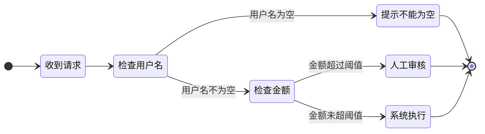
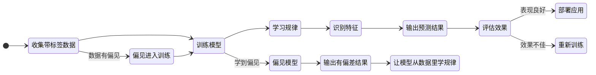
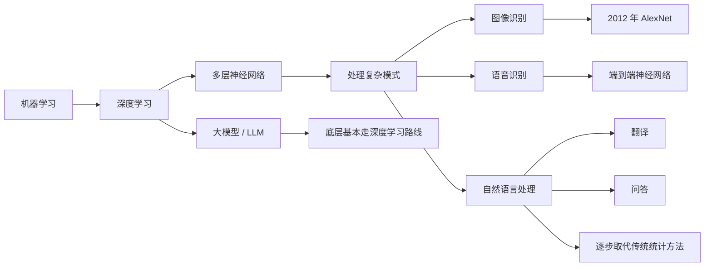
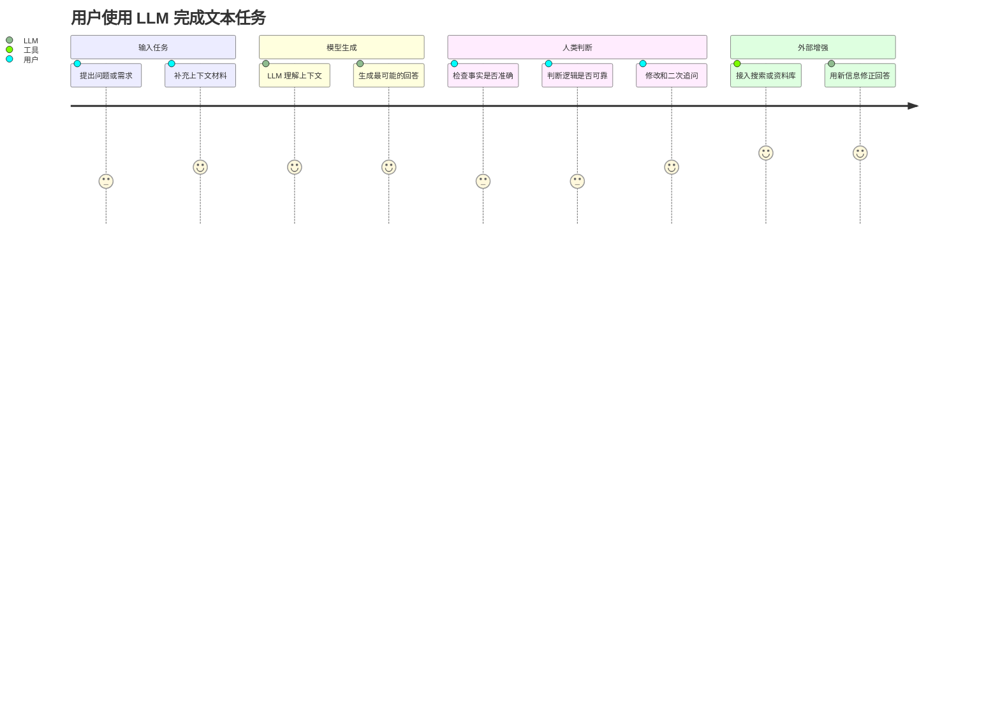

# 什么是 AI

AI 的全称是 Artificial Intelligence，中文叫「人工智能」。

  <strong>先记住一句话：</strong>AI 可以先理解成一组能力，让计算机在某些任务上表现出“类似智能”的行为。

<figure markdown="1" style="margin:1.2rem 0;text-align:center;">
{ style="max-width:100%;border-radius:0.65rem;box-shadow:0 0.35rem 1.2rem rgba(0,0,0,0.16);" }
<figcaption style="margin-top:0.55rem;font-size:0.86rem;color:var(--md-default-fg-color--light);">图1：1956 年达特茅斯会议的八位参会者</figcaption>
</figure>

这个词诞生于 1956 年。那年夏天，一群科学家在美国达特茅斯学院开了两个月的会，第一次把**「让机器像人一样思考」**这件事正式命名为人工智能。参会的人里包括 **John McCarthy、Marvin Minsky、Claude Shannon、Herbert Simon**——每一个名字后来都影响了计算机科学的走向。

AI 到底怎么定义？这个问题从 1956 年一路吵到今天，学界和产业界各有说法。

## 与其纠结定义，先看 AI 能做什么

先别把 AI 绑定到某个具体产品上。更准确的理解是，一堆让计算机表现出「像智能一样」的能力，都可以放进 AI 这张大地图里。

常见的 AI 任务：

-   **识别**

    识别人脸、识别语音、识别图片中的物体

-   **分类**

    判断垃圾邮件、标记恶意样本、给用户打标签

-   **预测**

    预测天气、预测故障、预测用户可能点击什么

-   **推荐**

    视频推荐、商品推荐、内容推荐

-   **生成**

    写文字、画图、生成代码、合成语音

-   **规划与对话**

    路径规划、资源调度、任务拆解、问答、客服、翻译、总结

你手机上的人脸解锁是 AI，外卖 App 猜你今天想吃什么的算法是 AI，ChatGPT 也是 AI。

它们都属于 AI，但走的技术路线并不一样。

AI 更像一张大地图，上面每一项任务对应不同的分支和路线。

## AI 有很多条技术路线

<figure markdown="1" style="margin:1.2rem 0;text-align:center;">
{ style="max-width:100%;border-radius:0.65rem;box-shadow:0 0.35rem 1.2rem rgba(0,0,0,0.16);" }
<figcaption style="margin-top:0.55rem;font-size:0.86rem;color:var(--md-default-fg-color--light);">图2：ChatGPT</figcaption>
</figure>

很多人第一次接触 AI，是从 ChatGPT 开始的。时间一久，就很容易把 AI 和聊天机器人画上等号。

这个理解太窄了。

AI 这门学科已经发展了几十年，里面积累了很多路线。Hello-AI 里你会主要接触到以下几条：

<h3 id="规则系统">规则系统</h3>

  <strong>关键词：</strong>人写条件，系统照着执行。

这是最早的 AI 实现方式，也是最直白的一种。

- 人写好条件 → 系统执行
- 如果用户名为空，提示「不能为空」
- 如果金额超过阈值，走人工审核

规则系统的好处很明显，稳定、可控、好解释。麻烦也很明显，一遇到复杂场景，规则会爆炸。你没法为每一种可能的情况提前写好规则。

<h3 id="机器学习">机器学习</h3>

  <strong>关键词：</strong>把大量样本交给模型，让它自己从数据里找规律。

给它大量带标签的样本，模型自己学会：

- 哪些特征更像垃圾邮件
- 哪些行为更像异常登录
- 哪些商品更可能被点击

它比规则系统灵活很多，但非常依赖数据质量。数据有偏见，学出来的模型就会有偏见。

<h3 id="深度学习">深度学习</h3>

  <strong>关键词：</strong>机器学习里的重要路线，用多层神经网络处理复杂模式。

深度学习是机器学习里的一条重要路线。它用多层神经网络来处理更复杂的模式。

它的突破让 AI 在以下领域大幅超越了之前的水平：

- 图像识别：2012 年 AlexNet 在 ImageNet 竞赛中把错误率从 26% 降到 15.3%，直接引爆了工业界对深度学习的关注
- 语音识别：端到端的神经网络模型让语音转文字的准确率有了质的提升
- 自然语言处理：从翻译到问答，深度学习方法逐步取代了传统的统计方法

今天大家口中说的「大模型」，底层基本都走的是深度学习这条路。

<h3 id="大模型-llm">大模型 / LLM</h3>

  <strong>关键词：</strong>在海量文本上训练，擅长问答、总结、改写、抽取和生成草稿。

LLM 是 Large Language Model 的缩写，中文叫「大语言模型」。它是深度学习里偏语言方向的一类模型。

特点是在海量文本上训练，参数规模动辄几百亿到几千亿。你熟悉的 *ChatGPT、Claude、DeepSeek*、通义千问，都是 LLM 往上再包一层的产品。

LLM 擅长文本类任务：问答、总结、改写、抽取、生成草稿、在上下文中推理。

LLM 有三个明显的边界：

- 正确性没法自动保证：它生成的是「最可能的回答」，和「经核实的事实」之间还有距离
- 知识有截止线：训练结束之后发生的事情，需要搜索或其他外部工具补上
- 长链条精确逻辑不稳定：算账、审计、严格的因果推理，需要额外验证

## 一张图理清关系

把这些概念串起来，关系是这样的：

<pre style="padding:1rem 1.2rem;border-radius:0.65rem;background:var(--md-code-bg-color);border:1px solid var(--md-default-fg-color--lightest);overflow:auto;">
AI（人工智能总称）
└─ 机器学习（从数据里学规律）
   └─ 深度学习（用深层神经网络处理复杂模式）
      └─ LLM（大语言模型，偏语言方向）
         └─ ChatGPT 等产品（LLM + 产品包装）
</pre>

LLM 只是 AI 这张大地图里的一条路线。

如果你在跟别人聊 AI 时，对方默认「AI = ChatGPT」，大概率是被产品宣传带偏了。真实的 AI 地图要宽得多。

## AI 的三个层次：你现在看到的，只是起点

AI 研究里还有一个常用的分层框架，把 AI 分成三种级别。这个框架有简化成分，但很适合帮新人建立坐标系。

**ANI：弱人工智能 / 窄人工智能**

ANI 就是现在你每天在用的所有 AI。

它在某一个特定任务上可以做到非常强——AlphaGo 能赢李世石，医学影像 AI 能比放射科医生更快找到肿瘤，GPT-4 能通过律师资格考试——但它的能力无法迁移到别的领域。

会下围棋的系统，换成麻将就要重新设计；能写代码的模型，放到看病场景也要重新训练和校准。每次换任务，都要重新适配。

这就是当前 AI 的真实水平：在特定任务上很强，但没有通用的理解和适应能力。

> 注意，当前最强大的 LLM 依然停留在 ANI 弱人工智能这一层，还没到 AGI 通用人工智能。

**AGI：通用人工智能**

AGI 是一个还没实现的目标：让机器在任何认知任务上达到甚至超过人类的水平。

它需要的能力远超单任务表现，还要能跨领域迁移学习。学了棋，能把某些思路用到医疗诊断；学了翻译，能迁移到法律推理；还能从少量样本中泛化，做因果推理，跳出单纯的统计相关性，甚至自主设定目标、分解任务、在环境变化时调整策略。

AGI 什么时候能实现？没人知道。乐观的人说十几年，悲观的人说永远。但无论时间线如何，它目前仍然停留在科研前沿，离日常可用的产品还有距离。

**ASI：超级人工智能**

ASI 是比 AGI 更远的概念：在所有领域都远超人类的智能。

它在理论上可能具备递归自我改进的能力——自己修改自己的架构，越改越聪明，最终引发「智能爆炸」。但这一切都是高度推测性的，目前没有任何实现路径。

对新人来说，理解这三个词就够了：

-   **ANI：现在的 AI**

    专精于特定任务，缺少通用迁移能力。你今天接触到的所有 AI，基本都在这一层。

-   **AGI：未来的目标**

    能像人类一样通用地思考和解决问题，目前还没有实现。

-   **ASI：更远的假设**

    在所有领域都远超人类的智能，目前属于高度推测。

这三个词不用背学术定义，抓住一个判断就行：今天接触到的 AI，基本都在 ANI 这一层。ChatGPT 看起来很「聪明」，但它和人的大脑走的是两套机制。

## AI 的能力边界

把 AI 的能力边界搞清楚，比记一百个名词更重要。

**LLM 很擅长：**

- 总结长文本
- 改写润色
- 翻译
- 按模板生成内容
- 在已知知识范围内回答问题
- 代码补全和简单调试

**LLM 需要谨慎使用的场景：**

- 稳定给出事实正确的答案（它会自信地胡说，这叫「幻觉」）
- 处理训练截止时间之后的新信息
- 严格的数学计算和精确逻辑推理
- 在长链条任务中保持一致性
- 理解情感和语境中的微妙含义
- 需要常识判断的开放式场景

  <strong>经验法则：</strong>把 AI 当成一个读过很多书但没见过真实世界、而且偶尔会瞎编的助手。它很强，但需要你监督。

## 八个常见误解

下面这些误解，是从大量 AI 科普中反复出现的问题里整理出来的。

**误解 1：AI 像人一样思考**

AI 没有意识、没有情绪、没有自我认知。它是在数据里找模式，然后输出最可能的结果。它能模拟对话，但背后没有人的那种「理解」和「感受」。

**误解 2：AI 很快会有意识**

意识来自极其复杂的生物演化，写几段代码离这件事还差得很远。当前 AI 的核心仍然是数学函数，谈不上真正拥有「想要」和「知道」。

**误解 3：AI 会取代所有工作**

历史上每次技术革命都会淘汰一些岗位，也会创造新的岗位。AI 更可能先接管工作里机械、重复的部分。创造力、同理心、批判判断，这些仍然需要人来兜底。

**误解 4：AI 始终客观公正**

AI 从数据里学，数据又是人造的，里面经常带着人的偏见。这就会带来算法偏见。一个在历史招聘数据上训练的模型，大概率会复现过去的性别或种族偏见。

**误解 5：AI 会毁灭人类**

当前 AI 最大的风险，来自人类对它的错误使用：深度伪造、自主武器、大规模监控。机器没有动机和目标，危险往往出在用机器的人身上。

**误解 6：AI 比人类聪明**

AI 在某些任务上可以碾压人类，比如下围棋、算大数，但这属于窄智能。人类智能更通用，能适应、推理、感受、想象，还能在不同场景间迁移。两者的「聪明」并不在同一个维度上。

**误解 7：AI 能自己学习进步**

即使是现在最前沿的模型，也需要大量人类参与：设计算法、选择数据、标注样本、评估结果、调整参数。离开这些持续输入，AI 就谈不上自动「进化」。

**误解 8：AI 能解决我们所有的问题**

AI 是工具，救世主这个角色它担不起。源于人性贪婪、不平等和道德缺失的问题，最后仍然要由人类社会自己处理。用得好，它是帮手；用不好，它会放大问题。选择权在人。

## 这章学完之后，你应该能做什么

读完这一章，你离 AI 专家还很远，但至少应该能做到这几件事：

-   **分清概念关系**

    能说清 AI、机器学习、深度学习、LLM 之间是什么关系。

-   **看懂当前阶段**

    知道现在所有的 AI 都是弱人工智能（ANI），包括你用的 ChatGPT。

-   **判断适用边界**

    能判断什么问题适合交给 AI，什么问题不适合。

-   **看穿标题党**

    遇到「AI 即将觉醒」「AI 要取代全人类」这类标题，能先停一下，判断它到底在说技术事实，还是在制造情绪。

## 下一步

分清了 AI 的大概范围之后，下一站建议看：

<a href="machine-learning.md" style="display:block;margin-top:0.75rem;padding:0.85rem 1rem;border-radius:0.55rem;background:var(--md-default-bg-color);text-decoration:none;border:1px solid var(--md-default-fg-color--lightest);">
  <strong>机器学习 →</strong> 
  了解 AI 如何从数据里学习规律，以及它和规则系统的区别。
</a>

