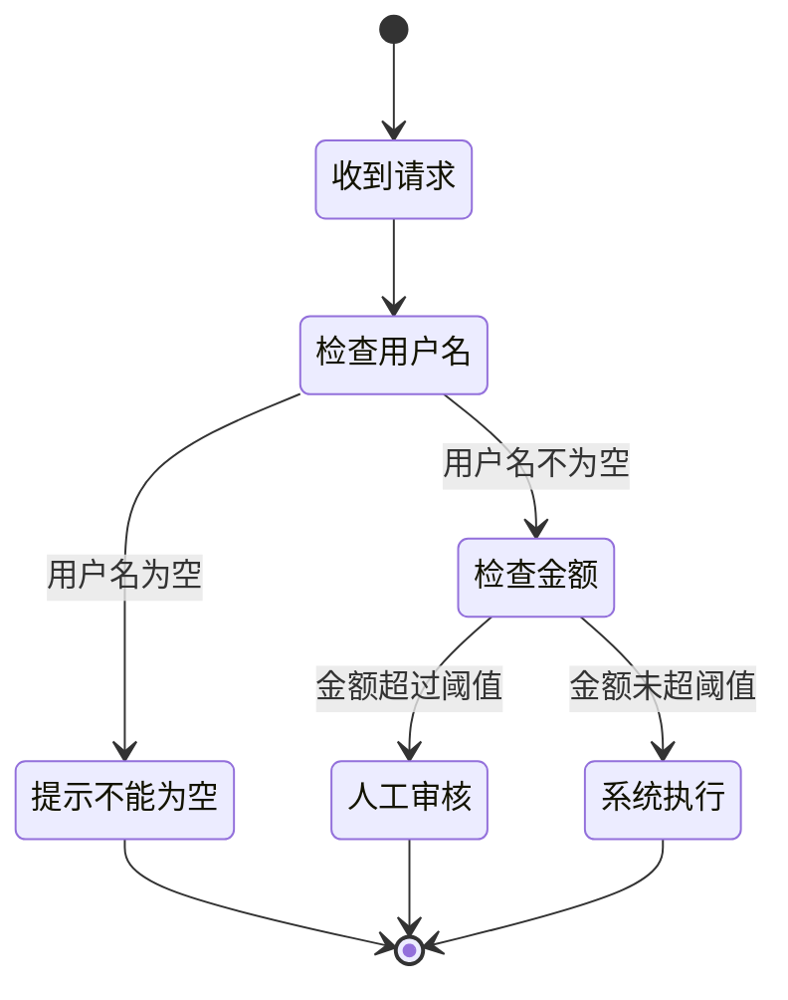
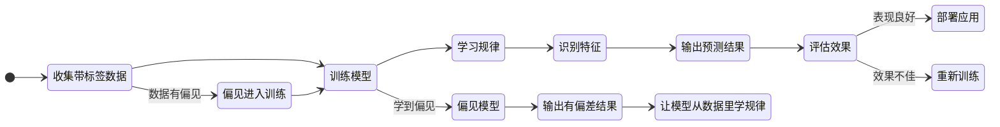
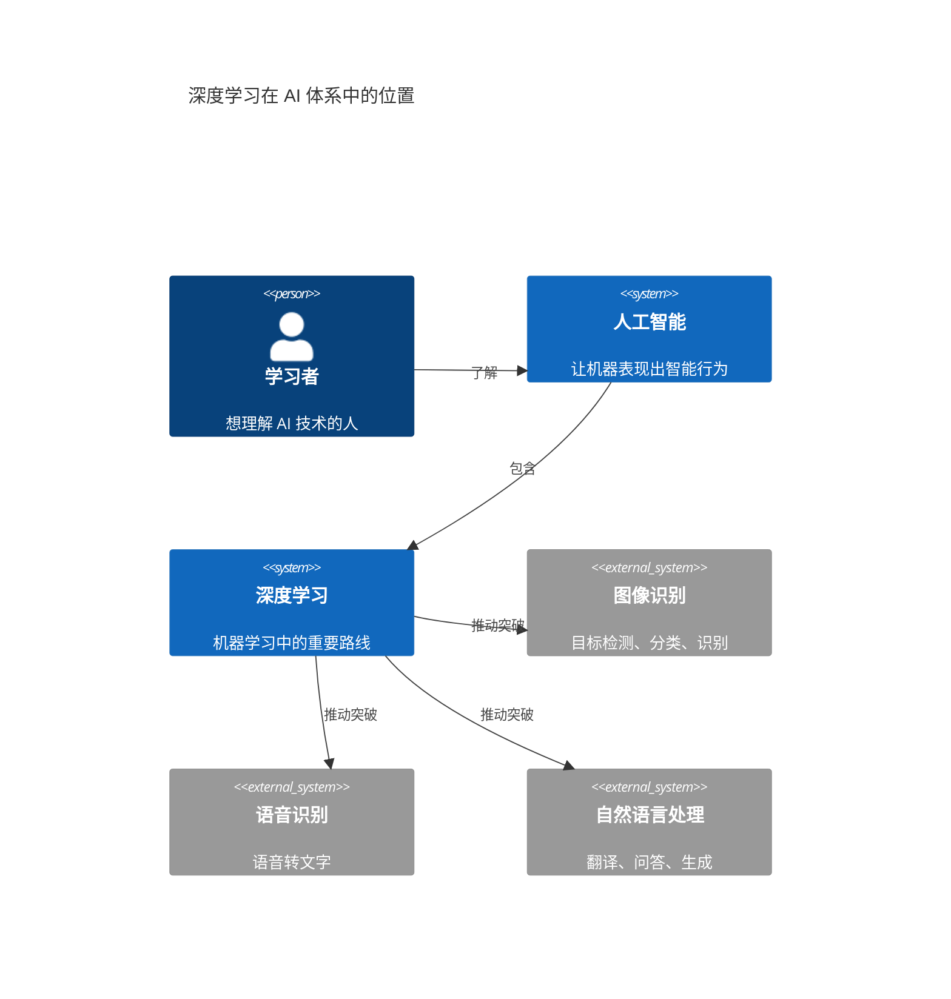

# 什么是 AI

AI 的全称是 Artificial Intelligence，中文叫「人工智能」。


<center style="font-size:14px;color:#C0C0C0;">图1：1956年达特茅斯会议的八位参会者</center>

这个词诞生于 1956 年。那年夏天，一群科学家在美国达特茅斯学院开了两个月的会，第一次把**「让机器像人一样思考」**这件事正式命名为人工智能。参会的人里包括 **John McCarthy、Marvin Minsky、Claude Shannon、Herbert Simon**——每一个名字后来都影响了计算机科学的走向。

但 AI 到底是什么？这个问题从 1956 年吵到了现在，而且越吵越不统一。

## 与其纠结定义，先看 AI 能做什么

AI 不是某一个具体产品，而是一类能力的总称。它想做的事很朴素：让计算机在某种程度上表现出「像智能一样」的行为。

常见的 AI 任务：

| 类型  | 具体例子                 |
| --- | -------------------- |
| 识别  | 识别人脸、识别语音、识别图片中的物体   |
| 分类  | 判断垃圾邮件、标记恶意样本、给用户打标签 |
| 预测  | 预测天气、预测故障、预测用户可能点击什么 |
| 推荐  | 视频推荐、商品推荐、内容推荐       |
| 生成  | 写文字、画图、生成代码、合成语音     |
| 规划  | 路径规划、资源调度、任务拆解       |
| 对话  | 问答、客服、翻译、总结          |

你手机上的人脸解锁是 AI，外卖 App 猜你今天想吃什么的算法是 AI，ChatGPT 也是 AI。

但它们不是一个东西。

AI 是那只大象的统称，上面每一项任务对应的是不同的分支和路线。

## AI 不是一个单独的技术


<center style="font-size:14px;color:#C0C0C0;">图2：ChatGPT</center>

很多人第一次接触 AI，是从 ChatGPT 开始的。这导致一个普遍的误解：AI 就是聊天机器人。

不是。

AI 是一个学科，里面有几十年积累下来的多条路线。Hello-AI 里你会主要接触到以下几条：

**规则系统**

这是最早的 AI 实现方式，也是最直白的一种。



- 人写好条件 → 系统执行
- 如果用户名为空，提示「不能为空」
- 如果金额超过阈值，走人工审核

规则系统稳定、可控、好解释。但它的问题是：遇到复杂场景，规则会爆炸。你没法为每一种可能的情况提前写好规则。

**机器学习**



给它大量带标签的样本，模型自己学会：

- 哪些特征更像垃圾邮件
- 哪些行为更像异常登录
- 哪些商品更可能被点击

它比规则系统灵活很多，但非常依赖数据质量。数据有偏见，学出来的模型就会有偏见。

**深度学习**



深度学习是机器学习里的一条重要路线。它用多层神经网络来处理更复杂的模式。

它的突破让 AI 在以下领域大幅超越了之前的水平：

- 图像识别：2012 年 AlexNet 在 ImageNet 竞赛中把错误率从 26% 降到 15.3%，直接引爆了工业界对深度学习的关注
- 语音识别：端到端的神经网络模型让语音转文字的准确率有了质的提升
- 自然语言处理：从翻译到问答，深度学习方法逐步取代了传统的统计方法

今天大家口中说的「大模型」，底层基本都走的是深度学习这条路。

**大模型 / LLM**

LLM 是 Large Language Model 的缩写，中文叫「大语言模型」。它是深度学习里偏语言方向的一类模型。

特点是在海量文本上训练，参数规模动辄几百亿到几千亿。你熟悉的 *ChatGPT、Claude、DeepSeek*、通义千问，都是 LLM 往上再包一层的产品。

LLM 擅长文本类任务：问答、总结、改写、抽取、生成草稿、在上下文中推理。

LLM 有三个明显的边界：

- 不保证正确：它生成的是「最可能的回答」，不是「经核实的事实」
- 不会自动更新知识：它的知识截止训练时点，之后发生的事情它不知道（除非接入搜索或其他外部工具）
- 长链条精确逻辑不稳定：算账、审计、严格的因果推理，单独靠 LLM 不够可靠

## 一张图理清关系

把这些概念串起来，关系是这样的：

```
AI（人工智能总称）
  └─ 机器学习（从数据里学规律）
       └─ 深度学习（用深层神经网络处理复杂模式）
            └─ LLM（大语言模型，偏语言方向）
                 └─ ChatGPT 等产品（LLM + 产品包装）
```

LLM 是 AI 的一种实现路线，不是 AI 的全部。

如果你在跟别人聊 AI 时，对方默认「AI = ChatGPT」，你就知道自己面对的是一个被营销简化过的通俗理解。真实的 AI 地图要宽得多。

## AI 的三个层次：你现在看到的，远不是终点

AI 研究里还有一个常用的分层框架，把 AI 分成三种级别。这个框架不完美，但很适合帮新人建立坐标系。

**ANI：弱人工智能 / 窄人工智能**

ANI 就是现在你每天在用的所有 AI。

它在某一个特定任务上可以做到非常强——AlphaGo 能赢李世石，医学影像 AI 能比放射科医生更快找到肿瘤，GPT-4 能通过律师资格考试——但它的能力无法迁移到别的领域。

会下围棋的系统不会打麻将，能写代码的模型不会看病。每次换任务，需要重新训练或重新设计。

这就是当前 AI 的真实水平：在特定任务上很强，但没有通用的理解和适应能力。

> 注意，即使是当前最强大的 LLM 也依然是 ANI 弱人工智能而非 AGI 通用人工智能

**AGI：通用人工智能**

AGI 是一个还没实现的目标：让机器在任何认知任务上达到甚至超过人类的水平。

它需要的不仅是单任务强，而是要能跨领域迁移学习——学了棋能用到医疗诊断，学了翻译能用到法律推理；能从少量样本中泛化，能进行因果推理而不只是统计相关性，能自主设定目标、分解任务、在环境变化时调整策略。

AGI 什么时候能实现？没人知道。乐观的人说十几年，悲观的人说永远。但无论时间线如何，它目前仍然是科研的前沿目标，不是产品。

**ASI：超级人工智能**

ASI 是比 AGI 更远的概念：在所有领域都远超人类的智能。

它在理论上可能具备递归自我改进的能力——自己修改自己的架构，越改越聪明，最终引发「智能爆炸」。但这一切都是高度推测性的，目前没有任何实现路径。

对新人来说，理解这三个词就够了：

- ANI：现在的 AI，专精但不能通用
- AGI：未来的目标，能和人类一样通用地思考和解决问题
- ASI：更远的假设，超越人类的智能

你不需要记住这三个词的学术定义，只需要知道：你今天接触到的所有 AI，都是 ANI。不要因为 ChatGPT 看起来很「聪明」，就觉得它和你的大脑是一个东西。

## AI 能干的事，和它不能干的事

把 AI 的能力边界搞清楚，比记一百个名词更重要。

**LLM 很擅长：**

- 总结长文本
- 改写润色
- 翻译
- 按模板生成内容
- 在已知知识范围内回答问题
- 代码补全和简单调试

**LLM 不擅长：**

- 保证事实正确（它会自信地胡说，这叫「幻觉」）
- 处理训练截止时间之后的新信息
- 严格的数学计算和精确逻辑推理
- 在长链条任务中保持一致性
- 理解情感和语境中的微妙含义
- 需要常识判断的开放式场景

一个有用的经验法则是：把 AI 当成一个读过很多书但没见过真实世界、而且偶尔会瞎编的助手。

它很强，但需要你监督。

## 八个常见误解

下面这些误解，是从大量 AI 科普中反复出现的问题里整理出来的。

**误解 1：AI 像人一样思考**

不是。AI 没有意识、没有情绪、没有自我认知。它是在数据里找模式，然后输出最可能的结果。它能模拟对话，但背后没有「理解」和「感受」。

**误解 2：AI 很快会有意识**

意识是生物进化的产物，不是写代码就能搞出来的。当前的 AI 本质上是数学函数，它没有「想要」也没有「知道」。

**误解 3：AI 会取代所有工作**

不会。历史上每次技术革命都淘汰了一些岗位，也创造了新的岗位。AI 更可能取代的是工作中机械、重复的部分，而不是需要创造力、同理心和批判判断的部分。

**误解 4：AI 始终客观公正**

不对。AI 从数据里学，而数据是人造的，带有人的偏见。这叫算法偏见。一个在历史招聘数据上训练的模型，大概率会复现过去的性别或种族偏见。

**误解 5：AI 会毁灭人类**

当前 AI 最大的风险不是它自己「叛变」，而是人类对它的错误使用：深度伪造、自主武器、大规模监控。机器没有动机和目标，危险的是用机器的人。

**误解 6：AI 比人类聪明**

AI 在某些任务上可以碾压人类（比如下围棋、算大数），但这叫窄智能。人类智能是通用的，能适应、推理、感受、想象并在不同场景间迁移。两者不是同一种「聪明」。

**误解 7：AI 能自己学习进步**

不能。即使是现在最前沿的模型，也需要大量人类参与：设计算法、选择数据、标注样本、评估结果、调整参数。没有人类的持续输入，AI 不会自动「进化」。

**误解 8：AI 能解决我们所有的问题**

AI 是工具，不是救世主。它解决不了源于人性贪婪、不平等和道德缺失的问题。用得好，它是帮手；用不好，它放大问题。选择权在人。

## 这章学完之后，你应该能做什么

读完这一章，你不需要成为 AI 专家。但你应该能：

1. 跟别人聊天时，分得清 AI、机器学习、深度学习、LLM 的关系
2. 知道现在所有的 AI 都是弱人工智能（ANI），包括你用的 ChatGPT
3. 能判断什么问题适合交给 AI，什么问题不适合
4. 不会被那些「AI 即将觉醒」「AI 要取代全人类」的标题吓到

## 下一步

分清了 AI 的大概范围之后，建议继续看：

- [什么是 LLM](what-is-llm.md) —— 了解大语言模型具体怎么工作、能干什么、不能干什么
