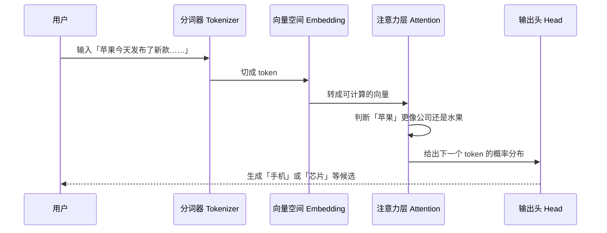

---
tags:
  - AI 基础
---

# 什么是 LLM

user  帮我把这段话改得像人话一点  
model  可以，我先保留原意，再把句子拆短一点……

LLM，全称 **Large Language Model**，中文叫「大语言模型」。

先别急着把它想成一个懂你的大脑。更贴近它工作方式的说法是，它像一台巨大的语言续写机器。你给它一段文字，它根据上下文判断后面最可能接什么，然后一个 token 一个 token 地写下去。

神奇的地方在于，当这台续写机器读过足够多文本、代码、网页、论文和对话之后，续写这件小事，会长出很多看起来很像理解、总结、翻译、写代码和推理的能力。

## 先盯住那个「发送」按钮

你在聊天框里输入一句话。

> 帮我解释一下 Transformer，别太学术，适合初中生听。

你点下发送。

屏幕停了一小会儿，答案开始往外冒。一个字，一小段，再一整段。它会解释、会换语气、会补例子。你继续追问，它还能接着前面的上下文聊下去。

这章就从这个瞬间往里拆。

先放下历史和术语。我们直接跟着一条消息往模型里面走一圈，看它到底经历了什么。

<strong>你看到的</strong>

- 输入一句自然语言
- 等几秒
- 拿到一段像人写的回答

<strong>模型里面发生的</strong>

- 文字被切成 token
- token 被转成向量
- Transformer 计算上下文关系
- 模型预测下一个 token
- 新 token 放回上下文，继续预测

一句话解释，LLM 是一种用海量文本训练出来的模型。它最核心的动作只有一个，根据上下文预测后面该怎么接。

这个区别很重要。后面讲幻觉、搜索、RAG、提示词，全都绕不开它。

## 资料库的错觉，续写器的真相

很多人第一次用 LLM，会本能地把它当成搜索引擎。

这很正常。你问它问题，它给你答案。体验上确实像搜索。

但底层完全两回事。

搜索引擎做的是检索。网页、文章、新闻、论文先存在那里，搜索引擎把相关页面找出来，再排个序给你看。

LLM 做的是生成。它根据输入和上下文，计算下一个 token 的概率，再继续往后写。它拿出来的答案，经常来自现场组织，很少像传统搜索那样从固定答案库里复制一段。

<strong>搜索引擎像图书管理员</strong>

你问它，哪本书里有这句话？

它去书架上找，然后把书名、页码和链接递给你。

<strong>LLM 像文本续写器</strong>

你给它一个开头。

它根据读过的语言模式、当前上下文和你的要求，把后面的文字写出来。

所以 LLM 可以写得很顺。

但顺，和真，隔着一层核查。

它最危险的地方也在这里。它可能把一个错误答案写得非常完整，格式正确、语气自信、逻辑看着也顺。如果你不查来源，很容易被它带走。

## 一句话在模型身体里走一圈

下面这张图展示的是一条消息的「内部旅行」，重点看顺序和角色，别把它当历史时间线。

拆成四个动作就够了。

**第一步，切开。**  
模型处理文本时，会先把整句话切成 token。中文里 token 可能是一个字，也可能是一个词；英文里可能是一个单词，也可能是单词片段。

**第二步，变成数字。**  
模型真正处理的是向量。你可以把向量理解成一个词在高维空间里的坐标，坐标里藏着语义、语气、上下文倾向。

**第三步，看关系。**  
Transformer 里的注意力机制会判断哪些 token 彼此相关。比如「苹果今天发布了新款」里的「苹果」，大概率指 Apple 公司；「这个苹果很甜」里的「苹果」，大概率是水果。

**第四步，继续写。**  
模型预测下一个 token。生成之后，它又把这个 token 放回上下文，再预测下一个。回答就是这么一点点长出来的。

这也是为什么同一个问题问两遍，答案可能不完全一样。模型每一步都在概率空间里选择后续文字，只要采样策略不同，后面就会分叉。

## 三个零件，先记住这三个

LLM 术语很多，新手最容易被名词淹没。

先抓三个就够。

<strong>Token</strong>

文本的切片单位。模型处理文字时，会沿着 token 一步步往前走。

例子，人工智能可能被切成「人工」和「智能」。

<strong>参数</strong>

模型内部可调整的数字。训练就是反复调整这些数字，让模型越来越会预测。

参数更像一大片被训练出来的语言肌肉，别把它想成一条条知识卡片。

<strong>上下文窗口</strong>

模型一次能看到多少信息。窗口越大，它能同时参考的前文、文件、代码越多。

窗口变大，信息容量会变宽；抓错重点、漏看细节的情况仍然会发生。

这三个零件拼起来，你就能理解大多数 LLM 现象。

模型为什么会忘前文？上下文窗口不够，或者注意力没抓住。  
模型为什么会编来源？因为它在生成像来源的文本，核验来源这件事还得额外做。  
模型为什么提示词一改，答案就变？因为上下文变了，概率分布也跟着变了。

## 为什么它突然爆发

LLM 当然没在 2022 年突然从天上掉下来。

它更像几条线终于撞到了一起。

<strong>2017</strong> 
Transformer 出现，注意力机制让大规模并行训练更顺。

<strong>2018-2020</strong> 
GPT 路线证明，先预训练再适配任务，可以把一个模型用到很多场景。

<strong>2022</strong> 
InstructGPT 和 ChatGPT 让模型更会听人话，对话界面把门槛降了下来。

<strong>2023 之后</strong> 
GPT-4、Claude、Gemini、LLaMA、Qwen、DeepSeek 等模型把生态推开。

只看一个节点，很容易误判。

Transformer 解决了「训得动」的问题。互联网和代码仓库提供了海量训练材料。GPU 集群把规模推上去。指令微调和人类反馈让模型更像助手。ChatGPT 又把它包装成普通人能用的聊天框。

技术爆发经常来自一堆干柴碰到火星。

LLM 也是这样。

## 它为什么看起来会思考

严格讲，LLM 的训练目标很朴素，预测下一个 token。

但朴素这个词，千万别理解成简单。

为了预测一句话后面该接什么，模型被迫学习很多东西。它要学语法，学事实，学代码结构，学论文格式，学问答套路，学一个解释应该怎么展开，也学人类在网上吵架、道歉、求助、写教程时的语言痕迹。

当规模足够大时，一些能力会冒出来。

它会总结，因为总结本身也是一种文本模式。  
它会翻译，因为不同语言之间有对应关系。  
它会写代码，因为代码也是高度结构化的语言。  
它能做一部分推理，因为训练材料里有大量解题步骤、证明、代码调试和人类解释过程。

但这里要冷静一点。

看起来会思考，和人类那种思考还有距离。

它没有主观体验，不会真的理解「疼」是什么，也不会真的对一个观点产生信念。它能模拟一段有情绪的文字，但模拟和拥有之间隔着很远。把它当工具，比把它当人安全得多。

## LLM 适合做什么

LLM 最适合处理那些能用语言描述、也能用语言交付的任务。

| 工作位 | 适合交给 LLM 的任务 | 你需要盯住什么 |
| --- | --- | --- |
| 草稿机 | 邮件、脚本、标题、提纲、汇报初稿 | 语气是否符合你本人，事实是否准确 |
| 解释器 | 解释报错、论文、概念、代码片段 | 是否把关键条件漏掉 |
| 代码搭子 | 写函数、补测试、改 bug、读项目结构 | 必须运行和审查，别只看它说得对不对 |
| 长文助手 | 总结会议、提取文档要点、整理资料 | 原文是否真的支撑它的结论 |
| 头脑风暴器 | 给角度、列方案、拆步骤、找反例 | 别把候选方案直接当最终判断 |

有一类任务要特别谨慎。

法律、医疗、金融、安全、学术引用、新闻事实、实时行情，这些都属于高风险区域。LLM 可以帮你整理问题、生成检查清单、解释背景，但事实来源要回到原始材料。

它可以当副驾驶。

方向盘还在你手上。

## 幻觉这个毛病，挺贵

幻觉听起来像一个很轻的词，好像只是偶尔胡说。

但在真实场景里，它可能很贵。

2023 年，美国纽约南区联邦法院处理过一个经典案例，**Mata v. Avianca**。律师在诉讼文件里使用了 ChatGPT 生成的法律案例引用，结果其中多个案例并不存在。文件交上去之后，对方律师查不到，法官也要求解释，最后相关律师因为提交虚假引用被制裁。

这个案例很适合放在 LLM 入门里。

因为这里的问题已经越过闲聊写错一句话，直接变成把虚构材料写进正式法律文件。更麻烦的是，它写得很像真的。案名、格式、语气、法律文本的腔调，全都有。

<strong>这里的教训也很直接，别让 LLM 独自负责事实。</strong>

LLM 负责生成，人负责核查。尤其是引用、数据、法规、论文、漏洞编号、公司财报、实时行情这种内容，必须回到原始来源。

如果你只记一条防幻觉规则，就记这个。

凡是会影响真实决策的内容，都要查源头。

## 搜索、RAG 和 LLM 怎么配合

现在很多产品会先检索资料，再把资料塞进上下文，让 LLM 根据资料组织回答。

这叫 RAG，Retrieval-Augmented Generation，检索增强生成。

它的思路很直接。

RAG 能显著降低幻觉，但它也没有免死金牌。

检索可能搜错。资料可能过期。模型可能读漏。引用也可能对不上原文。所以你看到带链接的 AI 答案，也别自动放心。链接只是检查入口，正确性还得靠你一路追到原文。

这个判断在安全、金融和学术场景里尤其重要。

## 怎么问，答案会更稳

提示词少一点玄学味会更好。

新手先做到三件事，效果就会明显好很多。

<strong>给背景</strong>

别只说「帮我写」。告诉它读者是谁、用途是什么、限制是什么。

<strong>给样例</strong>

你想要什么风格，最好贴一小段参考。模型很吃上下文里的示范。

<strong>给验收标准</strong>

告诉它避开什么。比如别编来源、别用套话、别超过 300 字。

一个弱提示词长这样。

> 解释一下 LLM。

一个更稳的提示词可以这样写。

> 我在写一篇面向 AI 新手的入门文章。请用 300 字解释 LLM，要求口语化，避开「赋能」「重塑」这类空话。必须讲清 token、上下文和幻觉风险。如果涉及事实，不确定的地方请标注出来。

你会发现，后者靠的当然没什么神秘咒语，关键就是把任务边界讲清楚。

## 常见误区

??? warning "误区 1，LLM 等于搜索引擎"

    这个理解会带偏。搜索引擎检索已有网页，LLM 生成新文本。带联网检索的产品会把两者结合，但生成部分仍然可能出错。

??? warning "误区 2，模型越大一定越适合我"

    这要看任务。大模型综合能力强，但成本、速度、上下文、工具生态、隐私部署都要算进去。写短文案、做固定分类、小规模私有任务时，小模型或专用模型可能更合适。

??? warning "误区 3，回答越流畅越可信"

    恰恰相反，越流畅的错误越危险。法律引用、论文标题、漏洞编号、财务数据、实时信息，都要回到原始来源查。

??? warning "误区 4，它真的懂我"

    它能根据上下文模拟理解你的表达，但没有人的主观体验。把它当成高性能语言工具，比把它当成有意识的伙伴更稳。

## 动手试试

光看概念不够。下面几个小实验，能让你直接摸到 LLM 的边界。

??? example "实验 1，同一句话改三种风格"

    找一段你自己写过的文字，让 LLM 分别改成「小红书风」「技术博客风」「口播风」。
    
    看看哪些信息被保留了，哪些信息被它自动改掉了。这个实验能帮你理解，LLM 很会迁移语气，但也可能悄悄改变事实。

??? example "实验 2，让它承认不确定"

    问一个偏冷门的问题，并在提示词里加一句，「不确定的地方请直接说不知道，别编」。
    
    对比加这句话前后的回答。你会发现，提示词能降低胡编概率，但没法彻底消除幻觉。

??? example "实验 3，测试上下文窗口"

    给它一篇长文章，先只贴开头 500 字让它总结，再贴全文让它总结。
    
    对比两个版本。它没看到的信息，引用起来就很飘；看到全文以后，也可能抓偏重点。

??? example "实验 4，查一次来源"

    让任意 LLM 列出 3 篇 Transformer 相关论文，并给出作者、年份和链接。
    
    然后逐个打开链接检查。重点放在来源能否回到真实页面，别被漂亮格式晃过去。

## 学完这一章，带走四句话

-   **LLM 是语言续写机器**

    它根据上下文预测下一个 token。很多复杂能力，都是从这个动作里长出来的。

-   **上下文决定它看见什么**

    你给它的信息、示例、限制和资料，会直接改变它的输出方向。

-   **流畅需要核查**

    文字越顺，越容易让人放松警惕；幻觉是生成式模型长期要面对的风险。

-   **高风险内容必须查源头**

    法律、医疗、金融、安全、论文引用、实时数据，都别只看 LLM 的回答。

## 延伸阅读

<a href="deep-learning.md" style="display:block;padding:0.95rem 1rem;border-radius:0.8rem;background:var(--md-default-bg-color);text-decoration:none;border:1px solid var(--md-default-fg-color--lightest);">
<strong>什么是深度学习</strong> 先理解多层神经网络，再看 LLM 会更顺。
</a>
<a href="token-embedding-context.md" style="display:block;padding:0.95rem 1rem;border-radius:0.8rem;background:var(--md-default-bg-color);text-decoration:none;border:1px solid var(--md-default-fg-color--lightest);">
<strong>Token、Embedding 与上下文</strong> 继续拆开 LLM 如何处理文字。
</a>
<a href="https://arxiv.org/abs/1706.03762" style="display:block;padding:0.95rem 1rem;border-radius:0.8rem;background:var(--md-default-bg-color);text-decoration:none;border:1px solid var(--md-default-fg-color--lightest);">
<strong>Attention Is All You Need</strong> Transformer 原始论文，现代 LLM 的关键起点。
</a>
<a href="https://openai.com/index/chatgpt/" style="display:block;padding:0.95rem 1rem;border-radius:0.8rem;background:var(--md-default-bg-color);text-decoration:none;border:1px solid var(--md-default-fg-color--lightest);">
<strong>OpenAI：Introducing ChatGPT</strong> ChatGPT 官方发布文章，适合了解对话式体验的起点。
</a>

## 下一步

如果你已经理解「LLM 是怎么生成文字的」，下一站建议看：

<a href="token-embedding-context.md" style="display:block;margin-top:0.75rem;padding:0.85rem 1rem;border-radius:0.65rem;background:var(--md-default-bg-color);text-decoration:none;border:1px solid var(--md-default-fg-color--lightest);">
  <strong>Token、Embedding 与上下文 →</strong> 
  继续拆开文字进入模型后的三个底层零件。
</a>

