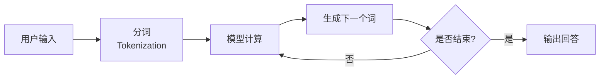

---
tags:
  - AI 基础
---

# 什么是 LLM

LLM 的全称是 Large Language Model，中文叫「大语言模型」。

你可以把它想象成一个**读了互联网上几乎所有公开文本的超级学生**——它读过维基百科、书籍、论文、网页、代码，甚至论坛里的闲聊。通过阅读这些海量文本，它学会了语言的规律：词怎么搭配、句子怎么组织、不同场景下该用什么语气说话。

你熟悉的 ChatGPT、Claude、DeepSeek、通义千问，本质上都是在 LLM 外面包了一层产品壳。LLM 是引擎，对话界面是方向盘和座椅。

## 为什么需要 LLM

在 LLM 出现之前，计算机处理语言的方式很「笨」。

比如你想让机器翻译一句话，工程师得写一堆规则：如果看到「苹果」前面是「吃」，就翻译成 fruit；如果前面是「公司」，就翻译成 Apple。规则越写越多，稍微遇到点新说法就崩盘。

后来有了机器学习，机器能从数据里学规律，不用人一条一条写规则了。但早期模型能「记住」的上下文很短，你说完三句话它就忘了第一句，生成的文本也经常前言不搭后语。

LLM 解决的核心问题就是：**让机器真正「读懂」和「说人话」**——不仅能处理很长的上下文，还能生成连贯、有逻辑、甚至带有一定推理能力的文本。

## LLM 到底是什么

拆开来看，LLM 就是三个关键词：大、语言、模型。

**大（Large）**

这里的「大」主要指两方面：**参数规模**和**训练数据量**。

参数（Parameter）是模型内部的调节旋钮，可以理解为这个「超级学生」在读书时记下的各种规律和关联。参数越多，模型能捕捉的语言细节就越丰富。

目前已公开确认的一些数字可以帮你建立直观感受：

| 模型 | 公开确认的参数量 | 训练数据量 |
| --- | --- | --- |
| GPT-3（OpenAI，2020） | 1,750 亿 | 约 3,000 亿词元（token） |
| LLaMA 3 70B（Meta，2024） | 700 亿 | 15 万亿词元 |
| DeepSeek-V3（2024） | 总参数 6,710 亿，每次激活 370 亿 | 14.8 万亿词元 |

GPT-4 的具体参数 OpenAI 没有公开，但业界普遍推测它采用了混合专家架构（Mixture of Experts，MoE），总参数量级在万亿以上。

这些数字到底是什么概念？如果把参数比作大脑里的神经突触，LLM 的「突触」数量是人类大脑的数十倍甚至上百倍。不过别紧张，这并不意味着 LLM 比人聪明——它只是专门用来处理语言的模式匹配机器。

**语言（Language）**

LLM 的主战场是人类自然语言。它能理解中文、英文、日文，也能写代码、做数学推导、生成表格。虽然名字叫「语言」模型，但它的能力已经延伸到了很多结构化文本任务。

**模型（Model）**

模型（Model）本质上是一个超级复杂的数学函数：输入一段文字，输出一段文字。它不会「思考」，而是通过统计规律预测「下一个词最可能是什么」，然后一个词一个词地生成整段回答。

## LLM 的核心能力

LLM 不是只会聊天的鹦鹉，它确实有几项扎实的本领：

**理解上下文**

你可以扔给它一篇 5,000 字的文章，让它总结核心观点；也可以跟它进行十几轮对话，它还能记得你最早提过的要求。这个「能记住多长」的能力叫上下文窗口（Context Window），就像它的短期记忆容量。早期的 GPT-3 大约能记 4,000 个词元，现在主流模型已经能处理 128,000 甚至更多的词元。

**生成连贯文本**

让它写一封辞职信、一段产品文案、一个睡前故事，它能根据你的要求调整语气、结构和细节。这个能力的本质是：它读过太多类似文本，知道「在这种情况下，通常接下来会说什么」。

**推理和翻译**

LLM 能做一些基础推理，比如「如果 A 大于 B，B 大于 C，那么 A 和 C 谁大」。也能在多种语言之间翻译，而且质量往往不错——因为它在训练时见过大量平行语料。

**总结和抽取**

从长文档里提取关键信息、把会议记录整理成待办事项、从合同里找出责任条款，这些任务 LLM 都比较擅长。

## LLM 是怎么工作的

一张图就能说明白 LLM 的基本流程：

简单来说：

1. 你输入一段文字，模型先把它切成一个个词元（Token）。词元可以是字、词，或者词的一部分。比如「人工智能」可能被切成「人工」「智能」两个 Token。
2. 模型根据这些 Token 计算出一个概率分布：下一个词最可能是什么。
3. 它选出一个词，把这个词加入上下文，再计算下一个词。
4. 循环往复，直到生成完整的回答。

所以 LLM 的核心动作其实是**预测下一个词**。它不会「理解」你的问题，只是根据海量文本中学到的模式，输出「在这种情况下最可能出现的回答」。

## LLM 不是搜索引擎

这是新手最容易踩的坑。

搜索引擎的工作方式是：**检索已有信息**。你在百度或 Google 输入问题，它去网页库里找最相关的页面，然后展示给你。这些页面在搜之前就已经存在了。

LLM 的工作方式是：**生成新文本**。它根据你输入的问题，一个词一个词地「编」出回答。这个回答可能混合了它读过的很多内容，也可能包含它自己「合理推测」出来的东西——这些东西可能是错的。

这个「自信地胡说」的现象叫**幻觉（Hallucination）**。比如你可能问它某篇论文的作者，它会给出一个听起来很合理的名字，甚至编出一篇根本不存在的论文。

所以，**不要把 LLM 当成能查证事实的工具**。它擅长的是组织语言、提供思路、帮你起草内容，但涉及事实核查，你还得自己验证。

## LLM 的能力边界

知道了 LLM 能做什么，更要清楚它不能做什么。

**不保证正确**

LLM 追求的是「看起来像正确的回答」，而不是「经过验证的事实」。它在训练时学的是「人们通常怎么回答这类问题」，而不是「这个问题的正确答案是什么」。

**知识有截止日期**

LLM 的知识截止到训练数据的时间点。比如 GPT-4 的知识截止到 2023 年，2024 年发生的大事它不知道——除非你给它额外提供信息，或者产品层接入了实时搜索。

**长链条逻辑不稳定**

让它做一道简单的算术题，它可能对；但让它算十步以上的复杂财务模型，错误率会显著上升。让它写一段 200 行的代码可能没问题，但让它维护一个上万行的项目，它很容易前后矛盾。

**没有真正的理解**

LLM 能模拟对话，但背后没有意识、没有情感、没有主观体验。它不会「想要」帮你，也不会「觉得」某个答案更好。它只是在执行概率预测。

## 常见误区

**误区 1：LLM 有思想**

不，它没有。它不会思考、不会感受、不会有自我意识。它能模拟出「我很开心」这样的句子，但背后没有任何情绪。把它当成一个高级自动补全工具，比把它当成一个人，要准确得多。

**误区 2：LLM 知道一切**

它的知识受限于训练数据。训练数据里没有的内容、训练截止日期之后发生的事件、专业领域的小众知识，它都可能不知道或者猜错。

**误区 3：LLM 的输出就是事实**

千万不要直接复制 LLM 生成的内容当作权威引用。尤其是涉及数据、人名、日期、论文引用时，务必二次核实。

**误区 4：LLM 越大一定越好**

参数量只是影响表现的因素之一。训练数据的质量、训练方法的设计、后续微调（Fine-tuning）的水平，都会影响最终效果。一个 70B 参数但训练精良的模型，在很多任务上可能比一个胡乱训练的千亿模型更实用。

## 最小示例：感受不同 LLM 的风格

把同一个问题丢给不同的 LLM，你会发现它们的回答风格和侧重点明显不同。

**提示词**：用一句话解释什么是光合作用，要求一个 8 岁孩子能听懂。

**ChatGPT（GPT-4o）** 的回答风格：

> 光合作用就是植物用阳光当「食物制造机」，把空气和水变成自己能吃的糖，同时放出氧气让我们呼吸。

**DeepSeek** 的回答风格：

> 植物像一个小工厂，叶子是车间，阳光是电力，把水和空气加工成糖分当粮食，顺便排出氧气。

**Claude** 的回答风格：

> 想象植物有一个神奇的厨房，阳光是炉灶，叶子是厨师。植物用这个厨房把水和空气煮成自己的零食，还顺便给我们制造了呼吸需要的氧气。

三个回答都对，但比喻方式不同：GPT-4o 偏「食物制造机」这种功能型比喻，DeepSeek 偏「工厂车间」这种结构化比喻，Claude 偏「神奇厨房」这种故事型比喻。没有哪个绝对更好，但你会发现不同模型有不同的「说话习惯」。

## 延伸阅读

- [Token、Embedding 与上下文](token-embedding-context.md) —— 深入了解 LLM 如何处理文字
- [Prompt 工程入门](../prompt/index.md) —— 学会怎么向 LLM 提问，才能得到更好的回答

## 练习题

1. 选同一个开放性问题（比如「如何养成早睡的习惯」），分别问 ChatGPT、DeepSeek、Claude 或通义千问，记录三个模型的回答。对比它们的结构、语气、具体建议的差异。
2. 问一个需要事实核查的问题（比如「2024 年诺贝尔文学奖得主是谁」），观察 LLM 是答对了、答错了，还是告诉你它不知道。如果答错了，它是怎么「编」的？
3. 把一篇你熟悉领域的文章扔给 LLM 让它总结，检查总结里有没有遗漏关键信息或加入原文没有的内容。
