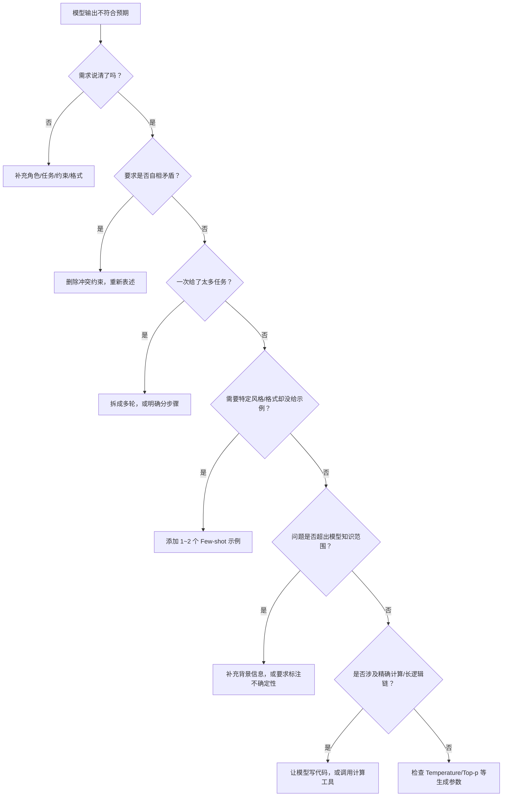

---
tags:
  - Prompt
---

# Prompt 常见失败案例

> 高手和新手的差距，不在于会不会写 Prompt，而在于能不能快速定位问题并修正。

## 这章解决什么问题

你照着网上的教程写了一个 Prompt，模型的输出却差强人意——要么泛泛而谈，要么漏掉要求，要么干脆胡说八道。你怀疑是模型不行，换了一个更贵的，结果还是一样。

问题很可能不在模型，而在 Prompt。

这一章是一面镜子。我们把新手最常踩的坑拆成六个典型案例，每个案例都给你看**错误的 Prompt 长什么样**、**为什么会失败**、**怎么改**。看完你会建立一个直觉：遇到问题先排查 Prompt，而不是先换模型——因为改 Prompt 的成本接近于零，换模型的成本可能是几十倍。

## 失败案例 1：需求太模糊

**现象**：模型输出泛泛而谈，像一篇万能作文，放到任何场景都成立，唯独对你没用。

**错误 Prompt**：

```
写一篇文章。
```

**分析**：

这个 Prompt 没有任何有效信息。模型不知道：

- 文章主题是什么？
- 写给谁看？
- 多长？
- 什么风格？
- 要解决什么问题？

模型只能凭概率生成一篇"最像文章的东西"，也就是平均意义上最安全的泛泛之谈。

**修正**：

用 Prompt 四要素来补全缺失的信息：

```
角色：你是一位有 5 年经验的科技专栏作者。

任务：写一篇关于「AI 编程助手如何改变软件工程师工作流」的文章。

约束：
- 字数：1200~1500 字
- 结构：先讲一个具体场景故事，再分析变化，最后给出建议
- 风格：口语化，像跟朋友聊天，避免学术术语

输出格式：
- 标题（吸引眼球，不超过 20 字）
- 正文（分段，每段有要点）
- 结尾（一句话总结核心观点）
```

对比两个 Prompt：前者 4 个字，后者 100 多字。多出来的不是废话，是**约束和方向**。模型不是读心术师，你给的信息越多，它越能命中靶心。

---

## 失败案例 2：一次塞太多任务

**现象**：模型漏掉部分要求，或者回答混在一起、逻辑混乱。

**错误 Prompt**：

```
请把下面这段英文技术文档翻译成中文，然后总结一下它的核心观点，再改写成适合产品经理阅读的版本，最后分析一下它的潜在商业价值。

[一段 2000 字的英文技术文档]
```

**分析**：

这个 Prompt 同时丢了四个任务：翻译、总结、改写、分析。问题出在两个方面：

1. **注意力稀释**：LLM 的注意力机制在长文本中会逐渐分散。任务越多，每个任务分配到的"关注度"越少，越容易漏掉细节。
2. **相互干扰**：翻译时模型专注于逐句对应，总结时却需要跳跃式抓取重点——两种思维模式混在一起，输出质量会互相拖累。

**修正**：

**方案 A：拆成多轮对话**

```
第一轮：请先翻译以下技术文档为中文，保持术语准确。
[文档]

第二轮：请总结这篇中文文档的核心技术观点，3 句话。

第三轮：请把这段总结改写成产品经理能听懂的语言。

第四轮：基于以上内容，分析这项技术的潜在商业价值，分点列出。
```

**方案 B：明确分步骤（单轮）**

```
请按以下步骤处理这段英文技术文档：

步骤 1：完整翻译成中文。
步骤 2：基于中文翻译，总结核心观点（3 句话）。
步骤 3：把总结改写成产品经理视角的表述。
步骤 4：分析商业价值，输出 bullet points。

注意：每一步完成后空一行，写「---」分隔，再开始下一步。
```

方案 A 更适合复杂任务，因为每轮都可以基于上一轮的输出继续优化。方案 B 适合简单任务，减少了来回切换的成本。

---

## 失败案例 3：约束自相矛盾

**现象**：模型输出质量差，或者干脆忽略其中一个约束，因为它发现两个要求不可能同时满足。

**错误 Prompt 示例 1**：

```
用一句话详细解释量子计算的原理。
```

**错误 Prompt 示例 2**：

```
请用非常随意但专业的语气写一封商务邮件。
```

**分析**：

- "一句话"和"详细"是矛盾的。一句话撑死了 50 字，不可能详细。
- "随意"和"专业"也是矛盾的。随意的反义词就是正式、专业。

模型遇到矛盾约束时，通常会**随机选择一个服从**，或者**生成一个两边都不讨好的中间态**。无论哪种，结果都不是你要的。

**修正**：

写完后自己读一遍，检查约束是否冲突。

```
修正后 1：用 3 句话解释量子计算的原理，每句话不超过 30 字。
修正后 2：语气亲切自然，像同事之间发邮件，但保持商务场合的基本礼貌。
```

关键原则：**约束之间要兼容，不能互相打架。**

---

## 失败案例 4：没有给示例（Few-shot）

**现象**：模型输出格式不稳定，风格飘忽。这次输出表格，下次输出段落；这次很正式，下次很随意。

**错误 Prompt**：

```
请按我的风格重写下面这段文字。
[原文]
```

**分析**：

模型无法读取你的心思。你说"我的风格"，但模型没见过你的风格，它只能猜一个"平均意义上的好风格"。

**修正**：

给 1~2 个示例，让模型"照葫芦画瓢"。

```
请参照以下示例的风格，重写后面的内容。

示例 1：
原文：本公司成立于 2010 年，专注于企业级 SaaS 解决方案。
改写：我们 2010 年起步，一直只做一件事——帮企业用好软件。

示例 2：
原文：该产品采用分布式架构，具备高可用性。
改写：这套系统拆成了很多小块，哪块出问题都不会影响全局。

现在请重写：
原文：我们的平台支持多租户隔离，确保数据安全。
```

示例不需要多，1~2 个足够让模型捕捉到风格模式。**这叫 Few-shot Prompting（少样本提示），是给模型最廉价的"培训"。**

---

## 失败案例 5：忽略模型的知识边界

**现象**：模型自信地胡说，听起来像真的，其实是编的。这叫**幻觉**（Hallucination）。

**错误 Prompt**：

```
请总结一下 2025 年诺贝尔物理学奖得主的主要贡献。
```

**分析**：

截至 2026 年 5 月，主流 LLM（如 GPT-4、Claude 3.5 Sonnet）的训练数据截止日期在 2024 年初或更早。它们根本不知道 2025 年的诺贝尔奖结果。但模型不会说"我不知道"——它会根据概率生成一段看似合理的文字，包括编造人名、机构和研究成果。

另一个常见场景是问非常专业的冷门知识：

```
请详细分析唐代诗人张若虚《春江花月夜》中"滟滟随波千万里"一句在清代注疏中的异文情况。
```

这种细分领域的问题，训练数据里本来就少，模型更容易编。

**修正**：

1. **先判断模型知不知道**：如果是时效性问题，先确认训练截止日期。可以直接问模型："你的知识截止到什么时候？"
2. **补充背景信息**：把相关事实写在 Prompt 里，让模型基于你提供的信息回答，而不是凭记忆。
3. **要求标注不确定性**：
   ```
   如果你不确定某个信息，请明确标注「不确定」或「推测」，不要编造。
   ```
4. **接入 RAG**（Retrieval-Augmented Generation，检索增强生成）：让模型先查资料再回答。这是更系统的解决方案，在 Hello-AI 的 RAG 章节会详细讲。

---

## 失败案例 6：期望模型做精确计算

**现象**：数学题、大数运算、复杂统计出错。

**错误 Prompt**：

```
请计算：123456789 × 987654321 = ?
```

**分析**：

LLM 不是计算器。它的底层是一个概率模型，通过预测"下一个最可能的 token"来生成文本。对于简单的加减法，它可能蒙对；但对于大数乘法、多步推导，出错的概率急剧上升。

同样的问题也出现在：

- 复杂财务报表的加减核对
- 多步代数方程求解
- 长链条逻辑推理（"如果 A 则 B，如果 B 则 C，如果 C 则 D……"推到第 10 步时很容易出错）

**修正**：

1. **让模型写代码来算**：
   ```
   请写一段 Python 代码计算 123456789 × 987654321，并输出结果。
   ```
2. **用工具调用**（如果平台支持）：让模型调用计算器、Wolfram Alpha 等外部工具。
3. **分解验证**：如果必须让模型算，把步骤拆到足够细，并要求它每步都验算。

**核心原则：不要让 LLM 干它不擅长的事。它擅长理解和生成语言，不擅长精确计算。**

## Prompt 失败诊断流程

遇到问题不知道属于哪一类？按这个流程排查：



这个流程覆盖了 90% 以上的 Prompt 失败场景。记住顺序：**先排查内容问题，再排查形式问题，最后才怀疑模型本身。**

## Prompt 自检清单

在把 Prompt 发出去之前，问自己这 10 个问题：

| 序号 | 问题 | 为什么重要 |
| --- | --- | --- |
| 1 | 我说清楚「我是谁，我要什么」了吗？ | 没有角色和任务，模型只能猜 |
| 2 | 约束条件具体吗？能量化尽量量化 | "短一点"不如"150 字以内" |
| 3 | 有自相矛盾的约束吗？ | 矛盾会让模型无所适从 |
| 4 | 一次只布置了一个核心任务吗？ | 多任务容易漏和乱 |
| 5 | 需要特定风格时，给示例了吗？ | 模型不会读心，示例是最便宜的训练 |
| 6 | 输出格式定义清楚了吗？ | 格式不明，每次输出可能不一样 |
| 7 | 这个问题在模型的知识范围内吗？ | 超范围的问题容易触发幻觉 |
| 8 | 需要精确计算或长逻辑链吗？ | LLM 不擅长，考虑用代码或工具 |
| 9 | 如果信息缺失，我要求模型怎么处理了吗？ | 没说"不许编"，模型就可能瞎编 |
| 10 | 我自己读一遍，能完全理解要做什么吗？ | 你自己都看不懂，模型更看不懂 |

建议：把这个清单复制下来，每次写重要 Prompt 时过一遍。熟练之后，这 10 个问题在脑子里 10 秒就能过完。

## 常见误区

**误区 1：失败了就换模型**

很多新手遇到不满意的结果，第一反应是"这个模型不行，换个贵的"。但实际上，Prompt 的问题没解决，换 GPT-4 还是 Claude 3.5 Opus，结果可能一样差。**先改 Prompt，成本为零；换模型，成本高十倍。**

**误区 2：以为好 Prompt 一次就能写出来**

没有人第一版 Prompt 就完美。Prompt 工程的核心就是**迭代**：写一版 → 测试 → 看差距 → 调整 → 再测试。优秀的 Prompt 都是改出来的，不是一次想出来的。

**误区 3：不记录失败案例**

同样的错误反复犯：上周踩了"约束矛盾"的坑，这周又踩一次。建议建一个自己的"Prompt 错题本"，把失败案例和修正版本记下来。复盘比盲目尝试效率高得多。

**误区 4：把模型的"好像懂了"当成"真的懂了"**

模型输出看起来很流畅、很专业，不代表它真的理解或正确。特别是在专业领域，模型的"自信胡说"最难识别。**永远对重要输出做交叉验证。**

## 延伸阅读

- [Prompt 基础结构](structure.md) —— 学习四要素框架，从源头减少失败
- [总结、改写、分类与抽取](tasks.md) —— 四项基础任务的正确打开方式
- [让输出更稳定](stable-output.md) —— 让模型输出更一致、更可预测
- [Prompt 模板库](templates.md) —— 直接套用经过验证的 Prompt 模板

## 练习题 / 小实验

**练习：诊断与改写**

下面三个 Prompt 都存在明显问题。请依次完成：
1. 诊断：属于哪种失败类型？
2. 分析：具体问题出在哪里？
3. 改写：写出一个修正后的版本。

---

**Prompt A**：

```
请分析一下人工智能。
```

**Prompt B**：

```
请帮我写一份周报，同时总结一下上周数据，再预测一下下周趋势，最后给一些优化建议。要求控制在 200 字以内，但要详细展开每个部分。
```

**Prompt C**：

```
请计算公司 Q1 到 Q4 的营收复合增长率：Q1 1200 万，Q2 1580 万，Q3 2040 万，Q4 2890 万。直接给出最终数字即可。
```

**参考答案提示**：

- Prompt A：需求太模糊，缺少所有四要素
- Prompt B：多任务 + 约束矛盾（200 字以内 vs 详细展开）
- Prompt C：精确计算任务，应该让模型写代码或给出计算步骤，而不是直接要最终数字

建议：先自己诊断和改写，再对照提示检查。重点不在于"和标准答案一样"，而在于**建立排查问题的思路**。
