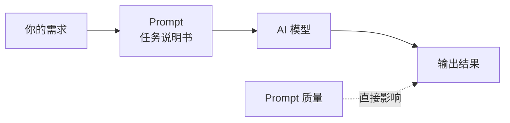
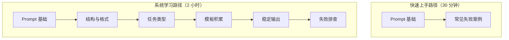

---
tags:
  - Prompt
---

# Prompt 总览

> 学会用 Prompt（提示词）和 AI 模型有效沟通，让同样的模型给你更好的回答。

## 这章解决什么问题

很多人用 ChatGPT、Claude 或 DeepSeek 时，都有这样的经历：

- 明明问题一样，换个问法，回答质量却天差地别
- 让模型写东西，结果太长或太短，格式完全不对
- 一次提好几个要求，模型只做了其中一个，其他的全忘了
- 看到别人分享的"神级 Prompt"，自己复制过来却效果平平

这些问题，90% 不是因为模型不行，而是因为**沟通方式不对**。

Prompt（提示词）就是你和模型之间的沟通桥梁。它不是某种神秘的"魔法咒语"，不需要你背诵特定关键词才能"召唤"出好结果。Prompt 本质上是一种**输入设计**（Input Design）——你把需求说清楚的方式。

这一章要做的，就是帮你建立一套写 Prompt 的基本方法论。学完这章，你不需要去背什么"万能公式"，而是能针对自己的具体需求，写出稳定、可控、可复现的 Prompt。

## Prompt 到底是什么

我们先破除一个最常见的误解。

!!! tip "Prompt 不是魔法咒语"

    网上有很多"顶级 Prompt 合集"，看起来像是某种 secret sauce（秘方），好像只要复制粘贴就能让模型变聪明。
    
    其实不是。
    
    模型不会因为某个词就突然"觉醒"，也不会因为你语气严厉就更听话。Prompt 的本质是**信息传递**——你把背景、任务、要求、格式告诉模型，模型根据这些信息生成回答。信息越清晰、越完整，结果越接近你的预期。

用个生活中的比喻：Prompt 就像你给下属布置任务。

- 如果你说"写个报告"，对方可能写出一篇完全不是你想要的报告
- 如果你说"写一份关于 2024 年新能源汽车市场的行业分析报告，面向投资人，重点看电池技术和政策支持，控制在 2000 字以内，用 Markdown 格式"，结果就会靠谱很多

Prompt 就是你在给 AI 布置任务时的**任务说明书**。

好的 Prompt 让模型"有迹可循"，知道你要什么、不要什么、结果该长什么样。

## 本章内容导航

这章包含 6 个主题，每个主题解决一个具体的 Prompt 写作问题：

| 章节 | 核心问题 | 适合谁 |
|------|---------|--------|
| [Prompt 基础](prompt-basic.md) | Prompt 到底包含哪些零件？怎么从"随便问"变成"会问"？ | 所有人，必看 |
| [角色、任务、约束与输出格式](structure.md) | 怎么把需求拆成结构化的模块，让模型不漏掉任何要求？ | 需要稳定输出的人 |
| [总结、改写、分类与抽取](tasks.md) | 常见的文本处理任务，Prompt 该怎么写最高效？ | 做内容处理的人 |
| [Prompt 模板](templates.md) | 有没有可以直接套用的模板？怎么根据场景选模板？ | 想提升效率的人 |
| [让模型稳定输出](stable-output.md) | 同样的 Prompt，为什么每次结果不一样？怎么让它更稳定？ | 需要可复现结果的人 |
| [Prompt 常见失败案例](failure-cases.md) | 哪些写法一定会踩坑？出了问题怎么排查？ | 已经写过一些 Prompt 的人 |

## 推荐阅读顺序

我们设计了两条学习路径，你可以根据自己的情况选择。

**路径一：快速上手（30 分钟）**

如果你现在就想改善日常使用的体验，按这个顺序：

1. [Prompt 基础](prompt-basic.md) —— 掌握核心组件和最小模板
2. [Prompt 常见失败案例](failure-cases.md) —— 避开最常见的坑

这两条看完，你的 Prompt 质量就会明显提升。

**路径二：系统学习（2 小时）**

如果你想把 Prompt 当成一项技能来学，按这个顺序：

1. [Prompt 基础](prompt-basic.md) —— 建立整体认知
2. [角色、任务、约束与输出格式](structure.md) —— 学习结构化写法
3. [总结、改写、分类与抽取](tasks.md) —— 掌握具体任务类型的写法
4. [Prompt 模板](templates.md) —— 积累可复用的模板
5. [让模型稳定输出](stable-output.md) —— 理解输出可控性
6. [Prompt 常见失败案例](failure-cases.md) —— 建立排查能力

建议不要一次看完，每看完一节就去实际用一下。Prompt 是技能，不是知识，光看不会进步。

## 这章学完之后，你应该能做什么

读完这一章，你不需要成为"Prompt 工程师"（Prompt Engineer，专门设计和优化 AI 提示词的人），但应该能：

1. **写出一个及格的 Prompt**：包含角色、任务、约束、输出格式等核心要素
2. **判断一个 Prompt 的好坏**：能看出别人的 Prompt 哪里清晰、哪里模糊
3. **排查输出不达预期的原因**：知道是 Prompt 的问题，还是模型能力边界的问题
4. **针对具体场景调整策略**：不同的任务类型（总结、分类、生成）能用不同的写法
5. **不被"万能 Prompt"忽悠**：明白 Prompt 的核心是清晰沟通，不是玄学

## 延伸阅读

Prompt 不是孤立存在的，它和模型能力、工具使用密切相关。建议结合以下章节一起看：

- [什么是 LLM](../basics/what-is-llm.md) —— 理解大语言模型的能力边界，才能知道 Prompt 能推动多远
- [AI 工具总览](../tools/index.md) —— 了解除了对话之外，还有哪些工具可以配合 Prompt 使用

## 练习题

 question "动手实验"

    打开你常用的 AI 对话工具（ChatGPT、Claude、DeepSeek 等），用以下两种方式问同一个问题，对比结果差异：

    方式 A（随意问）：
   
    帮我写个邮件。
    

    方式 B（结构化问）：

    角色：你是职场沟通顾问。
    任务：帮我写一封申请延期提交项目的邮件。
    背景：原定本周五交付，因为第三方接口延迟，需要延期 3 天。
    约束：
    1. 语气要专业但不过于生硬
    2. 不要过度道歉
    3. 明确提出新的交付时间
    输出格式：邮件正文，不超过 150 字。
    

    对比两个回答，思考：
    1. 方式 B 比方式 A 多了哪些信息？
    2. 这些信息如何影响了最终输出的质量？
    3. 方式 B 还能怎么改进？
