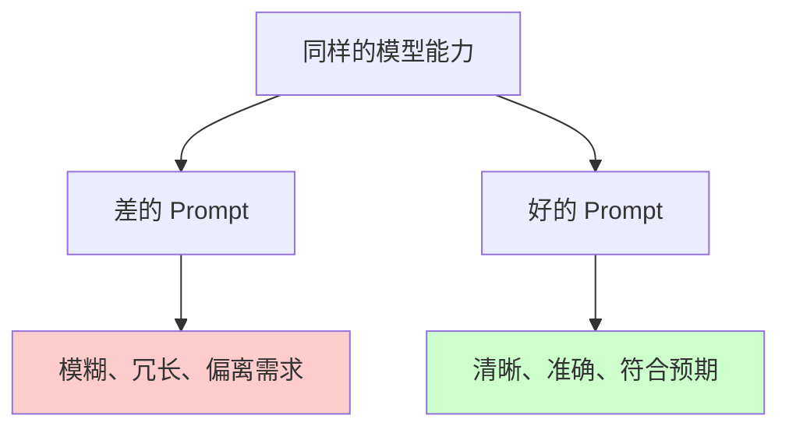
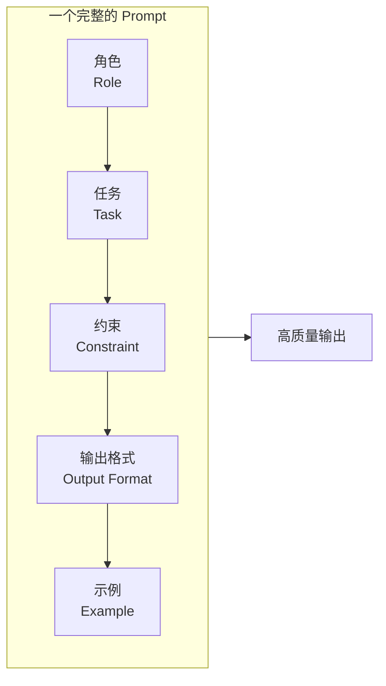
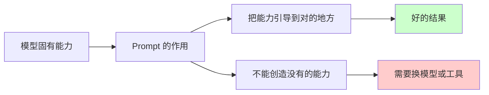

---
tags:
  - Prompt
---

# Prompt 基础

> 掌握 Prompt（提示词）的五大核心组件，学会把模糊需求变成清晰指令。

## 这章解决什么问题

很多人第一次接触 AI 对话工具时，提问方式都很"人类"——就像跟朋友聊天一样，想到什么说什么。

比如：
- "帮我写个东西"
- "这个怎么弄"
- "分析一下"

这些话对人来说没问题，因为人类会自动补全上下文、猜测你的真实意图。但模型不会。模型只会根据你**实际打出来的文字**来生成回答。你给的信息越少，它"猜"的余地越大，结果偏离你预期的概率就越高。

这章要解决的核心问题是：**怎么把脑中的需求，翻译成模型能听懂、能执行的指令？**

我们会从 Prompt 的基本结构讲起，给你一个可以直接套用的最小模板，再用对比示例展示"差 Prompt"和"好 Prompt"之间的差别。看完这章，你立刻就能写出比之前好得多的 Prompt。

## Prompt 到底是什么

Prompt（提示词）是你输入给 AI 模型的文本，用来告诉模型你想让它做什么。

更准确地说，Prompt 是一种**输入设计**（Input Design）——你不是在"跟 AI 聊天"，而是在给 AI 下发一份**任务说明书**。模型根据说明书里的信息，生成对应的输出。

!!! example "举个例子"

    你在 ChatGPT 输入框里打的每一句话都是 Prompt。
    
    - "你好" → 这是一个 Prompt，模型会回复问候
    - "请用一句话解释量子力学" → 这也是一个 Prompt，模型会尝试总结
    - 一段包含角色设定、任务描述、格式要求的 500 字长文本 → 这同样是一个 Prompt，只是信息量更大

Prompt 没有"魔法词"。模型不会因为你说"请"就更努力，也不会因为你说"你必须"就更听话。真正起作用的是**信息的完整度和清晰度**。

## 为什么 Prompt 很重要

同一个模型，不同的 Prompt，结果可以天差地别。

我们用 GPT-4o（OpenAI 2024 年发布的多模态大模型）做一个对比实验。需求都是一样的：**解释什么是 RAG**。

**Prompt 版本 A（随意型）：**

```
RAG 是什么？
```

模型可能会给出一篇 500 字的技术解释，充满术语，对小白很不友好。因为它不知道你的背景，只能按"最通用的方式"回答。

**Prompt 版本 B（结构化型）：**

```
角色：你是面向小白的技术科普作者。
任务：解释 RAG（Retrieval-Augmented Generation，检索增强生成）这个概念。
要求：
1. 先说明它解决什么问题
2. 用一个生活化的比喻来解释原理
3. 列出 1 个常见使用场景
4. 控制在 200 字以内
```

这次的输出会清晰很多：有场景、有比喻、有结构、有字数控制。模型知道"读者是谁""该用什么风格""多长算够"，所以不会乱发挥。

这就是 Prompt 的价值：**它不改变模型本身的能力，但能让模型把能力用在对的地方。**



## Prompt 的核心组件

一个完整、有效的 Prompt，通常由 5 个核心组件构成。你可以把它们理解为任务说明书的 5 个必填项。



下面我们逐个解释。

### 角色（Role）：你希望模型扮演谁

角色定义了模型的**说话身份和知识视角**。

同样是解释"区块链"，让它扮演"大学教授"和"小学老师"，输出的术语密度、举例方式会完全不同。

!!! example "示例"

    - ❌ 差："解释区块链"
    - ✅ 好："你是一位给 10 岁孩子讲科普的老师，请用生活中的例子解释区块链"

**常用角色类型：**

| 角色类型 | 适用场景 |
|---------|---------|
| 技术专家 | 需要深度、准确的技术解释 |
| 教学老师 | 需要由浅入深、循序渐进 |
| 文案编辑 | 需要润色、改写、优化表达 |
| 数据分析师 | 需要结构化分析、表格输出 |
| 法律顾问 | 需要严谨、合规的表达 |

### 任务（Task）：你要模型做什么

任务是最核心的部分，要明确、具体、可执行。

!!! example "示例对比"

    - ❌ 模糊："帮我看看这个"
    - ❌ 稍好："帮我分析一下这段文字"
    - ✅ 清晰："请从这段用户反馈中，提取出所有提到的产品问题，并按严重程度排序"

**判断任务是否清晰的标准：** 如果你把 Prompt 发给一个完全不了解背景的人，他能看懂要做什么吗？如果不能，就需要补充细节。

### 约束（Constraint）：不能做什么、必须满足什么

约束是模型的"刹车片"，防止它跑偏。

约束通常包括：
- **内容约束**：不能涉及什么主题、必须包含什么信息
- **风格约束**：正式还是口语、专业还是通俗
- **长度约束**：字数、段落数、列表项数
- **质量约束**：不能出现什么类型的错误

!!! example "示例"

    "请总结以下文章。要求：1）不超过 100 字；2）必须包含作者的核心论点；3）不要使用原文中的句子，用自己的话重新表达。"

这三条约束分别从长度、内容、风格三个维度限定了输出。

### 输出格式（Output Format）：结果长什么样

如果你不指定格式，模型会随机发挥。有时给段落，有时给列表，有时给表格。

常见的输出格式指定方式：

| 格式类型 | 写法示例 |
|---------|---------|
| 段落 | "输出为一段 200 字左右的说明" |
| 列表 | "用 3-5 个 bullet points 列出要点" |
| 表格 | "用 Markdown 表格对比 A 和 B 的优缺点" |
| JSON | "输出为 JSON 格式，包含 title、summary、tags 三个字段" |
| Markdown | "用 Markdown 格式输出，包含二级标题和代码块" |

!!! tip "小建议"

    如果你需要机器能解析的输出（比如要导入 Excel 或数据库），强烈建议指定结构化格式，如 JSON 或 Markdown 表格。纯文本段落很难被程序处理。

### 示例（Example）：给模型看"好的回答"长什么样

示例是 Prompt 里最有威力的组件之一，属于**少样本学习**（Few-shot Learning，给模型几个例子让它模仿）的一种简单形式。

当你用语言很难描述"好结果"的标准时，直接给例子往往更有效。

!!! example "示例"

    ```
    请把以下口语化表达改写为正式邮件用语。
    
    示例：
    输入：麻烦你尽快把这个发我一下
    输出：烦请于今日下班前将相关资料发送给我，如有困难请告知预期完成时间，谢谢。
    
    现在请改写：
    输入：这个方案不行，得重新做
    ```
    
    模型看了示例后，会模仿那种"正式但不生硬"的风格来改写，而不是自由发挥。

## 从"随便问"到"会问"的进化

我们用同一个真实需求，展示 Prompt 是怎么一步步进化的。

**需求背景：** 你是一个电商运营，想让 AI 帮你写商品详情页的文案。商品是一款降噪耳机。

---

**版本 1：随意问（新手常见）**

```
帮我写个耳机文案
```

**问题分析：**
- 没说是什么耳机（头戴式？入耳式？）
- 没说目标用户（上班族？学生？运动人群？）
- 没说卖点（音质？降噪？续航？）
- 没说长度和风格

**模型输出：** 一段通用到没有任何卖点的文案，根本没法用。

---

**版本 2：补充了基本信息（有所进步）**

```
帮我写一款降噪耳机的商品详情文案，面向上班族，突出降噪效果，大概 300 字。
```

**问题分析：**
- 有了商品类型、目标用户、核心卖点、长度
- 但没说风格（是科技感？生活方式？性价比？）
- 没说结构（先讲功能还是先讲场景？）
- 没说格式（纯文本？带小标题？）

**模型输出：** 可能能用，但大概率需要你再改几轮。

---

**版本 3：结构化 Prompt（合格水平）**

```
角色：你是一位电商文案策划专家，擅长把技术卖点转化为消费者能感知的场景价值。

任务：为以下商品撰写详情页文案。

商品信息：
- 产品：真无线降噪耳机 Model X
- 核心卖点：主动降噪深度 42dB，续航 36 小时，支持多设备切换
- 目标用户：25-35 岁通勤上班族

约束：
1. 不要堆砌技术参数，用场景化语言描述
2. 语气要专业但不冷冰冰，让人有"想拥有"的感觉
3. 总字数控制在 300-400 字
4. 必须包含"通勤""专注""续航"三个关键词

输出格式：
- 先写一段 50 字以内的场景引入（打动人心的开头）
- 再用 3 个小标题分别讲降噪、续航、多设备三个卖点
- 最后写一句号召性结尾
```

**模型输出：** 结构清晰、风格统一、卖点突出，基本可以直接用或只需微调。

这三个版本的差别，不是"用词更高级"，而是**信息更完整**。模型有了足够的上下文，才能一次性生成你真正需要的东西。

## 最小模板：直接套用

如果你记不住那么多理论，直接用这个模板填空就行：

```text
角色：你是一位[具体身份]。
任务：请[具体动作][对象/内容]。
背景：[补充必要的上下文信息，如读者是谁、使用场景是什么]
约束：
1. [第一条限制，如长度、风格]
2. [第二条限制，如必须包含/不能出现]
3. [第三条限制]
输出格式：[段落/列表/表格/JSON/Markdown 等]
```

**一个填好的例子：**

```text
角色：你是一位高中物理老师。
任务：请用牛顿三定律解释为什么坐公交车没座位时要抓紧扶手。
背景：面向高一学生，他们刚学完牛顿定律但还不习惯联系生活。
约束：
1. 用通俗中文，不要直接用公式符号（可以用文字描述公式含义）
2. 不超过 300 字
3. 举一个公交车急刹车的具体例子
输出格式：一段完整的讲解文字，分成"现象—原理—结论"三部分。
```

这个模板包含了 Prompt 的 4 个核心要素（角色、任务、约束、输出格式）。对于大多数日常场景，这已经足够产生不错的结果了。

## 常见误区

### 误区 1：Prompt 越长越好

**不是。** 清晰比长度重要。

一个 50 字的精准 Prompt，往往比一个 500 字但重点模糊的 Prompt 效果更好。关键是信息密度——每句话是否都在帮助模型理解你的需求。

如果你发现自己写了很长但结果还是不好，通常不是不够长，而是**结构太乱**或**要求互相矛盾**。

### 误区 2：一次塞太多任务

模型处理多任务的能力有限。你一次提 5 个要求，它可能只做了 3 个，另外 2 个"忘了"。

**解决办法：** 拆成多个 Prompt，一次一个主任务。如果必须在一个 Prompt 里完成多个任务，用编号列表明确列出，并告诉模型"请确保完成以上所有要求"。

### 误区 3：以为模型知道"好"的标准

模型不知道你心中的"好"长什么样。你不说"要专业"，它就按通用风格写；你不说"要简洁"，它可能就写得很啰嗦。

**解决办法：** 把你对"好"的定义翻译成可检查的标准。比如不是"写得好一点"，而是"用短句、每段不超过 3 行、避免形容词堆砌"。

### 误区 4：Prompt = 魔法咒语

这是最根深蒂固的误解。很多人到处搜集"神级 Prompt"，以为复制粘贴就能让模型变聪明。

**真相：** 模型不会因为某个特定词就突然变强。Prompt 的作用是**引导模型把已有的能力用在对的地方**。如果模型本身不具备某项能力（比如精确计算大数字），再厉害的 Prompt 也救不了。



## 延伸阅读

掌握了 Prompt 的基础结构后，你可以继续深入以下方向：

- [角色、任务、约束与输出格式](structure.md) —— 更系统地学习每个组件的高级写法
- [Prompt 模板](templates.md) —— 积累常见场景的可复用模板

## 练习题

??? question "动手改写"

    下面是一个典型的"差 Prompt"。请根据本章学到的知识，把它改写成结构化 Prompt。

    **原始 Prompt：**
    ```
    帮我写一个 Python 函数，要处理数据，然后输出结果，尽量好用。
    ```

    **你的任务：**
    1. 分析这个原始 Prompt 缺了哪些信息
    2. 用"角色 + 任务 + 约束 + 输出格式"的结构重写
    3. 在 ChatGPT / Claude / DeepSeek 里分别测试原始版本和你的版本，对比结果

    **参考方向（先自己写，再看）：**
    
    缺的信息可能包括：
    - 处理什么类型的数据？（字符串？列表？JSON？）
    - "好用"的标准是什么？（要有错误处理？要注释？）
    - 输出结果的形式是什么？（返回值？打印？写文件？）
    - 目标用户是谁？（你自己用？团队用？开源？）
