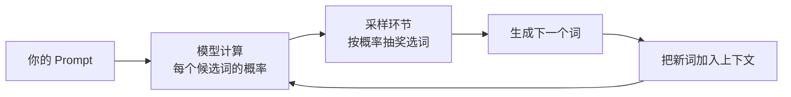
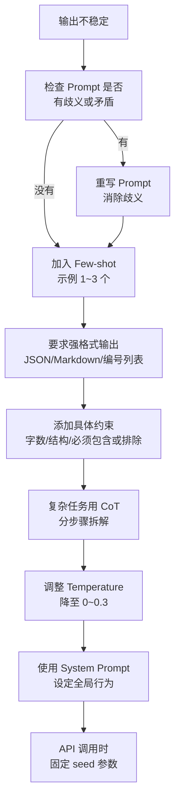

---
tags:
  - Prompt
---

# 让模型稳定输出

> 同一句话问三遍，得到三个答案？这页教你 7 个技巧，把模型的输出从"开盲盒"变成"可预期"。

## 这章解决什么问题

你花 20 分钟写了一个 Prompt，模型第一次给出的答案很完美。你兴奋地拿给同事看，同事用同样的 Prompt 又问了一遍，结果完全不一样。

这不是你的错觉。LLM 的本质是一个概率生成器——每次生成下一个词时，它都从一堆候选词里"抽"一个。既然是抽奖，结果就有波动。

但"有波动"不代表"只能认命"。这章给你 **7 个经过验证的技巧**，从参数设置到 Prompt 写法，系统性降低输出的不稳定性。读完这章，你能判断"这次输出不一样"是哪个环节出了问题，也知道该从哪里下手修复。

## 为什么输出会不稳定

在动手优化之前，先理解不稳定的根源。LLM 生成文本的过程大致是这样的：



不稳定主要来自两个环节：

1. **采样随机性**：模型每次选词都有随机成分，temperature、top-p 等参数控制的就是这个随机性
2. **Prompt 模糊性**：如果你的指令本身有歧义，模型每次"理解"的方向可能不同，导致结果差异更大

第二个原因比第一个更常见，也更容易被忽视。调低 temperature 只能压缩第一个因素的波动，如果 Prompt 本身含糊，温度再低也可能出现"语义漂移"。

## 提高稳定性的 7 个技巧

### 技巧 1：降低 Temperature

**Temperature（温度）** 是控制模型输出随机性的核心参数，取值范围通常是 0.0 到 2.0。关于它的详细原理，可以参考 [温度与采样参数](../basics/temperature-sampling.md)。

这里只给结论：

| 场景 | 推荐 Temperature | 原因 |
| --- | --- | --- |
| 代码生成、JSON 输出、事实问答 | 0~0.3 | 几乎每次都选概率最高的词，输出最稳定 |
| 文本摘要、翻译 | 0.3~0.5 | 基本忠实输入，允许少量措辞变化 |
| 一般对话、写作辅助 | 0.5~0.7 | 平衡自然度和一致性 |
| 创意写作、头脑风暴 | 0.8~1.2 | 多样性优先，接受波动 |

如果你发现同一个 Prompt 每次输出差异很大，第一步就是把 temperature 降到 0.3 以下试试。

### 技巧 2：明确输出格式

人话版本的格式要求效果有限。真正稳定的是**强格式约束**，比如：

- **JSON Schema**：不仅说"输出 JSON"，还要给出具体的键名、值类型
- **Markdown 结构**：明确几级标题、几个段落、表格列名
- **编号列表**：要求必须按顺序输出 N 个点

举个例子：

```text
❌ 弱格式：
"把结果整理成 JSON。"

✅ 强格式：
"请严格按以下 JSON 格式输出，不要添加任何额外字段：
{
  \"summary\": \"string, 不超过 50 字\",
  \"keywords\": [\"string\", \"string\", \"string\"],
  \"sentiment\": \"string, 只能是 positive/negative/neutral 之一\"
}"
```

强格式就像给模型画了一个"填空表格"，它只需要往格子里填内容，不容易跑偏。

### 技巧 3：给示例（Few-shot Prompting）

**Few-shot Prompting（少样本提示）** 是指在 Prompt 里给出 1~3 个"输入→输出"的示例，让模型"照猫画虎"。

它的稳定性原理是：示例把"抽象的要求"变成了"具体的模仿对象"。模型看到"哦，原来是要长成这样的"，比听一百句"要清晰、要结构化"都管用。

```text
请把以下用户反馈归类为"产品建议""使用问题""情绪吐槽"三类。

示例 1：
输入："希望加一个夜间模式，晚上用太刺眼了"
输出：{"category": "产品建议", "reason": "用户提出了新功能需求"}

示例 2：
输入："登录按钮点了好几次没反应"
输出：{"category": "使用问题", "reason": "用户遇到功能性故障"}

示例 3：
输入："更新之后越来越卡，想卸载了"
输出：{"category": "情绪吐槽", "reason": "用户表达不满情绪，未提出具体诉求"}

现在请处理：
输入："收藏夹能不能支持自定义文件夹？"
输出：
```

注意：**示例不要超过 3 个**。给太多示例反而会干扰模型，让它过度关注示例的细节而忽略你的真实任务。

### 技巧 4：分步骤拆解（Chain of Thought）

**Chain of Thought（思维链，简称 CoT）** 是一种让模型"一步一步来"的技巧。你在 Prompt 里要求模型先展示推理过程，再给出最终答案。

CoT 提高稳定性的原理是：把"一步黑箱跳跃"变成"多步可见路径"。即使最终结果有偏差，你也能从中间步骤定位问题。

```text
❌ 直接要结果（不稳定）：
"计算 23 × 47 等于多少？"

✅ 分步骤拆解（更稳定）：
"请分步计算 23 × 47，展示每一步的推理过程，
最后给出最终答案。格式如下：
步骤 1：...
步骤 2：...
最终答案：..."
```

对于需要推理、计算、比较的任务，CoT 几乎总能提升稳定性和准确率。

### 技巧 5：约束条件具体化

模糊的约束等于没有约束。把约束写得越具体，模型的自由度越小，输出越稳定。

| 模糊约束 | 具体约束 |
| --- | --- |
| "不要太长" | "控制在 150~200 字之间" |
| "写清楚一点" | "分三段，每段不超过 3 句话" |
| "用专业语言" | "使用学术论文常用的第三人称，避免口语化表达和感叹号" |
| "包含关键点" | "必须提到：成本优势、时间效率、风险控制；不要展开历史背景" |

约束具体化的另一个技巧是**双向约束**：既说"要什么"，也说"不要什么"。

```text
要求：
1. 必须包含：背景、问题、解决方案、预期效果
2. 不要包含：技术实现细节、团队成员介绍、预算明细
```

### 技巧 6：使用系统提示词（System Prompt）

**系统提示词（System Prompt）** 是设定模型全局行为的指令，通常与用户的具体提问分开。在 OpenAI、Claude 等 API 中，System Prompt 会以独立的角色字段传入。

系统提示词提高稳定性的原理是：它在对话的"最底层"设定了行为基线，后续每轮用户提问都会在这个基线上处理。

```text
系统提示词：
"你是一位严谨的技术文档审核员。你的风格是：
1. 只基于给定文本回答，不做外部推测
2. 发现问题时用'[问题]'标记，并给出修改建议
3. 输出格式必须是 Markdown 表格：| 位置 | 问题类型 | 建议 |
4. 如果文本没有问题，只回复'未发现明显问题'六个字，不要加任何解释"

用户提问：
"请审核这段 API 文档：..."
```

如果你在使用网页版 ChatGPT 或 Claude，没有独立的 System Prompt 输入框，可以在对话最开始发一段"角色设定"，然后每次新建对话时复制这段设定。

### 技巧 7：固定随机种子（Seed 参数）

某些 API（如 OpenAI 的 GPT-4、DeepSeek API）支持传入 **seed（随机种子）** 参数。当你把 seed 设为一个固定整数时，在 Prompt 和参数完全相同的情况下，模型会尽量复现同样的输出。

```python
# OpenAI API 示例
response = client.chat.completions.create(
    model="gpt-4",
    messages=[...],
    temperature=0,
    seed=42  # 固定随机种子
)
```

注意：seed 不是 100% 保证完全一致的"时间胶囊"。模型版本更新、上下文长度变化等因素仍可能导致输出差异。但对于短期内的自动化测试和 A/B 对比，seed 非常有用。

## 稳定性提升路径

面对一个"输出不稳定"的问题，建议按这个顺序排查：



这个顺序的设计思路是：**先解决"Prompt 质量问题"，再解决"参数设置问题"**。如果 Prompt 本身有歧义，调再多参数也是治标不治本。

## 对比实验：不稳定 vs 稳定

同一个任务，两种写法，输出差异会非常明显。

**任务**：从一段产品评论中提取评分、优缺点和购买建议。

**Prompt A（不稳定版）**：

```text
分析这段评论，把关键信息整理出来。

评论："这款耳机音质确实不错，低音很有劲，
但戴久了耳朵疼，续航大概 6 小时。
如果主要是通勤用，还是可以买的。"
```

可能的输出（每次不一样）：
- 第一次：一段流水账描述
- 第二次：没有提取"购买建议"
- 第三次：格式每次不同，有的用列表，有的用段落

---

**Prompt B（稳定版）**：

```text
请从以下产品评论中提取指定信息。

评论："这款耳机音质确实不错，低音很有劲，
但戴久了耳朵疼，续航大概 6 小时。
如果主要是通勤用，还是可以买的。"

要求：
1. 只基于评论原文提取，不做推测
2. 如果某条信息在评论中没有明确提及，写"未提及"

输出格式（严格按此 JSON，不要额外字段）：
{
  "overall_rating": "number, 1~5，如果评论没有明确评分则填 null",
  "pros": ["string", "string"],
  "cons": ["string", "string"],
  "purchase_recommendation": "string, 评论中关于是否值得购买的说法"
}
```

输出（每次高度一致）：

```json
{
  "overall_rating": null,
  "pros": ["音质不错", "低音有劲"],
  "cons": ["戴久了耳朵疼", "续航大概 6 小时"],
  "purchase_recommendation": "如果主要是通勤用，还是可以买的"
}
```

两者的差距不在模型，而在 Prompt 的"约束密度"。稳定版给模型画了明确的格子，它只需要往里填空。

## 常见误区

**误区 1：以为 Temperature = 0 就能完全稳定**

Temperature 趋近于 0 确实能大幅降低随机性，但"完全稳定"是不存在的。不同模型版本、不同的 API 实现细节、甚至是不同的上下文长度，都可能带来微小差异。如果你需要 100% 可复现，要结合 seed 参数和强格式约束。

**误区 2：示例给得太多反而干扰**

Few-shot 的黄金数量是 1~3 个。超过 3 个，模型可能过度拟合示例的形式（比如示例用了某种特定措辞，它就以为必须用那种措辞），反而降低泛化能力和稳定性。

**误区 3：约束写得自相矛盾**

```text
❌ 矛盾约束：
"请用非常详细的方式，在 30 字以内总结..."
"请用轻松幽默的语气，同时保持学术论文的严谨性..."
```

矛盾约束会让模型陷入"两头不是人"的困境，输出反而更不稳定——因为它每次"抽奖"时，可能偏向不同的约束方向。

**误区 4：忽视系统提示词的作用**

很多人把所有指令都塞进用户消息里，忽略了系统提示词的"全局基线"作用。对于需要长期保持风格一致的任务（如客服机器人、审核助手），把行为规则放在 System Prompt 里，比每轮重复说一遍更稳定。

**误区 5：频繁更换模型版本**

GPT-4、Claude 3.5、DeepSeek 等不同模型对同一个 Prompt 的理解和输出风格有差异。如果你在某一个模型上调好了 Prompt，换模型后要重新测试稳定性，不要假设"好 Prompt 是跨模型通用的"。

## 延伸阅读

- [温度与采样参数](../basics/temperature-sampling.md) —— 深入理解 Temperature、Top-k、Top-p 的数学原理和实际调参方法
- [Prompt 基础](prompt-basic.md) —— 掌握 Prompt 的基本构成
- [角色、任务、约束与输出格式](structure.md) —— 学习如何用结构化框架写出高稳定性的 Prompt

## 练习题

**练习 1：稳定性诊断**

你写了这样一个 Prompt，但模型每次输出的格式都不一样：

```text
请总结这篇新闻的主要观点。
```

按照本章的 7 个技巧，逐一优化这个 Prompt。每优化一步，记录你认为"这一步解决的是什么不稳定因素"。

**练习 2：对比实验**

选一个你常用的 Prompt（比如"帮我写周报""帮我改邮件"），分别用以下两种方式各运行 3 次：

- A 组：原来的 Prompt，temperature=0.7
- B 组：加入强格式约束 + Few-shot 示例 + temperature=0.2

记录两组输出的差异，回答：
1. B 组的稳定性是否明显更高？
2. B 组有没有牺牲内容质量或灵活性？

**练习 3：系统提示词实践**

为你常用的一个场景（如"帮我检查语法错误""帮我翻译技术文档"）写一段系统提示词。要求：
- 不超过 100 字
- 包含风格、格式、约束三个要素
- 测试 3 轮不同内容的对话，验证系统提示词是否有效约束了模型的行为
