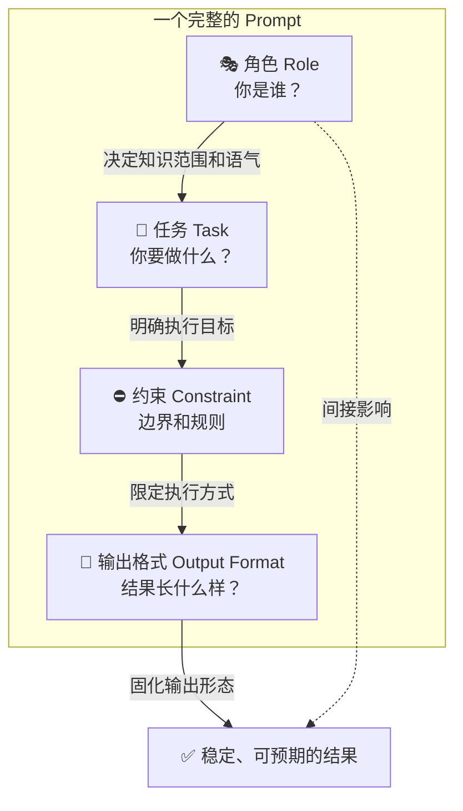

---
tags:
  - Prompt
---

# 角色、任务、约束与输出格式

> 把需求说清楚，不是靠"感觉"，而是靠结构。这页教你用四个要素把 Prompt 从"随便问"变成"精确指令"。

## 这章解决什么问题

你有没有遇到过这种情况：同一个问题问模型三遍，得到三个完全不同的答案，而且没有一个是你真正想要的？

问题往往不在模型，而在你的 Prompt 太"散"。你可能同时说了三句话，但模型不知道哪句是重点、哪句是边界、哪句只是你的情绪发泄。

这章给你一套结构化的思考框架——**角色（Role）、任务（Task）、约束（Constraint）、输出格式（Output Format）**。这四个要素就像写邮件时的「收件人、主题、正文、附件要求」，缺一个，信息就会在路上丢包。

学会这套框架，你能做到两件事：一是自己写 Prompt 时有章可循，二是拿到别人的烂 Prompt 时能一眼看出缺了什么。

## 核心概念

### 角色（Role）：给模型一个"人设"

**角色（Role）** 是你在 Prompt 开头给模型设定的身份或立场。它告诉模型"你是谁"、"你该以什么身份回答"。

为什么角色很重要？因为 LLM 的本质是**概率预测**——它会根据上下文推测"接下来最应该说的话"。你给的角色，直接决定了它调用的知识范围和语气风格。

举个例子：

```text
❌ 模糊角色：
"解释一下区块链。"

✅ 明确角色：
"你是一位有10年经验的金融科技产品经理，
请用小白能听懂的话解释区块链的核心原理。"
```

同样的技术概念，用"大学教授"的口吻回答会堆术语，用"产品经理"的口吻会更关注应用场景。角色就像调频旋钮，决定了模型从哪个频道发射信号。

角色设定有三个层级，效果逐级递增：

| 层级 | 写法 | 效果 |
| --- | --- | --- |
| 无效 | "你是一个专家" | 太笼统，模型不知道你是哪方面的专家 |
| 一般 | "你是一位 Python 工程师" | 有方向，但缺乏细节 |
| 有效 | "你是一位在硅谷工作过10年的后端工程师，习惯写 PEP8 风格的代码，注释偏好英文" | 模型能精准调用对应的知识和风格 |

### 任务（Task）：明确你要模型做什么

**任务（Task）** 是 Prompt 的核心指令，告诉模型"具体要执行什么操作"。

任务的黄金标准是：**具体、可衡量、可验证**。模糊的任务让模型自由发挥，清晰的任务让模型有明确的输出目标。

对比一下：

```text
❌ 模糊任务：
"帮我写个关于环保的东西。"

✅ 清晰任务：
"请写一篇面向大学生的环保倡议书，
目的是说服他们减少使用一次性塑料袋，
篇幅控制在 500 字以内。"
```

第一个任务，模型不知道"东西"是什么体裁、面向谁、多长、目的是什么。第二个任务，模型有明确的参数可以对齐。

写任务时，可以用这个自检清单：

- [ ] 动作明确（写、分析、总结、翻译、比较……）
- [ ] 对象明确（处理什么内容、面向谁）
- [ ] 目标明确（为什么要做这个任务）
- [ ] 验收标准明确（怎么算"做好了"）

### 约束（Constraint）：边界条件

**约束（Constraint）** 是任务的边界条件，告诉模型"什么能做、什么不能做、必须满足什么"。

如果把任务比作地图上的目的地，约束就是导航规则：不能走高速、必须避开拥堵、要在 30 分钟内到达。

常见的约束类型包括：

| 类型 | 例子 |
| --- | --- |
| 内容约束 | "不要涉及政治话题"、"必须提到 X 概念" |
| 风格约束 | "用口语化中文"、"避免使用英文缩写" |
| 长度约束 | "不超过 300 字"、"至少列出 5 条" |
| 结构约束 | "分三段，每段一个小标题" |
| 知识约束 | "只基于 2020 年之前的知识回答" |
| 安全约束 | "不要生成可执行的危险代码" |

约束的关键是**具体且可执行**。"写得专业一点"不是约束，因为"专业"的标准因人而异。"使用学术论文常用的第三人称叙述，避免感叹句"才是约束。

### 输出格式（Output Format）：指定结果的结构

**输出格式（Output Format）** 是告诉模型"结果应该以什么形态呈现"。

为什么格式约束能让结果更稳定？因为 LLM 生成文本时，格式信息也是一种强约束。当你明确要求 "JSON"，模型就会进入"生成键值对"的模式；当你要求"Markdown 表格"，它就会组织行列结构。

常见的输出格式包括：

```text
• 分点列表（bullet points）
• 编号列表（numbered list）
• Markdown 表格
• JSON / YAML
• 代码块（指定语言）
• 特定段落结构（如：背景→问题→方案→总结）
```

举个例子：

```text
❌ 模糊的格式要求：
"把结果整理得清晰一点。"

✅ 明确的格式要求：
"请用以下 JSON 格式输出：
{
  \"优点\": [\"...\", \"...\"],
  \"缺点\": [\"...\", \"...\"],
  \"建议\": \"...\"
}"
```

### 四要素的关系

这四个要素不是独立的，而是互相配合的。角色决定"谁在说话"，任务决定"要做什么"，约束决定"规则和边界"，输出格式决定"结果长什么样"。



## 最小示例：三个完整 Prompt

下面给出三个覆盖不同场景的"四要素"完整示例，你可以直接复制修改。

### 示例 1：问答型（解释概念）

```text
【角色】
你是一位在一线互联网公司做了5年技术面试官的资深工程师。

【任务】
请向一位非技术背景的创业者解释"微服务架构"这个概念。

【约束】
1. 不要使用任何技术缩写（如 REST、API、RPC 等）
2. 必须举一个外卖平台的实际例子
3. 篇幅控制在 300 字以内
4. 语气要友好、有耐心，像跟朋友聊天

【输出格式】
用三段结构输出：
- 第一段：用一句话定义（不超过 30 字）
- 第二段：外卖平台的例子（用比喻，比如"厨房分工"）
- 第三段：一句话总结什么时候适合用、什么时候不适合
```

### 示例 2：写作型（生成文案）

```text
【角色】
你是一位擅长社交媒体运营的内容策划，熟悉小红书平台的用户喜好。

【任务】
为一支新上市的降噪耳机写一篇小红书风格的种草文案。

【约束】
1. 目标用户是每天通勤 1 小时以上的上班族
2. 突出"地铁上也能安静听歌"这个场景
3. 不要提价格，不要出现"最便宜""性价比之王"等绝对化用语
4. 总字数 150~200 字
5. 语气要真实，像一个普通用户的分享，不要太像广告

【输出格式】
- 标题一行（带 emoji，不超过 15 字）
- 正文一段
- 结尾加 3~5 个相关话题标签（#xxx 格式）
```

### 示例 3：代码型（代码审查）

```text
【角色】
你是一位注重代码质量和可维护性的 Python 技术负责人。

【任务】
审查下面这段 Python 代码，指出潜在的问题并给出改进建议。

【约束】
1. 只关注安全性、可读性和性能三类问题
2. 不要修改业务逻辑
3. 对每个问题给出：问题描述 + 风险等级（高/中/低）+ 修改建议
4. 如果代码没有明显问题，直接说"暂无重大问题"

【输出格式】
用 Markdown 表格输出：
| 行号 | 问题类型 | 风险等级 | 问题描述 | 修改建议 |

代码如下：
```python
[user_input = input("请输入文件名: ")
with open(user_input, "r") as f:
    data = f.read()]
```
```

## 常见误区

**误区 1：角色设定太笼统**

"你是一个专家"——这种角色等于没有角色。模型不知道"专家"该调用哪方面的知识，也不知道该用什么语气。有效的角色必须包含**领域、经验年限、风格偏好**中的至少两个。

**误区 2：任务和约束混为一谈**

任务说的是"做什么"，约束说的是"怎么做"。把它们混在一起写，模型会分不清主次。

```text
❌ 混乱写法：
"写一封邮件要正式一点给老板汇报项目进度不要太长"

✅ 清晰写法：
任务：写一封项目进度汇报邮件
约束：
- 收件人是直属上级
- 语气正式
- 正文不超过 150 字
```

**误区 3：输出格式只说"清晰一点"**

"清晰"是主观感受，不是格式。模型不知道你的"清晰"是"分点"还是"表格"还是"段落"。必须给出具体的格式样例或结构描述。

**误区 4：约束太多且互相矛盾**

```text
❌ 矛盾约束：
"用非常详细的语言，在 50 字以内解释量子力学，
要通俗易懂，同时保持学术严谨性。"
```

"非常详细"和"50 字以内"打架，"通俗易懂"和"学术严谨"也打架。写约束前，先自己检查一下有没有逻辑冲突。

**误区 5：四要素缺一不可**

不是每个 Prompt 都需要写满四个要素。如果你只是随口问一句"今天天气怎么样"，硬套四要素反而画蛇添足。四要素是一套"复杂任务的结构化工具"，不是日常聊天的枷锁。

## 延伸阅读

- [Prompt 基础](prompt-basic.md) —— 了解 Prompt 的基本构成和常见写法
- [Prompt 模板](templates.md) —— 拿到即用的高频场景模板
- [让模型稳定输出](stable-output.md) —— 学习如何让模型的输出更可预期

## 练习题

**练习 1：四要素改写**

下面是一个典型的"模糊需求"，请用 Role-Task-Constraint-Output Format 的结构重写：

> "帮我写个方案，关于怎么提高团队效率的，要专业一点，不要太长。"

**练习 2：约束自检**

找出下面 Prompt 中的矛盾约束，并说明怎么修改：

> "请用高中生能听懂的语言，详细推导贝叶斯定理的数学证明过程，要求每一步都引用顶级数学期刊的原文，总篇幅控制在 200 字以内。"

**练习 3：角色对比实验**

用同一个任务（比如"解释什么是 NFT"），分别设定三个不同的角色：
1. 一位当代艺术策展人
2. 一位区块链工程师
3. 一位中学美术老师

对比三个回答在语气、侧重点、用词难度上的差异，思考：角色对输出质量的实际影响有多大？
