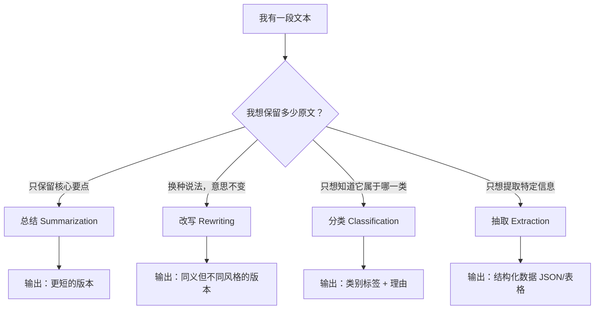

---
tags:
  - Prompt
---

# 总结、改写、分类与抽取

> 学会这四项基本功，你就能处理 80% 的日常文本任务。

## 这章解决什么问题

很多人第一次打开 ChatGPT，不知道能问什么。憋了半天只憋出一句「你好」或者「给我讲个故事」。

其实不是模型没用，是你还没意识到：LLM 最擅长的事情，恰恰是最朴素的那几件——帮你读长文、换种说法、打标签、挑重点。这四件事在 Prompt 工程里统称为**基础文本任务**，英文叫 Foundational Text Tasks。

掌握它们的意义很实际：你不需要懂编程，不需要调参数，只要写清楚 Prompt，就能让模型帮你处理大量文字工作。这章会逐个讲透这四项任务，并告诉你怎么写 Prompt 才能得到稳定、好用的结果。

## 核心概念解释

### 总结（Summarization）

**总结**（Summarization）：把长文本压缩成短文本，同时保留核心信息，去掉细枝末节。

例子：你有一篇 3000 字的行业报告，没时间通读，让模型帮你浓缩成 200 字的要点，这就是总结。

**为什么需要专门学 Prompt？**

很多人写总结 Prompt 就三个字：「总结一下」。结果模型要么缩得太短漏了重点，要么还是太长没省时间。问题出在你没告诉它：**总结给谁看、要多短、关注什么**。

**Prompt 技巧：**

| 技巧 | 示例 |
| --- | --- |
| 指定长度 | "控制在 150 字以内" / "用 3 个 bullet points" |
| 指定关注点 | "只总结技术实现细节，忽略市场分析" |
| 指定输出形式 | "一段话概述" / "分点列出" / "表格对比" |
| 指定受众 | "用非技术人员能听懂的语言总结" |

**最小示例：**

下面是一段 500 字左右的技术说明。我们展示三种不同的总结要求，看看输出有什么区别。

> **原文**：
> 本文介绍一种基于 Transformer 架构的文本摘要方法。该方法使用预训练语言模型 BERT 作为编码器，提取输入文档的深层语义特征。在解码阶段，采用指针生成网络（Pointer-Generator Network），允许模型直接从源文档复制词语，从而减少未登录词（OOV）问题。实验在 CNN/Daily Mail 数据集上进行，使用 ROUGE-1、ROUGE-2 和 ROUGE-L 作为评价指标。结果表明，该方法在 ROUGE-L 上达到了 39.5 的分数，相比基线模型提升了 2.3 个百分点。此外，本文还引入了一种覆盖率机制（Coverage Mechanism），用于减少生成摘要中的重复内容。消融实验显示，去掉覆盖率机制后，ROUGE-L 分数下降至 38.1，证明该机制对摘要质量有显著贡献。本文的模型在单张 NVIDIA V100 GPU 上训练，批量大小为 32，学习率采用预热策略，前 4000 步线性增加到 2e-4，之后按平方根反比衰减。训练共耗时约 12 小时。

**Prompt 1（泛泛总结）**：

```
请总结以下内容：
[原文]
```

**输出 1**：这篇文章提出了一种基于 Transformer 的文本摘要方法，使用 BERT 编码器和指针生成网络，在 CNN/Daily Mail 数据集上取得了较好的效果，并引入了覆盖率机制减少重复。

**Prompt 2（指定关注点 + 指定长度）**：

```
请总结以下技术说明，只保留模型架构和核心创新点，控制在 50 字以内：
[原文]
```

**输出 2**：使用 BERT 编码器 + 指针生成网络解码，引入覆盖率机制减少重复，ROUGE-L 达 39.5。

**Prompt 3（指定受众 + 指定形式）**：

```
请用 bullet points 总结以下内容的实验设置，让刚入门的研究者能看懂：
[原文]
```

**输出 3**：

- 数据集：CNN/Daily Mail（新闻摘要标准数据集）
- 评价指标：ROUGE-1、ROUGE-2、ROUGE-L（自动衡量摘要质量的分数）
- 硬件：单张 NVIDIA V100 GPU
- 训练时间：约 12 小时
- 学习率策略：前 4000 步预热到 2e-4，然后衰减

同样的原文，不同的 Prompt，产出完全不同。**总结不是模型会不会的问题，是你有没有说清楚要求的问题。**

---

### 改写（Paraphrasing / Rewriting）

**改写**（Paraphrasing / Rewriting）：保持原文意思不变，换一种表达方式。可以换风格、换结构、换受众，但核心信息不能丢。

例子：把一篇学术论文的结论改写成朋友圈文案，意思一样，但语气、长度、用词全变了。

**适用场景：**

- **降重**：论文查重率太高，需要换一种说法表达同样的观点
- **适配受众**：同一款产品说明，给工程师看和给投资人看，写法完全不同
- **风格转换**：把正式报告改成口语化分享，或者把闲聊记录整理成邮件

**Prompt 技巧：**

| 技巧 | 示例 |
| --- | --- |
| 指定目标风格 | "改写成正式商务邮件的语气" / "像跟朋友聊天一样说" |
| 指定目标读者 | "改写给 8 岁小朋友能听懂" / "改写给有技术背景的人" |
| 保留特定信息 | "必须保留价格、截止日期、负责人三个信息" |
| 排除特定信息 | "去掉涉及公司内部代号的部分" |

**最小示例：**

> **原文**：
> 本产品采用分布式微服务架构，基于 Kubernetes 进行容器编排，支持水平扩展。核心模块包括用户服务、订单服务和支付服务，各服务之间通过 gRPC 协议进行通信，平均响应延迟控制在 50ms 以内。

**Prompt 1（改写给小学生）**：

```
把下面这段话改写给小学生能听懂，不要省略任何功能描述：
[原文]
```

**输出 1**：这个 App 就像一个有很多小团队一起工作的公司。每个小团队负责一件事：有的管用户登录，有的管买东西，有的管付钱。它们用很快的方式互相传话，你点一下按钮，不到一秒钟就有回应。如果来的人太多，还可以自动加人手，不会卡。

**Prompt 2（改写给投资人）**：

```
把下面这段话改写给投资人，突出技术优势和扩展性，控制在 80 字以内：
[原文]
```

**输出 2**：采用云原生微服务架构，基于 Kubernetes 弹性调度，三大核心模块松耦合部署，内部通信延迟低于 50ms，具备支撑千万级并发的横向扩展能力。

注意看：同一个技术描述，给小学生的版本用了比喻（"像公司""传话"），给投资人的版本用了行业关键词（"云原生""弹性调度""松耦合"）。**改写不是翻译，是重新组织信息以适应场景。**

---

### 分类（Classification）

**分类**（Classification）：把输入内容分到预定义的类别里。模型不生成新内容，只做一个判断：这条输入属于哪一类。

例子：收到一条用户评论，让模型判断它是正面、负面还是中性，这就是分类。

**适用场景：**

- **情感分析**：批量判断用户评论的情绪倾向
- **垃圾邮件识别**：判断一封邮件是正常邮件、广告还是钓鱼邮件
- **内容标签**：给文章自动打上「科技」「体育」「财经」等标签
- **工单分派**：根据用户问题描述，自动分配给售后、技术或销售部门

**Prompt 技巧：**

| 技巧 | 示例 |
| --- | --- |
| 明确类别定义 | "正面：表达满意或推荐；负面：表达不满或投诉；中性：仅陈述事实" |
| 给边界案例 | "如果用户说'还行吧'，归为中性而非正面" |
| 要求置信度 | "输出类别，并给出 0~100 的置信度分数" |
| 允许多标签 | "一条评论可以同时属于'负面'和'物流'两个标签" |

**最小示例：**

```
请将以下用户评论分类为「正面」「负面」「中性」之一。

分类标准：
- 正面：用户明确表达满意、推荐、表扬
- 负面：用户明确表达不满、投诉、后悔购买
- 中性：仅陈述事实，没有明显情绪

边界案例说明：
- "还行""一般" → 中性
- "比预期好" → 正面
- "包装破损但东西能用" → 中性（陈述事实，未明确不满）

要求：先给出分类结果，再用一句话说明理由。

评论：
1. "物流快得离谱，昨天下午下单今天早上就到了，包装也完好。"
2. "屏幕亮度比我想象中暗，室外用有点费劲。"
3. "商品编号是 XJ-2024-08，颜色是深空灰。"
4. "用了两周，感觉无功无过吧。"
```

**模型输出**：

1. **正面**。用户明确表扬了物流速度和包装完好。
2. **负面**。用户指出了产品缺陷（屏幕亮度不足），并表达了使用中的困扰。
3. **中性**。仅陈述商品信息，无任何情绪表达。
4. **中性**。"无功无过""吧"表示一般，没有明确满意或不满。

这个例子展示了两个关键点：一是**类别定义必须具体**，二是**边界案例能大幅减少歧义**。如果不提前说明"包装破损但东西能用"算中性，模型可能会误判为负面。

---

### 抽取（Extraction）

**抽取**（Extraction）：从非结构化文本中提取特定结构化信息，按你指定的格式输出。模型不解释、不总结，只负责「找到你要的东西」。

例子：从一份合同里抽出租期、租金、违约金条款，整理成表格，这就是抽取。

**适用场景：**

- **合同审查**：抽关键条款（付款方式、违约责任、终止条件）
- **简历解析**：从邮件或 PDF 文本中提取姓名、电话、工作经历
- **聊天记录整理**：从群聊记录中抽取待办事项和负责人
- **舆情监控**：从新闻中抽取涉及的公司名称、金额、时间

**Prompt 技巧：**

| 技巧 | 示例 |
| --- | --- |
| 指定输出格式 | "输出 JSON" / "输出 Markdown 表格" / "每行一个字段：字段名：内容" |
| 指定必须字段 | "必须包含：姓名、电话、工作年限" |
| 处理缺失字段 | "如果某项信息缺失，填写'未提及'，不要编造" |
| 字段命名统一 | "日期统一用 YYYY-MM-DD 格式" |

**最小示例：**

```
请从以下简历文本中提取信息，输出为 JSON 格式。

必须包含的字段：
- name（姓名）
- phone（电话）
- email（邮箱）
- years_of_experience（工作年限，数字）
- skills（技能列表，数组）
- latest_company（最近一家公司名称）

规则：
- 如果某字段在文本中未提及，填写 null
- 工作年限只算全职工作，实习不算
- 技能列表去重

简历文本：

大家好，我叫李明，做过 3 年 Java 开发和 1 年实习前端。手机 138-0013-8000，邮箱 liming@example.com。上一家公司是字节跳动，主要负责抖音电商的后台系统。技术栈包括 Java、Spring Boot、MySQL、Redis，也用过一点 Kafka 和 Elasticsearch。Java 用得最熟。
```

**模型输出**：

```json
{
  "name": "李明",
  "phone": "138-0013-8000",
  "email": "liming@example.com",
  "years_of_experience": 3,
  "skills": ["Java", "Spring Boot", "MySQL", "Redis", "Kafka", "Elasticsearch"],
  "latest_company": "字节跳动"
}
```

注意 Prompt 里的几个细节：

- **字段命名统一**：用英文 snake_case，方便后续程序处理
- **规则明确**："实习不算"避免了年限计算歧义
- **缺失处理**：要求填 null，防止模型瞎编
- **去重**："Java 用得最熟"和前面提到的 "Java" 自动去重

## 四种任务怎么选？

拿到一段文本，不知道该用哪种任务？看这个决策树：



简单记法：

- **太长不想看** → 总结
- **这样说不太合适** → 改写
- **这是哪一类** → 分类
- **把XX挑出来** → 抽取

## 常见误区

**误区 1：让总结"尽量短"却不指定多短**

「尽量短」对模型来说没有标准。你眼中的"短"可能是 100 字，模型理解成 20 字，关键信息全丢了。修正：用具体数字或形式约束，比如"3 句话""150 字以内""5 个 bullet points"。

**误区 2：改写时丢失关键信息**

你让模型把技术文档改通俗，结果它为了"通俗"把核心功能描述也简没了。修正：在 Prompt 里明确加一句"不要省略任何功能描述"或"必须保留以下信息：……"。

**误区 3：分类类别定义模糊**

你定义了两类："好"和"不错"。模型会懵——这两个词在中文里几乎同义，怎么分？修正：类别之间要有明确边界，用"正面/中性/负面"而不是"好/不错/还行"。

**误区 4：抽取时字段命名前后不一致**

你在 Prompt 里写"提取电话号码"，但输出格式里定义的是"phone"。模型可能输出"电话号码：138-0000-0000"，而不是你要的 JSON 字段。修正：字段名在 Prompt 和格式定义中严格统一。

**误区 5：把分类和总结混为一谈**

你给模型一段评论，要求"总结一下这条评论的情感"，结果模型写了一小段话分析情绪。其实你要的只是一个标签"正面"。修正：任务要单一，需要标签就写"分类"，需要概述才写"总结"。

## 延伸阅读

- [Prompt 基础结构](structure.md) —— 学习四要素框架，把 Prompt 写得更有条理
- [Prompt 常见失败案例](failure-cases.md) —— 了解为什么有时候模型不按预期输出
- [让输出更稳定](stable-output.md) —— 让模型输出格式更一致、更可预测
- [Prompt 模板库](templates.md) —— 直接可用的 Prompt 模板

## 练习题 / 小实验

**练习：一鱼四吃**

以下是同一段混合文本，请分别用「总结」「改写」「分类」「抽取」设计四个不同的 Prompt，让模型完成对应任务。

> **原文**：
> 我上周在京东买了一台戴森 V12 吸尘器，花了 3499 元。物流是京东自营，第二天就到了，包装很严实。用了三天，吸力确实强，吸猫毛很干净，但续航有点短，充满电只能撑 40 分钟左右。我家 120 平，中途得充一次电才能吸完。客服说电池保修两年，有问题可以直接换。总体来说，清洁效果满意，但希望续航能再长一点。京东的以旧换新活动抵了 200 块，算下来实际付了 3299 元。订单号是 JD20241125001。

**任务要求**：

1. **总结**：用 2 句话概括这条评价的核心观点。
2. **改写**：改写成一条适合发在微博上的 100 字短评，保留价格、续航、吸力三个信息。
3. **分类**：判断这条评价的整体情感（正面/负面/中性），要求给出类别和置信度（0~100）。
4. **抽取**：提取商品名称、价格、购买渠道、续航时长、保修政策、订单号，输出 JSON。

建议：先自己写 Prompt，去模型里跑一遍，对比输出和你预期之间的差距，然后迭代修改。
