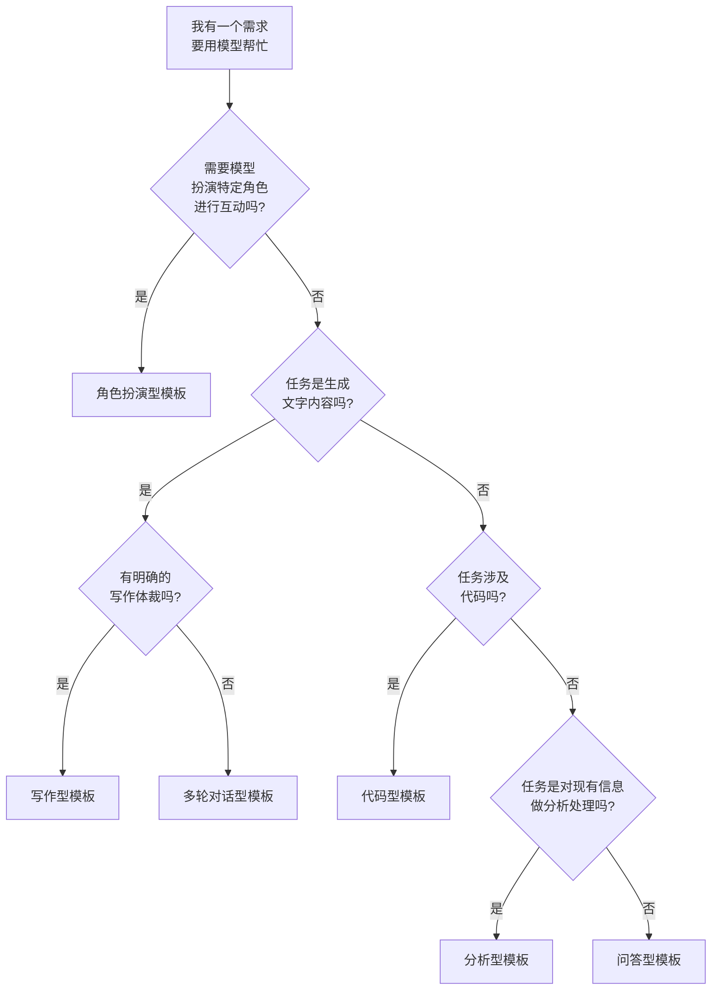

---
tags:
  - Prompt
---

# Prompt 模板

> 好 Prompt 不是每次从零想出来的，而是基于模板改出来的。这页给你一套可直接复制使用的模板库。

## 这章解决什么问题

写 Prompt 最痛苦的不是"不会写"，而是"每次都重写"。

你今天写了一个让模型帮你改邮件的 Prompt，效果还不错。下周又来了 5 封邮件要改，你却发现已经忘了上周那个 Prompt 是怎么写的，只能重新摸索一遍。

**模板（Template）** 就是解决这个问题的：把验证过有效的 Prompt 结构固化下来，下次直接填空。它的好处有三点：

1. **减少重复思考**：不用每次都从零构思结构
2. **保证输出一致性**：同一个模板产出的结果风格相近
3. **降低协作门槛**：团队成员可以共用一套"Prompt 语言"

这章给你一个通用模板框架，再加 6 个高频场景的即拿即用模板。

## 核心概念

### 什么是 Prompt 模板

**Prompt 模板（Prompt Template）** 是一种带有占位符（placeholder）的 Prompt 结构，你把固定部分写好，把变化部分留空，每次使用时填入具体内容即可。

最简单的模板长这样：

```text
你是一位【角色】。
请【任务描述】。
要求：
1.【约束1】
2.【约束2】
输出格式：【格式要求】
```

用的时候把【】里的内容替换掉，就是一个完整可用的 Prompt。

### 通用模板框架：RTFC

在 Role-Task-Format-Constraint 四要素的基础上，我推荐一个最简模板框架：**RTFC**。

```text
R（Role）：你是一位【具体身份】，【相关背景/经验】
T（Task）：请【具体动作】【处理对象】，目的是【目标】
F（Format）：请以【格式】输出，结构如下：【结构描述】
C（Constraint）：
- 必须满足：【硬性要求】
- 不能出现：【禁止事项】
- 其他限制：【字数/风格/知识范围等】
```

这个框架的好处是**好记、够用、不臃肿**。你可以根据任务复杂度增减内容，但 RTFC 四个字母能帮你检查"有没有漏掉什么"。

## 6 个高频场景模板

### 模板 1：问答型（获取特定知识）

适合场景：让模型解释概念、梳理知识、对比选项。

**模板：**

```text
你是一位在【领域】有【年限】年经验的【身份】。

请用【目标读者】能听懂的语言，解释【概念/问题】。

要求：
1. 先讲"为什么需要知道这件事"，再讲"它是什么"
2. 必须举一个【具体领域】的实际例子
3. 如果涉及多个选项/流派，请用对比表格说明
4. 不要堆砌术语；如果必须使用术语，请在括号内加注一句人话解释

输出格式：
- 一句话定义（不超过 40 字）
- 核心原理解释（1~2 段）
- 实际例子（1 段）
- 一句话总结：什么时候用、什么时候不用
```

**示例（解释 Kubernetes）：**

```text
你是一位在云计算领域有 8 年经验的运维架构师。

请用刚入职的初级后端工程师能听懂的语言，解释 Kubernetes 的核心作用。

要求：
1. 先讲"为什么需要知道这件事"，再讲"它是什么"
2. 必须举一个电商平台大促时的实际例子
3. 如果涉及多个选项/流派，请用对比表格说明
4. 不要堆砌术语；如果必须使用术语，请在括号内加注一句人话解释

输出格式：
- 一句话定义（不超过 40 字）
- 核心原理解释（1~2 段）
- 实际例子（1 段）
- 一句话总结：什么时候用、什么时候不用
```

---

### 模板 2：写作型（文章、邮件、文案）

适合场景：生成各类文本内容，需要风格可控。

**模板：**

```text
你是一位擅长【风格/平台】的内容创作者。

请为【目标受众】写一篇【体裁】，主题是【主题】。

背景信息：
【提供必要的上下文，比如产品特点、事件经过、邮件往来等】

要求：
1. 语气：【正式/轻松/专业/亲切等】
2. 篇幅：【字数范围】
3. 必须包含的要点：【要点1】【要点2】【要点3】
4. 禁止出现的内容：【禁止1】【禁止2】
5. 其他风格要求：【如：多用短句、避免感叹号等】

输出格式：
【明确段落结构或特殊格式要求，如：标题→导语→正文→结尾 CTA】
```

**示例（写道歉邮件）：**

```text
你是一位擅长职场沟通的高级助理。

请为一位项目经理写一封给客户的道歉邮件，主题是"项目延期两周"。

背景信息：
- 延期原因是核心开发人员突然离职
- 客户是合作 3 年的老客户，关系一直不错
- 新方案是引入外包团队填补空缺，预计追回 1 周时间

要求：
1. 语气：真诚、不推卸责任、体现专业性
2. 篇幅：正文 150~200 字
3. 必须包含的要点：道歉、原因（简要）、补救方案、新的时间节点
4. 禁止出现的内容：不要承诺"绝对不会再发生"、不要指责离职员工
5. 其他风格要求：用第一人称"我们"，不要用"本公司"

输出格式：
- 标题一行
- 正文一段
- 结尾署名
```

---

### 模板 3：分析型（数据分析、文本分析）

适合场景：让模型处理信息、提炼结论、发现模式。

**模板：**

```text
你是一位擅长【分析类型】的分析师。

请对以下【数据/文本】进行分析：

【粘贴内容】

分析任务：
1.【任务1，如：总结核心观点】
2.【任务2，如：找出 3 个关键趋势】
3.【任务3，如：指出潜在风险】

要求：
1. 每个结论都要有原文依据（引用或概括）
2. 如果数据不足，明确说明"基于现有信息无法判断"
3. 不要做超出给定信息的推测
4. 分析角度：【如：商业视角、用户视角、技术视角】

输出格式：
【如：Markdown 表格、分点列表、带小标题的段落】
```

**示例（用户反馈分析）：**

```text
你是一位擅长用户体验研究的分析师。

请对以下 App 用户反馈进行分析：

【粘贴 10 条用户评论】

分析任务：
1. 按主题归类反馈（如：性能、功能、界面、价格）
2. 找出被提及最多的 3 个问题
3. 给出优先级建议（高/中/低），并说明理由

要求：
1. 每个结论都要有原文依据（引用或概括）
2. 如果数据不足，明确说明"基于现有信息无法判断"
3. 不要做超出给定信息的推测
4. 分析角度：产品经理视角，关注"哪些反馈最影响留存"

输出格式：
用 Markdown 表格输出：
| 主题 | 提及次数 | 典型原话 | 优先级 | 理由 |
```

---

### 模板 4：代码型（代码生成、解释、审查）

适合场景：和代码打交道的一切任务。

**模板：**

```text
你是一位专注于【语言/领域】的【身份，如：工程师/安全专家】。

请【动作：生成/解释/审查/优化】以下代码：

```【语言】
【代码块】
```

要求：
1. 代码风格：【如：PEP8/Google Style/Clean Code】
2. 必须满足：【功能性要求】
3. 安全约束：【如：防注入、防 XSS、输入校验】
4. 注释要求：【如：关键逻辑必须加注释，用中文】
5. 兼容性：【如：Python 3.9+、兼容 Chrome 110+】

输出格式：
【如：直接输出代码块 / 先说明改动点再输出代码 / 用 diff 格式展示修改】
```

**示例（代码审查）：**

```text
你是一位专注于 Python 的安全工程师。

请审查以下代码：

```python
def login(username, password):
    query = f"SELECT * FROM users WHERE username='{username}' AND password='{password}'"
    result = db.execute(query)
    return result.fetchone()
```

要求：
1. 代码风格：PEP8
2. 必须满足：功能保持不变的前提下消除安全隐患
3. 安全约束：防 SQL 注入、密码必须哈希比对、失败时不能暴露系统信息
4. 注释要求：关键逻辑加中文注释
5. 兼容性：Python 3.9+

输出格式：
先列出发现的安全问题（风险等级：高/中/低），
然后输出修复后的完整代码块。
```

---

### 模板 5：角色扮演型（模拟面试、模拟客服）

适合场景：需要模型扮演特定角色进行互动。

**模板：**

```text
现在，请你扮演一位【角色身份】，【角色的具体背景和性格特征】。

场景设定：
【时间、地点、事件背景】

你的任务：
【模型在这个场景里需要做什么】

互动规则：
1.【规则1，如：每次只问一个问题，等用户回答后再继续】
2.【规则2，如：如果用户回答模糊，追问具体细节】
3.【规则3，如：保持角色人设，不要用"作为 AI"之类的表述】
4.【结束条件，如：面试进行 5 轮后给出综合评价】

开场白：
【模型说的第一句话，帮助用户进入角色】
```

**示例（模拟技术面试）：**

```text
现在，请你扮演一位大厂的高级后端面试官，有 10 年工作经验，
面试风格偏压力型，会追问候选人的设计思路。

场景设定：
这是一场针对 3~5 年经验后端工程师的技术面试，
岗位是电商平台的订单系统开发。

你的任务：
通过 5 轮技术问答，考察候选人的系统设计能力、
数据库优化经验和异常处理能力。

互动规则：
1. 每次只问一个问题，等用户回答后再继续
2. 如果用户回答得太浅，追问"如果流量扩大 10 倍呢？"
3. 保持面试官人设，不要用"作为 AI"之类的表述
4. 5 轮结束后给出综合评价（优势 + 待提升点）

开场白：
"你好，我是今天的面试官。我们直接开始吧。
请先简单介绍一下你做过的一个高并发项目。"
```

---

### 模板 6：多轮对话型（保持上下文一致性）

适合场景：需要在一个长对话中保持模型的人设、记忆和风格。

**模板：**

```text
【系统级设定——这段会在每轮对话开始时强化】
你是一位【角色】。在整个对话过程中，请记住：
1. 你的核心任务是【任务】
2. 你的语气风格是【风格】
3. 你必须遵守的约束：【约束列表】
4. 如果用户的问题偏离主题，请【引导方式】

【第一轮开场】
用户当前的需求是：【需求简述】

请开始第一轮输出：【具体的第一轮任务】

【后续轮次的记忆锚点——可选】
每次回复前，请先确认：
- 当前进行到第几步？
- 用户上一轮提供了什么新信息？
- 下一步应该做什么？
```

**示例（逐步改写文章）：**

```text
你是一位专业的中文编辑。在整个对话过程中，请记住：
1. 你的核心任务是帮用户把草稿改得更通顺、更有说服力
2. 你的语气风格是直接、务实，不客套，每次给出具体修改建议
3. 你必须遵守的约束：不改用户的事实性内容、不添加未经用户确认的信息
4. 如果用户说"就这样吧"，输出最终版全文并结束

用户当前的需求是：
把一篇 2000 字的产品介绍改到 800 字以内，保留核心卖点。

请开始第一轮输出：
先通读用户提供的原文，用 3 句话概括你认为的核心卖点，
然后问用户"我理解的对吗？有没有遗漏？"

【后续轮次的记忆锚点】
每次回复前，请先确认：
- 当前进行到第几步？（理解→确认→改写→微调→定稿）
- 用户上一轮提供了什么新信息？
- 下一步应该做什么？
```

## 模板选择决策图

拿到一个需求，不知道用哪个模板？按这个流程走：



## 模板使用技巧

**技巧 1：先复制，再删改**

不要试图一上来就写出完美模板。先用 RTFC 框架套一遍，然后观察模型输出，把"模型总是搞错的地方"补充进约束，把"多余的废话"从模板里删掉。

**技巧 2：给模板做版本管理**

把你的 Prompt 模板存成文本文件或笔记，标注：
- 创建日期
- 适用模型（GPT-4 / Claude / DeepSeek 等）
- 使用效果评分
- 已知问题

**技巧 3：知道什么时候跳出模板**

模板不是牢笼。如果遇到以下情况，应该跳出模板：

- 任务特别简单，套模板反而啰嗦
- 需要极强创意，模板会限制发散
- 和模型已经建立了上下文，不需要重复角色设定
- 测试新模型时，先用简单 Prompt 探探底

## 常见误区

**误区 1：模板万能论**

不是所有场景都适合套模板。让模型帮你脑暴 10 个产品名字，用一个轻量的发散型 Prompt 效果更好，硬套结构化模板反而扼杀创意。

**误区 2：模板一成不变地用**

模板是起点，不是终点。同一个模板在不同模型上的效果可能差别很大。GPT-4 对 JSON 格式要求执行得很好，某些轻量模型可能需要你把格式要求写得更直白。

**误区 3：过度复杂的模板**

如果你的模板本身有 500 字，而任务只需要 200 字的输出，那模板可能比任务还难写。模板的作用是"提效"，不是"炫技"。保持模板精简，约束只保留最关键的。

**误区 4：不给示例**

模板解决了"结构"，但没解决"风格"。如果你希望输出符合特定风格，在模板后面加 1~2 个示例（Few-shot），效果会好很多。

## 延伸阅读

- [Prompt 基础](prompt-basic.md) —— 理解 Prompt 的基本构成
- [角色、任务、约束与输出格式](structure.md) —— 深入理解 RTFC 四要素
- [让模型稳定输出](stable-output.md) —— 学习如何让模板产出的结果更稳定

## 练习题

**练习 1：填空实操**

选择上面 6 个模板中的任意一个，填入你自己的真实需求。把它发给模型，记录输出结果。然后回答：
- 模板哪里覆盖到了你的需求？
- 哪里需要补充或删减？

**练习 2：模板改造**

把下面这个"非模板化"的 Prompt，改写成 RTFC 结构的模板：

> "帮我看看这段代码有没有问题，要指出哪里不好，然后改好给我。"

**练习 3：跨场景迁移**

把"问答型模板"改造一下，用于"让一个 10 岁小朋友理解复利"的场景。思考：角色、约束和输出格式需要做哪些调整？
