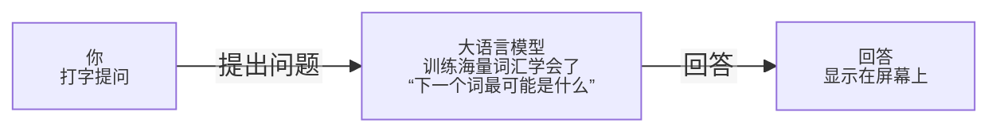

---
tags:
  - Tools
---

# Chat AI 怎么用

> 从 "打招呼" 到 "真的好用"，看懂它们是什么、选哪个、怎么问出好答案

---

## Chat AI 到底是个啥？

wechat、googlechat、chatgpt？

**Chat AI** 一看名字就知道，是用来聊天的 AI，约等于，你打字，它回答，就像是微信里面的朋友，你问什么，它回答什么。区别是，这个"朋友"读过**几乎整个互联网**， 能写文章、改代码、分析数据、帮你想方案—— 而且**随时在线、不会嫌烦、不会收费打赏**（大多数时候）。



AI 并不是"真的懂"你，它只是根据你说的话，预测出"最可能说什么"。 所以你说得越清楚，它答得越好。

## Chat AI 的进化史

了解一下它怎么从一个"傻瓜程序"变成现在的样子，帮你更好地知道它能干什么、干不了什么。

> 所以它的上限在哪？目前 Chat AI 的知识来自训练数据，有"截止日期"，不知道今天的新闻； 会"一本正经地胡说"（行话叫"幻觉"）； 没有意识和情感，只是在预测文字。 知道这几点，你就不会对它有不合实际的期待，也不会被它唬到。

**1966 — ELIZA：第一个聊天机器人** 麻省理工学院的魏岑鲍姆（Weizenbaum）做了一个叫 ELIZA 的程序，能用固定套路回答你。 比如你说"我很难受"，它就反问"你说你很难受，能展开讲讲吗？" ——完全没有理解，就是在套话。当时很多人却把它当真人，这让魏岑鲍姆本人都吓了一跳。

**2011 — Siri / 小冰：语音 + 检索的时代** 苹果的 Siri 和微软的小冰让聊天机器人走进了大众生活。 但它们本质还是"查数据库"——你问天气，它查天气接口；你问历史，它查维基百科。 遇到没有预设答案的问题，就一脸懵逼。

**2017 — Transformer 论文：一切的根源** 谷歌的一篇论文《Attention is All You Need》彻底改变了 AI 的走向。 这篇论文提出了一种叫 Transformer 的架构，让模型能同时关注句子里的每一个词、理解它们的关系。 现在所有的 Chat AI，全都建立在这个基础上。

**2018–2020 — GPT-1 / GPT-2 / GPT-3：规模越来越大** OpenAI 开始用 Transformer 训练越来越大的模型，发现了一个规律：参数越多、训练数据越多，它就越聪明。 GPT-3 拥有 1750 亿参数，出来之后很多人被它的写作能力震惊了，但那时还没有面向普通人的产品。

**2022.11 — ChatGPT 爆炸出圈：AI 对话的元年** OpenAI 把 GPT-3.5 + 一项叫 RLHF（人类反馈强化学习）的技术合在一起，做出了 ChatGPT。 发布五天内用户破百万，两个月破亿——史上最快。 这一次，普通人终于能直接用上聪明的 Chat AI 了。

**2023–2026 — 群雄并起：Claude、DeepSeek、Kimi……** ChatGPT 成功之后，各路玩家入场：Anthropic 推出 Claude，Google 推出 Gemini， 国内的 Kimi、DeepSeek、通义千问、豆包相继出现。 到 2026 年，竞争格局已经形成"海外三巨头 + 国产新势力"的局面， 每家都在拼谁更聪明、谁更好用、谁更便宜。

## 主流 Chat AI 一览

### ChatGPT（OpenAI · 美国）

Chat AI 的鼻祖，江湖地位最高，插件生态最丰富。 GPT-5 在复杂推理和多步任务上很强，还能处理图片、文件、代码。 国内需要科学上网。 标签：`综合最强 · 需科学上网`

### Claude（Anthropic · 美国）

以"安全、诚实"著称，逻辑和长文写作很出色， 支持超长上下文（最长可塞入一本书）。 Opus 4.6 在代码和复杂分析上全球领先。 国内同样需要科学上网。 标签：`写作最强 · 逻辑严谨`

#### DeepSeek（深度求索 · 中国）

国内访问最稳定，免费额度很大，代码能力在国内模型里首屈一指。 DeepSeek V3.2 的 API 价格只有 Claude 的百分之一。 直接用官网就行，不用折腾。 标签：`国内直连 · 免费好用`

#### Kimi（月之暗面 · 中国）

长文档处理是它的招牌，一次可以读几十万字。 扔进去一整本书、一份合同、一堆论文，让它帮你总结、找关键点。 中文对话体验自然流畅。 标签：`国内直连 · 长文档王者`

#### 通义千问（阿里巴巴 · 中国）

阿里出品，中文和数学推理能力不错，适合学生和上班族日常使用。 与阿里云生态深度绑定，对于企业用户有天然优势。 Qwen3-Max 是 2026 年国内前列的模型之一。 标签：`国内直连 · 阿里生态`

#### Gemini（Google · 美国）

Google 自家模型，原生绑定 Google 搜索，能获取实时信息。 图文混合处理能力强，能看图说话、分析图表。 和 Gmail / Google Docs 整合很方便，用 Google 全家桶的人福利。 标签：`实时联网 · 多模态强`

| 我想做什么         | 推荐用哪个             | 理由                              |
| ------------- | ----------------- | ------------------------------- |
|  写代码 / 调试 Bug | DeepSeek / Claude | 代码能力强，DeepSeek 国内直连，Claude 逻辑严谨 |
| 写文章 / 润色文字    | Claude / ChatGPT  | 写作质量最高，文字有温度不生硬                 |
| 读长篇文件 / 总结报告  | Kimi / Claude     | 支持超长上下文，不会"看不完"                 |
| 查实时信息 / 最新新闻  | Gemini / ChatGPT  | 支持联网搜索，信息不过时                    |
| 中文学习 / 日常聊天   | 通义千问 / DeepSeek   | 国内直连，中文体验自然，免费额度大               |
| 公司内部用 / 不想出境  | DeepSeek / 通义千问   | 数据在国内，合规有保障                     |


## 怎么问，才能得到好答案

Chat AI 好不好用，70% 取决于你怎么问。 这是很多人用了半年都没发现的事。

>  注意"角色 + 要求 + 格式 + 长度限制"四件套都用上了，回答就非常对口。

1. **给它一个"角色"** 在问题前面加一句"你是一个……"， 效果会好很多。比如"你是一个熟悉 CTF 的安全工程师"， 它的回答会更专业、更贴近你要的风格。
2. **说清楚你要"什么格式"** "用列表"、"分三段"、"100 字以内"、"给我一个表格"—— 加上格式要求，不然它经常给你一大段流水账， 还是你再整理一遍。
3. **一次只问一件事** 很多人喜欢一口气问五个问题，结果 AI 的回答又多又乱。 一次问一件事，答完再接着问，思路清晰，效果也好。
4. **不满意就让它重来** 答得不好？直接说："不对，我要的是……"或 "能不能再简短一点？" AI 不会生气，它很愿意改。 别一次不满意就放弃，多试几次。
5. **贴上你的"原料"** 让它帮你改文章？把文章粘上去。 让它分析代码？把代码粘上去。 越多背景信息，它越能对症下药，而不是空想。
6. **让它"一步一步想"** 遇到复杂的逻辑题或分析题，在问题结尾加一句： "请一步一步分析"。这能让它把推理过程展开写出来， 答案准确度会明显提升。

**✗ 这样问，大概率废话一堆**

```
帮我写个自我介绍
```

_AI 不知道你是谁、写给谁看、多少字、什么风格， 只能猜，结果必然是一段四不像的模板文。_

**✓ 这样问，命中率高很多**

```
我叫李明，重庆人，23岁，网络安全专业，
          刚参加工作，要在组内周会自我介绍，
          时间大约1分钟，风格：简洁不浮夸，
          最后提一下我对渗透测试比较感兴趣。
```

_把"人、场合、长度、风格、重点"都说清楚， AI 才能真正帮到你。_

**对话示例：**

 **我：** 你是一个有五年渗透测试经验的安全工程师。 帮我写一份关于 SQL 注入的技术总结， 用于 CTF 比赛复盘。 要求：分点列出常见注入类型（报错注入、布尔盲注、时间盲注）， 每种附一个简单 Payload 示例，最后说一下防御方法。 不超过 600 字。

 **AI：** SQL 注入技术总结1. 报错注入利用数据库报错信息回显数据……Payload:1' AND extractvalue(1,concat(0x7e,user()))--2. 布尔盲注根据页面是否有变化判断条件真假……（继续输出中）

## 它能帮你做哪些事

不是什么事都能干，但这些场景用起来真的香。

-  **写代码 / 调 Bug**：把报错信息粘进去，问"这个错误是什么意思，怎么修"——比自己 Google 快三倍。
    
-  **写作 / 润色**：写邮件、写报告、改简历、润色句子。给它你的草稿，让它改得通顺流畅。
    
-  **学习新知识**："用最简单的话解释一下 TCP 三次握手"——比看文档快，随时追问不怕烦。
    
-  **资料总结**：把一篇长文章或 PDF 扔进去，让它给你提炼出重点，省去大量阅读时间。
    
-  **分析数据**：把表格数据粘进去，让它帮你找规律、算统计、出结论，不用自己写公式。
    
-  **头脑风暴**：想不出方案？说清楚你的问题和限制条件，让它帮你列出 10 个思路。
    
-  **翻译**：技术文档翻译最合适，不只翻字面，还能结合上下文给出更准确的表达。
    
-  **安全学习**：CTF 解题思路、漏洞原理分析、Payload 解释——安全方向的好帮手。
    
-  **规划 / 整理**：让它帮你拆解任务、排优先级、做计划——把混乱的脑子整理清楚。
    

## 常见误区

AI 不是万能的，知道它的边界，才能用得安心。

> **它会"胡说八道"** 这叫"幻觉"（Hallucination）。它可能给你编一个看起来很像真的错误答案。凡是需要精确的事（数据、引用、法律条文），一定要自己核查。

>  **别把隐私数据喂进去** 密码、身份证号、公司机密、客户数据——别粘到 AI 对话框里。你不知道这些数据会不会被用于训练。

> **知识有截止日期** 每个模型都有"训练截止时间"，之后发生的事它不知道。问最新新闻、最新漏洞，要用支持联网的版本。

>  **结果别直接全用** AI 的输出是"参考"，不是"定论"。写文章用它打草稿，用代码要测试，做决策要自己判断——它是助手，不是替你负责的人。


### 关于 Chat AI，接下来的可能的走向

**最可能：工具化，融入日常** Chat AI 不再是"一个单独的产品"，而是融进各种软件里， 就像搜索框一样无处不在。 你不会觉得自己在"用 AI"，就像你现在不会觉得自己在"用搜索引擎"。

**最危险：被当作全知全能** 最大的风险不是 AI 太聪明，而是人们太轻信。 当大家习惯了用 AI 替自己思考，批判能力和自我判断会慢慢退化。 这是更值得警惕的方向。

**最乐观：放大每个人的上限** 一个人、几个工具，做出以前需要一个团队才能做的事情。 AI 把知识的获取门槛拉平了，这可能是近代最大的一次能力民主化。

---

##  它改变的不是"你能做什么"，而是"你多快能做"

从 ELIZA 到 ChatGPT，这条路走了接近 60 年。 前 55 年全是在铺路——数学基础、算法框架、算力积累、数据规模。 最后五年，一切突然串联起来，产品就爆了。

2026 年的格局，已经是海外三强（OpenAI、Anthropic、Google）+ 国产新势力（DeepSeek、Kimi、通义）的并跑状态。 国内用户最实际的选择：学习和日常任务用 DeepSeek 或 通义千问，有条件的话再搭配 Claude 处理高质量写作和复杂分析。

但说到底，工具是工具，它能把你的效率放大 3 到 10 倍， 但前提是你得知道自己要什么。 一个不清楚目标的人，给他一把最好的锤子也没用。 Chat AI 最大的价值，是把你脑子里的模糊想法，快速变成一个可以修改的初稿。

所以，学会"问清楚问题"， 比学会用哪个 AI，重要十倍。

## 延伸阅读 


## 练习题

### 练习一
- 选择一个你常用的 Chat AI 工具（如 DeepSeek、通义千问、豆包等），尝试用 "四件套" 方法提问：
    
    > "你是一名初中数学老师，请用最简单的语言解释一下什么是勾股定理，并举 2 个生活中的应用例子，总字数不超过 200 字。"
    > 
    > 观察 AI 的回答是否符合你的要求。

### 练习二
- 找一篇你最近读过的长文章（不少于 1000 字），将其复制粘贴到 AI 中，要求："请用 3 个要点总结这篇文章的核心内容，每个要点不超过 50 字。"

